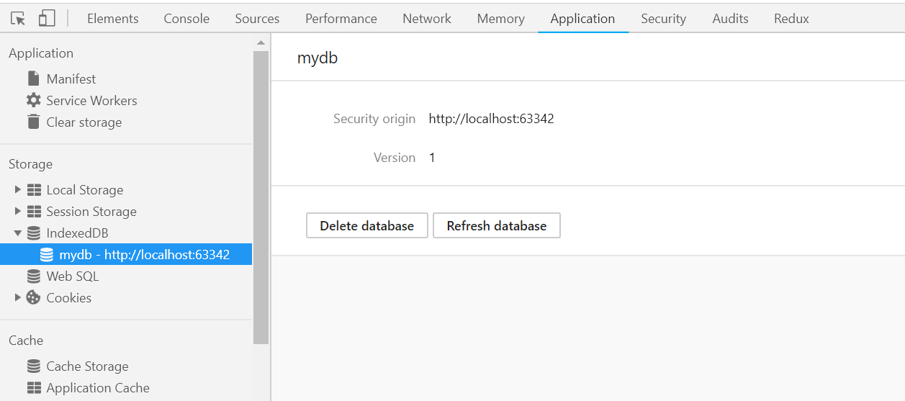

# IndexedDB

现在的大部分浏览器都支持IndexedDB作为内置数据库，IndexedDB和WebSQL不同，它并不使用SQL语言，操作类似MongoDB这样的NoSQL，IndexedDB能够存储的是JavaScript对象。

## 创建数据库

创建数据库使用`indexedDB.open(name, version)`，第一个参数是数据库名，第二个参数（可选参数）是版本号，如果指定名字的数据库不存在，就新创建一个。

这个数据库版本的概念和Android是一样的：应用的数据库更新时，版本号提升就能覆盖原来的数据库，达到修改用于客户端应用的数据库结构的目的。

```javascript
var idbRequest = indexedDB.open('mydb', 1);
idbRequest.onsuccess = function (e) {
    console.log('success');
};
idbRequest.onerror = function (e) {
    console.log('error');
};
idbRequest.onupgradeneeded = function (e) {
    console.log('upgradeneeded ');
};
```

IndexDB数据库操作是异步的，`open()`函数有三个回调事件：

* onsuccess：数据库成功打开
* onerror：数据库打开出错
* onupgradeneeded：数据库升级成功或数据库创建

注意：浏览器第一次运行上述代码时，会回调`onupgradeneeded`和`onsuccess`，再次刷新就只会回调`onsuccess`了。

我们可以在chrome的开发者工具中调试IndexedDB。



虽然创建了数据库，但是上面代码并没有创建数据库要存储的数据结构，我们可以在upgradeneeded事件回调中编写。

```javascript
idbRequest.onupgradeneeded = function (e) {
  var db = e.target.result;
    db.createObjectStore('user', {autoIncrement: true});
  };
```

* `db.createObjectStore()`：第一个参数是键名，第二个参数是配置参数，这里我们指定键自增。

## 添加数据

对IndexedDB的增删改查操作必须通过事务实现，下面是向IndexedDB添加数据的例子：

```javascript
var idbRequest = indexedDB.open('mydb', 3);
var db;
idbRequest.onsuccess = function (e) {
    db = e.target.result;
    console.log('success');
};
idbRequest.onerror = function (e) {
    console.log('error');
};
idbRequest.onupgradeneeded = function (e) {
    db = e.target.result;
    db.createObjectStore('user', {autoIncrement: true});
};

function addUser() {
    db.transaction(['user'], 'readwrite')
        .objectStore('user')
        .add({username: 'Tom', password: '123456'});
}
```

## 删除数据

基本操作同上，只不过使用的函数时`objectStore.delete()`，参数是数据的主键。

## 更新数据

使用的函数是`objectStore.put()`，例子如下：

```javascript
function updateUser() {
    db.transaction(['user'], 'readwrite')
        .objectStore('user')
        .put({username: 'Tomas', password: '123456'}, 1);
}
```

`put()`第一个参数是数据，第二个参数是主键。

## 查询数据

* 通过主键查询：通过设置的主键字段查询数据
* 通过索引查询：为某个字段设置索引，就可以通过该索引查询该字段，否则默认只能通过主键查询
* 遍历数据：迭代数据库中的数据

### 通过主键查询数据

```javascript
function queryUser() {
    var dbRequest = db.transaction(['user'], 'readwrite')
        .objectStore('user')
        .get(1);
    dbRequest.onsuccess = function (e) {
        console.log(dbRequest.result);
    }
}
```

### 遍历数据

```javascript
function iterUser() {
    var dbRequest = db.transaction(['user'], 'readwrite')
        .objectStore('user')
        .openCursor();
    dbRequest.onsuccess = function (e) {
        var cursor = e.target.result;
        if (cursor) {
            console.log(cursor.value);
            cursor.continue();
        }
    }
}
```

### 通过索引查询数据

我们首先在原来创建数据库的代码的基础上，添加创建索引的操作：

```javascript
db
  .createObjectStore('user', {autoIncrement: true})
  .createIndex('username', 'username');
```

通过索引查询：

```javascript
function queryUserByIndex() {
    var dbRequest = db.transaction(['user'], 'readwrite')
        .objectStore('user')
        .index('username')
        .get('Tom');
    dbRequest.onsuccess = function (e) {
        console.log(dbRequest.result);
    }
}
```
