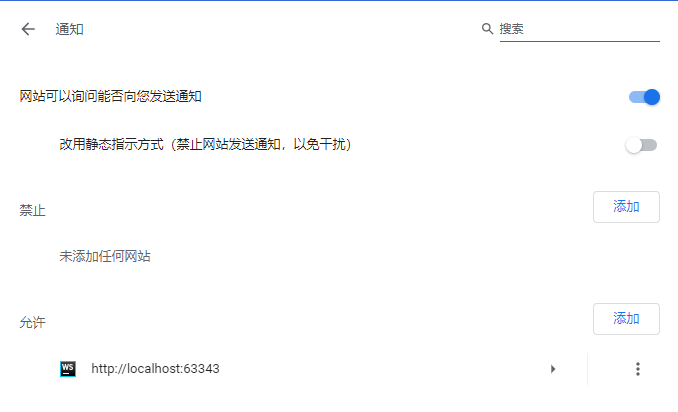

# Notification 通知

PC下的现代浏览器如Firefox和Chrome，或是Android系统的浏览器，均支持向操作系统的通知区域发送消息。在网页的代码中，这是通过HTML5的Nitification实现的。

## 通知权限

浏览器通知具有三种权限：

* `default`：默认，需要询问用户是否授权通知功能，如果同意，则变为`granted`，否则`denied`
* `granted`：已授权，可以弹出消息
* `denied`：禁止弹出消息

我们在浏览器设置中可以找到如下图的配置功能（图中是Chrome浏览器），供我们修改某个网站的通知设置：



## 例子代码

下面代码中，我们实现点击按钮，发送一条消息：

app.js
```javascript
window.onload = function () {

    document.querySelector('#notify-btn')
        .addEventListener('click', function () {
            // 如果用户浏览器支持通知，且未禁用
            if (window.Notification && Notification.permission !== 'denied') {
                // 询问用户是否开启通知
                Notification.requestPermission(function (permission) {
                    if (permission === 'granted') {
                        // 同意通知，发送一个通知
                        var notification = new Notification('新消息', {
                            icon: 'http://localhost:63343/notification-demo/shoujo.jpg',
                            body: '美女正邀请你开始聊天'
                        });
                        // 通知点击回调
                        notification.onclick = function () {
                            console.log('用户点击了通知');
                        }
                    }
                });
            }
        });
};
```

注意：Firefox下，`requestPermission()`必须在按钮点击等回调中调用，在页面初始化时调用会报错`The Notification permission may only be requested from inside a short running user-generated event handler.`。

## 通知效果

### Chrome

Chrome浏览器会向Windows10的消息区域发送消息。


### Firefox

Firefox弹出的消息显然是浏览器进程自己实现的一个弹出窗口。


