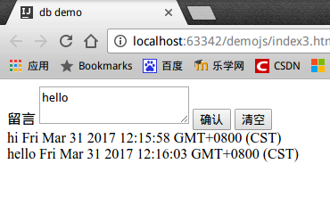
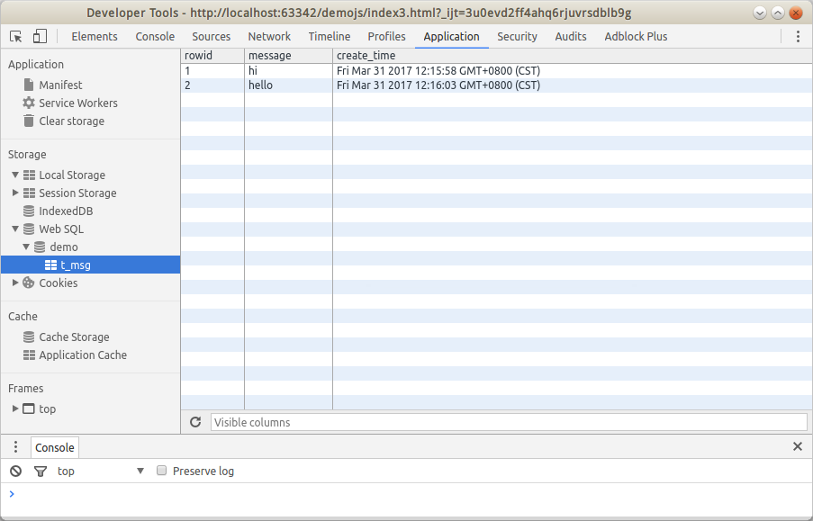
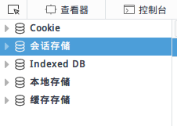

# WebSQL

htm5中，浏览器集成了一个SQLite本地数据库，这大大提高了web app的用户体验，一些数据可以直接存储在本地数据库中，和真正的客户端应用一样。

## 数据库操作

### 打开/创建数据库对象

```javascript
var db = openDatabase("mydb", "1.0", "Test db", 2 * 1024 * 1024)
```

参数分别是：数据库名，版本号，数据库描述，大小（字节）。如果数据库存在就打开，不存在就创建。

### 事务

```javascript
db.transaction(function(tx){
    tx.executeSql("");
});
```

transaction使用一个回调函数，其中是执行的sql语句。

### 增删改查

```javascript
transaction.executeSql(sqlquery, [], dataHandler, errorHandler);
function dataHandler(transaction, results);
function errorHandler(transaction, errmsg);
```

* executeSql()第一个参数是执行的sql语句（包含用“?”作为占位符），第二个参数是参数列表，第三个参数是执行成功时回调，第四个参数是执行出错回调。
* dataHandler()第一个参数是事务对象，第二个参数是查询结果集。结果集的rows属性保存了查询到的每条记录。
* errorHandler()第一个参数是事务对象（可以用于事务回滚），第二个参数是错误信息字符串

### 数据库实现留言本

```html
<!DOCTYPE html>
<html lang="zh-CN">
<head>
	<meta charset="UTF-8">
	<title>db demo</title>
</head>
<body>
	<label for="text">留言</label>
	<textarea id="text"></textarea>
	<button id="btn_submit">确认</button>
	<button id="btn_clear">清空</button>
	<div id="history"></div>
	<script>
		var db = openDatabase("demo", "1.0", "db demo", 1024 * 1024);

		var text_area = document.querySelector("#text");
		var button_submit = document.querySelector("#btn_submit");
		var button_clear = document.querySelector("#btn_clear");
		var history_div = document.querySelector("#history");

		button_submit.addEventListener("click", add, false);
		button_clear.addEventListener("click", clear, false);

		load();

		function add()
		{
			var data = text_area.value;
			var date = new Date();
			db.transaction(function(tx)
			{
				tx.executeSql("INSERT INTO t_msg VALUES (?,?)", [data, date]);
			});
			load();
		}

		function load()
		{
			db.transaction(function(tx)
			{
				tx.executeSql("CREATE TABLE IF NOT EXISTS t_msg(message text, create_time text)", []);
				tx.executeSql("SELECT * FROM t_msg", [], function(tx, rs)
				{
					history_div.innerHTML = "";
					for(var i = 0; i < rs.rows.length; i++)
					{
						var item = rs.rows.item(i);
						var new_div = document.createElement("div");
						new_div.innerHTML = item.message + " " + item.create_time;
						history_div.appendChild(new_div);
					}
				});
			});
		}

		function clear()
		{
			db.transaction(function(tx)
			{
				tx.executeSql("DROP TABLE IF EXISTS t_msg", []);
			});
			load();
		}
	</script>
</body>
</html>
```

### 上述代码运行结果

chrome



chrome调试器



### 为什么firefox不能运行


实际上firefox并没有实现Web SQL这个功能，firefox只有indexed db功能。查看firefox调试器的存储页面，也没有Web SQL。firefox仅支持Indexed DB，一种以NoSQL组织数据的数据库。



Indexed DB在Microsoft edge，firefox，chrome中都支持，因此浏览器的本地数据库可能Indexed DB是更好的选择，同时，firefox也因此拒绝实现WebSQL，而是只实现了IndexedDB。将来WebSQL标准也可能被废弃。
