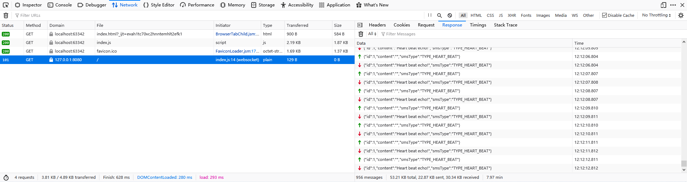

# WebSocket

WebSocket是HTML5中的一个重要特性，它能够实现基于浏览器的在单个TCP连接上全双工通信。另外，WebSocket是基于消息的应用层协议，底层基于TCP，通常对性能要求不高的场景，直接传递Json文本即可，非常简单易用。这篇笔记我们简单了解下WebSocket的使用。

注：后端支持WebSocket协议的框架有很多，比如JavaEE的JSR-356（Tomcat等均支持）、Netty框架等等，这里对于后端就不多做介绍了。

## WebSocket连接请求

WebSocket连接建立的过程是基于HTTP的，在浏览器中我们可以观察到相关内容。下面是一个例子，我们在`http://localhost:63342`这个页面上，请求建立WebSocket连接`ws://127.0.0.1:8080/`：

请求头：
```
GET / HTTP/1.1
Host: 127.0.0.1:8080
User-Agent: Mozilla/5.0 (Windows NT 10.0; Win64; x64; rv:81.0) Gecko/20100101 Firefox/81.0
Accept: */*
Accept-Language: zh-CN,en-US;q=0.7,en;q=0.3
Accept-Encoding: gzip, deflate
Sec-WebSocket-Version: 13
Origin: http://localhost:63342
Sec-WebSocket-Extensions: permessage-deflate
Sec-WebSocket-Key: aYQj19Q527ngoHx0KFFC2Q==
Connection: keep-alive, Upgrade
Pragma: no-cache
Cache-Control: no-cache
Upgrade: websocket
```

上面的HTTP请求头中，`Upgrade: websocket`指示该请求用于建立一个WebSocket连接，`Sec-WebSocket-Key`用于进行校验。

响应头：
```
HTTP/1.1 101 Switching Protocols
upgrade: websocket
connection: upgrade
sec-websocket-accept: ZErUtIOZ5NLu14E6coLrO8tnSQI=
```

响应HTTP头中，`101`状态是`Switching Protocols`，即切换协议，这里我们使用的是`websocket`协议。

## 查看WebSocket数据

如果WebSocket传送的是文本数据，那么调试起来实际上是十分方便的。直接在浏览器的调试工具中观察即可：



我这里使用的是火狐浏览器。

## WebSocket收发消息

下面代码中，我们编写了一段简单的程序，主要实现了三个内容：

1. 建立WebSocket连接
2. 接收服务端消息
3. 向服务端发送消息

```javascript
window.onload = function () {
    var infoBlock = document.getElementById('info-block');
    var reply = document.getElementById('reply');
    var replyBtn = document.getElementById('reply-btn');

    var socket = new WebSocket('ws://127.0.0.1:8080/');
    // 接收消息
    socket.onmessage = function (msg) {
        var sms = JSON.parse(msg.data);
        if (sms.smsType === 'TYPE_SMS') {
            infoBlock.innerText += sms.content;
        }
    };
    // 发送消息
    replyBtn.onclick = function () {
        if (socket.readyState === WebSocket.OPEN) {
            var wsMsg = JSON.stringify({ id: 1, content: reply.value, smsType: 'TYPE_SMS' });
            socket.send(wsMsg);
        }
    };
};
```
