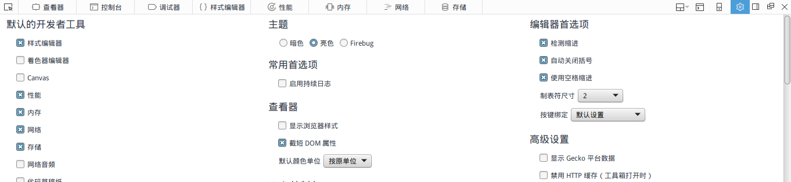
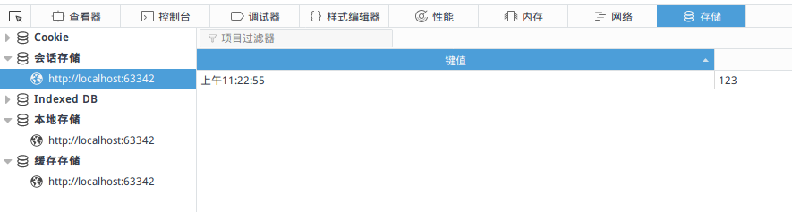

# WebStorage

用cookie存储一些数据时，cookie比较小，存取可能也不太方便（随http一起发送），因此出现了web storage。

web storage简单来说，就是操作一些键值对。其具体分为两种：

* session storage：一次会话的临时保存
* local storage：永久保存

注：

## Web Storage存取

* length属性 表示storage大小
* key(i) 根据索引获得键
* getItem(key) 根据键得到值
* setItem(key) 设置键值对
* removeItem(key) 删除键值对
* clear() 清空storage对象
* storage事件 storage改变时触发

## 例子代码

下面例子代码使用local storage实现了一个简单的留言本：

```html
<div>
    <div id="notes"></div>
    <div>
        <textarea id="textarea"></textarea>
    </div>
    <div>
        <button id="submit-btn">提交</button>
        <button id="reload-btn">刷新</button>
    </div>
</div>
```

```javascript
$(function () {
    var submitBtn = $('#submit-btn');
    var reloadBtn = $('#reload-btn');

    function addNotes() {
        var notes = localStorage.getItem('notes');
        if (!notes) {
            notes = [];
        } else {
            notes = JSON.parse(notes);
        }
        notes.push($('#textarea').val());
        localStorage.setItem('notes', JSON.stringify(notes));

        reloadNotes();
    }

    function reloadNotes() {
        var notesDiv = $('#notes').empty();

        var notes = localStorage.getItem('notes');
        if (notes) {
            notes = JSON.parse(notes);
            for (var i = 0; i < notes.length; i++) {
                notesDiv.append($('<div>' + notes[i] + '</div>'));
            }
        }
    }

    submitBtn.click(addNotes);
    reloadBtn.click(reloadNotes);
});
```

代码比较简单，值得注意的是，我们存取web storage的时候，都是使用了`JSON`进行了序列化和反序列化，这是因为web storage只能存储字符串格式，而我们代码中使用了数组，因此需要将其转为JSON存取。

## 在firefox中查看web storage

在设置中启用存储选项（左下角）



点击存储标签，session storage的内容就在“会话存储”中



## 安全性

web storage中和cookie一样，要注意xss的问题，不要将敏感信息存入其中，合理选择session storage还是local storage。

## 注意点

### local storage设置超时

local storage默认没有超时功能，是永久生效的（不包括用户手动清理缓存）。那么如何给local storage设置超时呢？可以在存入的数据加一个时间戳，然后判断就行了。

### session storage跨页面问题

实际使用中，有一点需要注意：session storage是不能跨浏览器标签页存储的，也就是说，假如我们把登录会话凭证存储在session storage中，那么用户如果同时打开两个标签页，在其中一个登录，刷新另一个标签页是不会具有登录状态的，这和Cookie不同。

也就是说，如果是传统的网页型站点，还是建议使用Cookie，而session storage更适合单页面应用、后台管理系统等。如果一定要在传统站点中使用web storage，则应该使用local storage。
