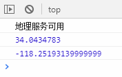

# 地理定位

地理位置API能够通过IP定位用户的经纬度。

```javascript
if ('geolocation' in navigator) {
  console.log('地理服务可用');
  navigator.geolocation.getCurrentPosition(function (pos) {
    // 获取纬度
    console.log(pos.coords.latitude);
    // 获取精度
    console.log(pos.coords.longitude);
  });
} else {
  console.log('地理服务不可用');
}
```

使用Chrome浏览器：



请求使用地理位置API时，浏览器会询问用户是否同意，只有经过用户同意，我们才能获得用户的地理位置。
