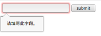
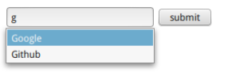

# HTML5对表单的加强

表单（数据提交）一直是业务系统的核心功能之一。HTML5为表单增加了一些新的功能和属性。本文以几种重要控件为例，介绍这些新特性。本文使用Firefox52浏览器。

## 验证功能加强

### required

指定此属性的表单字段为必填。注意，该功能不是自己的JavaScript代码实现的，而是浏览器内置实现的。

例子
```html
<form>
  <input type="text" required="true" name="username">
  <input type="submit" value="submit">
</form>
```

当什么都不写就提交表单时，运行状况如下：



### pattern

正则表达式匹配。

例子
```html
<input type="text" required="true" pattern="^[0-9]*$" name="username">
```

当输入项和正则表达式不匹配时，浏览器上会显示：请匹配要求的格式。

### maxLength

使用该属性时，该控件输入不能超过指定值。（超过就不能继续输入了）

例子
```html
<input type="text" maxLength="5" name="username">
```

### 控件自带的正则匹配

比如Email控件（`type="email"`），如果输入不是邮箱格式，则不允许提交，和使用一个正则表达式的text功能相同。

### novalidate

此属性可以放到表单上，或者控件元素上，加上`novalidate`的元素在表达提交时，不会自动验证。

## 额外属性

### placeholder

占位符。十分常用的属性。

### autocomplete

浏览器是否缓存以前输入过的值作为自动完成的下拉菜单。不是很实用。

### autofocus

加载页面后自动获得焦点。每个页面只能指定一个autofocus。由于和placeholder有点冲突，因此不是很实用。

## datalist控件

新的标签`<datalist>`可以提供输入的备选项，我们可以通过ajax的方式动态加载选项，达到边输入边搜索的目的。

```html
<input type="url" name="url" required list="url_list">
<datalist id="url_list">
  <option label="Google" value="https://www.google.com">
  <option label="Baidu" value="https://www.baidu.com">
  <option label="Github" value="https://www.github.com">
</datalist>
```


