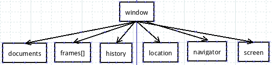
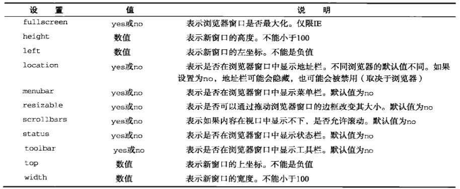
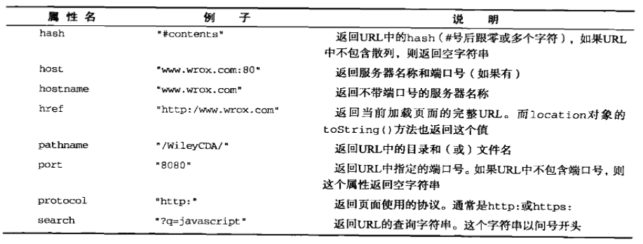
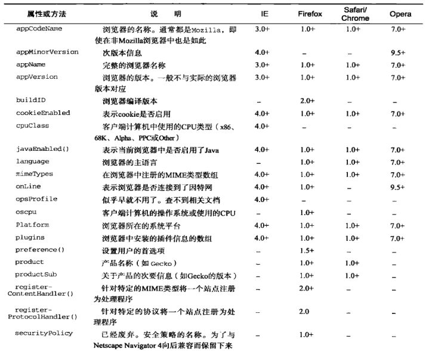
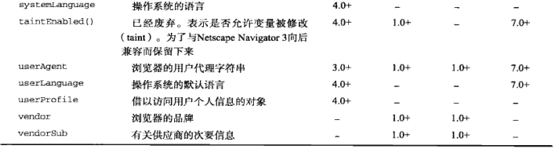

# BOM

浏览器对象模型，由浏览器实现，以前缺乏一个统一标准，bom最初是netscape浏览器标准的一部分，但现在已由w3c纳入html5标准内了。bom由核心对象window，和一系列相关对象构成。



如图所示，documents也是window的子对象。

本文只使用浏览器的事实标准：chrome和firefox进行测试。

# 全局window对象

javascript中，任何一个全局的变量或函数都是window的属性，window就是全局作用域，因此window的属性和函数也可以不用点“.”操作符直接访问。

## 浏览器位置/大小

这些属性实际上都没什么用，标准也不怎么统一。

* screenX/screenY：获得window相对于屏幕左边和上边的距离。
* innerWidth/innerHeight/outerWidth/outerHeight：内部视口宽度/高度，浏览器窗口宽度/高度

## 导航和打开窗口

### 打开新标签

在新标签中打开一个页面：
```javascript
window.open("http://www.baidu.com")
```

### 打开新窗口

新窗口有很多属性可选，可以open函数中在指定窗口属性：



```javascript
window.open("http://www.baidu.com", "new window", "width=640, height=480");
```

运行结果：


新窗口可以不经用户同意自行关闭。例子，打开新窗口1秒后关闭：

```javascript
function open_win()
{
	var new_win = window.open("http://www.baidu.com", "new window", "width=640, height=480");
	setTimeout(function()
	{
		new_win.close();
	}, 1000);
}
```

关闭后可以通过closed属性检查窗口打开还是关闭。

## 计时器

### setTImeout(function, delay)/clearTimeout(interval_id)

指定超时调用，清除超时调用。setTimeout返回一个interval_id，可以接收下来用于清除超时调用。

### setInterval(function, delay)/clearInterval(interval_id)

间歇调用，每个delay时间就调用一次。清除方法同上。

## 系统对话框

### alert(message)

弹出警告框，参数是警告内容。

### confirm(message)

弹出确认框，参数是确认内容。返回值true/false表示用户点击的是确认还是取消。

### prompt(message, textfield_default)

输入框，参数是提示信息和文本输入域默认值，返回值表示用户输入的是确认还是取消。

# location对象

location的属性：



## 改变当前页面

location.assign('http://www.baidu.com')，当前页面标签加载新页面，可以用浏览器后退按钮返回原来页面。

## 重新加载页面

location.reload()重新加载页面，如果传入参数true，表示不读取缓存重新加载页面

# navigator对象

用于识别客户端浏览器。属性列表：




