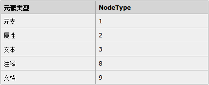

# DOM

文档对象模型，html DOM定义了访问和操作html文档的标准方法，由w3c定义，由浏览器实现。

DOM将html文档表达为树结构。

## DOM节点

文档中所有内容都是节点：

* 整个文档是一个文档节点
* 每个 HTML 元素是元素节点
* HTML 元素内的文本是文本节点
* 每个 HTML 属性是属性节点
* 注释是注释节点

## 节点树


节点树有父、子、同胞的概念。

# DOM编程接口

每一个节点被看成一个Element对象，DOM提供的编程接口就是这些对象的方法和属性，除此之外，还有一个Document对象表示整个文档。

## Document对象

document对象表示整个html页面，document是window的一个属性，因此能够直接访问。通过document可以取得与页面有关的信息，而且还能操作页面外观和其底层结构。

## 文档信息

* document.title 文档标题
* document.URL 文档url
* document.domain 文档域名
* document.referrer 来源页面url

## Element对象属性

### innerHTML

用于获取或替换html元素的内容。例子：
```html
<!DOCTYPE html>
<html lang="en">
<head>
	<meta charset="UTF-8">
	<title>DEMO</title>
</head>
<body>
	<div id="div1">
		<p>hello</p>
	</div>
	<script>
		//获得节点
		var div = document.getElementById("div1");
		//输出innerHTML
		console.log(div.innerHTML);
		//修改innerHTML
		div.innerHTML = "<h1>hello</h1>";
	</script>
</body>
</html>
```

控制台输出：`<p>hello</p>`

页面“hello”的标记被改为h1

### nodeName

nodeName 属性规定节点的名称。

* nodeName 是只读的
* 元素节点的 nodeName 与标签名相同
* 属性节点的 nodeName 与属性名相同
* 文本节点的 nodeName 始终是 #text
* 文档节点的 nodeName 始终是 #document

注释：nodeName 始终包含 HTML 元素的大写字母标签名

### nodeValue

规定节点的值：

* 元素节点的 nodeValue 是 undefined 或 null
* 文本节点的 nodeValue 是文本本身
* 属性节点的 nodeValue 是属性值

### nodeType

nodeType 属性返回节点的类型。nodeType 是只读的。



### style

style属性可以访问节点的css样式，例子：

```javascript
var div = document.getElementById("div1");
div.style.color = "red";
```

注：读取属性时，如果属性不存在返回空字符串而不是null

### getAttribute()/setAttribute()/removeAttribute()

获取/设置/移除属性，同样可用于css属性修改，但也可用于其他属性。

## Element对象访问

### getElementById()

返回带有指定ID的元素。

### getElementsByTagName()

返回指定标签名所有元素。

### getElementsByClassName()

返回指定class的所有元素。

### 访问方法级联操作

document可以看成文档根节点，因此如果想访问整个文档的所有<p>元素，使用document.getElementsByTagName("p")即可，如果像选出id="id"节点的子<p>元素，那么使用document.getElementById("id").getElementsByTagName("p")即可。

### 父、子、同胞导航属性

注意：这些属性包括文本节点，而不只是元素节点！如果指向访问元素节点（通常就是这样），请参考DOM扩展章节，Element Traversal API部分。

* parentNode：父节点
* firstChild：第一个子节点
* lastChild：最后一个子节点
* childNodes：子节点数组

## 创建html元素

* 使用innerHTML创建
* 使用createElement()创建，例子如下：

```javascript
var div = document.getElementById("div1");
var p = document.createElement("p");
var text = document.createTextNode("hello");
p.appendChild(text);
div.appendChild(p);
```

一些插入操作：

* appendChild()：添加子元素，插入位置是父节点的最后一个元素
* insertBefore()：在某个同胞节点前插入
* removeChild()：删除节点，使用`child.parentNode.removeChild(child)`类似代码，查找父子元素不用标注太多id属性
* replaceChild()：替换节点

## Text对象

文本节点由Text类型对象表示，可以使用createTextNode()创建。一般情况下，每个元素只有一个文本子节点。实际上处理文本节点，在Element对象上，用innerHTML就行了。

## 事件处理

请参考事件处理章节。
