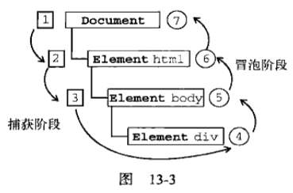
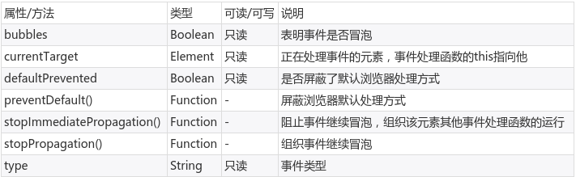

# 事件流

最初浏览器有两种截然相反的事件处理规则：事件捕获和事件冒泡，对于一组有父子关系的元素，事件处理的顺序规则决定了哪个元素先响应事件，最终w3c统一了一个标准：



事件处理被分为捕获阶段和冒泡阶段。单击div，从document开始捕获，然后向上冒泡。开发者可以通过`element.addEventListener()`的参数进行在捕获阶段还是冒泡阶段响应事件，但通常应该使用事件冒泡。

# 实现事件响应

## 由html标签属性指定

```html
<body>
	<button id="btn" onclick="btn_click()">click</button>
	<script>
		function btn_click()
		{
			alert("hello");
		}
	</script>
</body>
```

## DOM0级事件处理程序

```html
<body>
	<button id="btn">click</button>
	<script>
		var btn_click = function()
		{
			alert("hello");
		};
		document.querySelector("#btn").onclick = btn_click;
	</script>
</body>
```

## DOM2级事件处理程序

```html
<body>
	<button id="btn">click</button>
	<script>
		var btn_click = function()
		{
			alert("hello");
		};
		document.querySelector("#btn").addEventListener("click", btn_click, false);
	</script>
</body>
```

第三种功能最强大，可以指定捕获顺序（通常为冒泡），还可以使用`removeEventListener()`删除事件处理函数绑定（参数和add相同）。

## Event对象

上述三种事件处理方式，都会传入event对象到事件处理函数中，event对象的常用属性和方法：



# 事件类型

## UI事件

* load：页面加载完成在window上触发，图像加载完在img上触发
* unload：页面卸载后在window上触发
* error：发生javascript错误时在window上触发，无法加载图像在img上触发
* select：用户选择文本框中一个或多个字符时触发
* resize：窗口大小改变时在window上触发
* scroll：页面滚动条改变在html元素上触发，元素内滚动条滚动在元素内触发

## 焦点事件

* blur：元素失去焦点触发，这个事件不会冒泡
* focus：元素获得焦点触发，这个事件不会冒泡

## 鼠标与滚轮事件

* click：鼠标左键单击或按下回车键触发。
* dbclick：双击鼠标左键触发。
* mousedown：用户按下任意鼠标按钮触发。
* mouseenter：鼠标移动到元素范围内触发，不冒泡，内部元素不会触发。
* mouseleave：鼠标移动到元素范围外触发，不冒泡，内部元素不会触发。
* mousemove：鼠标移动时不停的触发。
* mouseout：鼠标移出某个元素触发，可能移到这个元素外部，也可能移到这个元素内部的某个元素。
* mouseover：鼠标移入某个元素触发。
* mouseup：鼠标释放触发。
* event.clientX 鼠标客户区x坐标
* event.clientY 鼠标客户区y坐标
* event.pageX 鼠标页面x坐标
* event.pageY 鼠标页面y坐标
* event.screenX 鼠标屏幕x坐标
* event.screenY 鼠标屏幕y坐标

注：我测试的时候，clientX/clientY和pageX/pageY在firefox和chrome中都是相同值，都是相对于页面的。

我们经常利用ctrl+单击的方式多选，实际上javascript中也可以捕获这种事件，鼠标+功能组合键：

* event.shiftKey shift键按下
* event.ctrlKey ctrl键按下
* event.altKey alt键按下
* event.metaKey win/cmd键按下

## 键盘与文本事件

* keydown 键盘按下，按住不放会重复触发
* keypress 键盘按键，按住不放会重复触发
* keyup 按键弹起

注：实际上以上三个属性大部分都在用户输入文本时用到，除此之外游戏时也会用到

* event.keyCode 按键的键码

## html5事件

### contextmenu

实现右键菜单例子：
```html
<body>
	<div id="my_div" style="width: 640px; height: 480px; background-color: red"></div>
	<div id="my_menu" style="visibility: hidden; background-color: green; position: absolute">
		<ul>
			<li>li1</li>
			<li>li2</li>
			<li>li3</li>
			<li>li4</li>
		</ul>
	</div>
	<script>
		var div = document.querySelector("#my_div");
		var menu = document.querySelector("#my_menu");
		var show_menu = function(event)
		{
			event.preventDefault();
			menu.style.left = event.clientX + "px";
			menu.style.top = event.clientY + "px";
			menu.style.visibility = "visible";
		};
		var hide_menu = function(event)
		{
			menu.style.visibility = "hidden";
		};
		div.addEventListener("click", hide_menu, false);
		div.addEventListener("contextmenu", show_menu, false);
	</script>
</body>
```

### beforeunload

页面卸载之前触发，可以对用户弹个框，询问是否真的退出。

### readystatechange

页面状态改变，页面状态：

* uninitialized：未初始化
* loading：正在加载
* loaded：加载完毕
* interactive：交互，可以操作对象了，但是还没加载完成
* complete：完成
