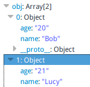

# json和javascript

json是流行的数据交换和存储格式，部分功能上替代了xml，尤其是ajax时的数据传递。而json和javascript是能够对应起来的。他们语法相近，转换十分容易。

# json语法

数据为键值对，由逗号分隔，大括号保存对象，方括号保存数组。

和javascript对应

* 数据键值对对应对象属性
* 方括号数组对应javascript数组

# json转javascript对象

```javascript
var json_str = '[{"name":"Bob","age":"20"},{"name":"Lucy","age":"21"}]';
var obj = JSON.parse(json_str);
```

运行结果：



# javascript对象转json

```javascript
var bob = {};
var lucy = {};
bob.name = "Bob";
lucy.name = "Lucy";
bob.age = 20;
lucy.age = 21;
var obj = [bob, lucy];
var json_str = JSON.stringify(obj);
```
