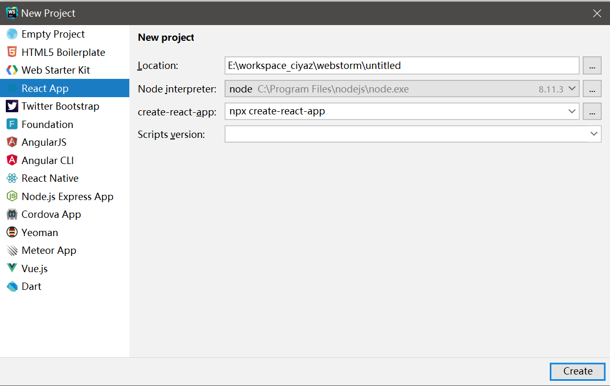
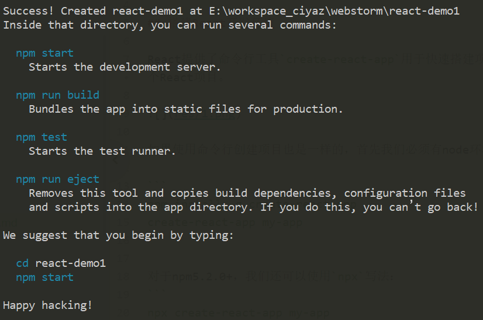
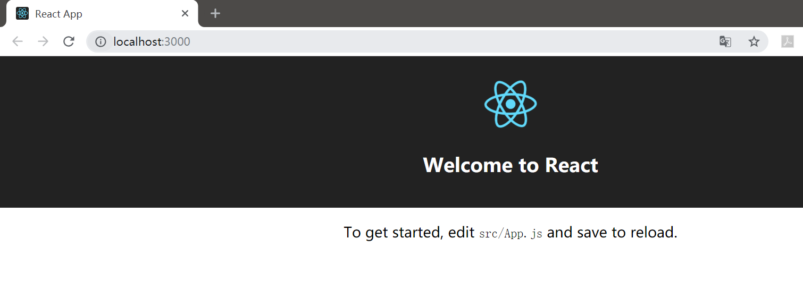

# React环境搭建和简单使用

React是一套用于构建用户界面的JavaScript库。React来自Facebook，最初用于开发Instagram，后被Facebook开源。React的同类产品有Angular，Vue等，这两个框架在其他章节中已经介绍过了。

## create-react-app

## 创建React工程

React提供了命令行工具`create-react-app`用于快速搭建项目模板，如下图所示，我们可以直接使用webstorm创建一个React项目。



如果使用命令行创建项目也是一样的，首先我们必须有node环境和npm，然后执行下列命令：

```
npx create-react-app my-app
```

注：必须使用`5.2.0`以上版本的`npm`，如果使用`nvm`，可能找不到`npx`命令，我们可以使用`npm init react-app my-app`代替。

常见完成后，会在控制台中提示成功，并告诉我们一些构建和运行命令：



运行`npm start`，然后使用浏览器访问`http://localhost:3000`，就可以看到模板项目启动了。



注：虽然我们仅仅是想写个demo，但是基于npm辣鸡的包管理机制和国内的网络状况，该过程会下载近2w个文件到项目目录中，约150MB，比较慢。

## 使用antd组件库

下面介绍如何在React项目中引入阿里开发的antd组件库。

文档：[https://ant.design/docs/react/use-with-create-react-app-cn](https://ant.design/docs/react/use-with-create-react-app-cn)

安装antd和一些需要的依赖。

```
npm install --save antd react-app-rewired babel-plugin-import
```

* 注：`react-app-rewired`和`babel-plugin-import`用于实现CSS的按需加载

修改package.json。

```json
"scripts": {
  "start": "react-app-rewired start",
  "build": "react-app-rewired build",
  "test": "react-app-rewired test"
},
```

在项目根目录创建一个`config-overrides.js`，用于覆盖`create-react-app`的默认配置：

```javascript
const {injectBabelPlugin} = require('react-app-rewired');

module.exports = function override(config, env) {
    config = injectBabelPlugin(
        ['import', {libraryName: 'antd', libraryDirectory: 'es', style: 'css'}],
        config,
    );
    return config;
};
```

这样，我们就可以在`create-react-app`创建的工程中正常使用`antd`组件库了。

## 手动搭建工程

`create-react-app`屏蔽了很多工程配置的细节，一些工程配置修改起来可能不如我们自己手动搭建的方便使用，这里我们再手动搭建一个最基础的React工程，主要操作包括集成Webpack、Webpack的调试服务器、Babel、CSS和JSX的Loader，以及React相关内容，以加深对相关工具链和依赖库的理解。

警告：由于Node生态的组件生态比较粗放，推荐参考着`create-react-app`或是`antd-pro`等工程模板中的依赖版本和配置来搭建工程。

### 初始化前端工程

```
mkdir react-demo
cd react-demo
npm init
```

### 安装配置webpack

```
npm install --save-dev webpack-cli webpack style-loader css-loader webpack-dev-server
```

### 安装配置babel

```
npm install --save-dev babel-loader @babel/core @babel/preset-env @babel/preset-react
```

### 安装React

```
npm install --save react react-dom
```

### 相关配置

package.json
```json
{
  "name": "react-demo",
  "version": "1.0.0",
  "description": "",
  "main": "src/index.js",
  "scripts": {
    "build": "webpack --mode production",
    "dev": "webpack-dev-server --mode development --watch --hotOnly"
  },
  "author": "",
  "license": "ISC",
  "devDependencies": {
    "@babel/core": "^7.11.0",
    "@babel/preset-env": "^7.11.0",
    "@babel/preset-react": "^7.10.4",
    "babel-loader": "^8.1.0",
    "css-loader": "^4.2.0",
    "style-loader": "^1.2.1",
    "webpack": "^4.44.1",
    "webpack-cli": "^3.3.12",
    "webpack-dev-server": "^3.11.0"
  },
  "dependencies": {
    "react": "^16.13.1",
    "react-dom": "^16.13.1"
  }
}
```

webpack.config.js
```javascript
const path = require('path');
const webpack = require('webpack');

module.exports = {
    entry: './src/index.js',
    output: {
        filename: 'bundle.js',
        path: path.resolve(__dirname, './dist')
    },
    resolve: {
        extensions: ['.js', '.jsx']
    },
    module: {
        rules: [
            {
                test: /\.css$/,
                use: ['style-loader', 'css-loader'],
            },
            {
                test: /\.js|\.jsx$/,
                exclude: /node_modules/,
                loader: "babel-loader"
            }
        ]
    },
    devtool: "source-map",
    devServer: {
        host: 'localhost',
        port: 8080,
        open: true,
        contentBase: path.join(__dirname, './dist')
    },
    plugins: [
        new webpack.HotModuleReplacementPlugin()
    ]
};
```

.babelrc
```json
{
    "presets": [
        "@babel/preset-env",
        "@babel/preset-react"
    ]
}
```
