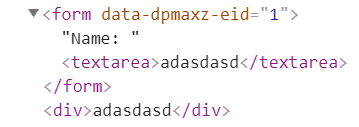

# 处理表单

这篇笔记我们主要学习React中，有关表单数据和事件处理的内容。

我们知道，表单控件如输入框、复选框等，它们内部都会保持着自己的数据容器，但是React组件的数据中心的组件的state，页面上数据的改变需要触发React中组件state数据的改变，才能使得应用的数据保持一致。

Angular或Vue中，都实现了表单数据的双向绑定，非常方便，但是React推崇单向数据流，虽然对于整个应用的数据逻辑构建有一定好处，但是对于表单处理着实比较麻烦。

## 将表单控件数据同步到state

下面代码使用React实现了数据的双向绑定，表单input中输入的字符串，会同步显示到下面的div中。

```javascript
import React, {Component} from 'react';

class NameForm extends React.Component {
    constructor(props) {
        super(props);
        this.state = {value: ''};

        this.handleChange = this.handleChange.bind(this);
    }

    handleChange(event) {
        this.setState({value: event.target.value});
    }

    render() {
        return (
            <div>
                <form>
                    Name: <input type="text" value={this.state.value} onChange={this.handleChange}/>
                </form>
                <div>
                    {this.state.value}
                </div>
            </div>
        );
    }
}

export default NameForm;
```

在这个例子中，使用React实现了将表单的输入绑定到组价的state，而state中数据同步到页面上则是React实现的。

这里要注意的就是input的值是如何传递给组件的，`<input>`标签上使用了`value`属性，绑定的是`{this.state.value}`这个状态数据属性，这一步实现的是从state向input标签同步数据。

当input中的数据改变时，`handleChange()`函数被回调，我们通过`event.target.value`取出数据，并设置给state，这一步实现的是从input标签向state同步数据。

## 针对textarea标签的改进

我们知道`<textarea>`使用文本节点值表示这个控件容纳的数据，这和input控件不同。React中对此做出了改进，我们可以像使用input一样使用textarea。

```javascript
render() {
    return (
        <div>
            <form>
                Name: <textarea value={this.state.value} onChange={this.handleChange}/>
            </form>
            <div>
                {this.state.value}
            </div>
        </div>
    );
}
```

页面上真正显示的textarea会自动将值作为文本节点。



## 针对select标签的改进

原始的select控件中，使用`<option>`的`selected`属性表示一个选项被选中了，React中并不使用`selected`属性，而是在根`select`标签中使用`value`属性表示选中项。这种改进便于JSX的编写。

下面的代码实际上就是把上面例子中的input换成了select，select选中的值改变，下面div中显示的值也会同步改变。

```javascript
render() {
    return (
        <div>
            <form>
                <select value={this.state.value} onChange={this.handleChange}>
                    <option value="apple">apple</option>
                    <option value="pear">pear</option>
                    <option value="banana">banana</option>
                </select>
            </form>
            <div>
                {this.state.value}
            </div>
        </div>
    );
}
```

## 多个组件的双向绑定

如果一个表单有多个组件（通常都是这样的），我们显然不应该定义一大堆`handleXXXChange()`函数，而是使用一个统一的回调函数处理所有组件的`onChange`事件，这需要我们在回调函数中判断做出修改的究竟是哪一个控件，并作出相应的处理。

```javascript
import React, {Component} from 'react';

class NameForm extends React.Component {
    constructor(props) {
        super(props);
        this.state = {username: '', password: '', repassword: ''};

        this.handleChange = this.handleChange.bind(this);
    }

    handleChange(event) {
        //这里可以使用event.target.type和event.target.name进行判断，传来event对象是哪一个表单控件
        if (event.target.type === 'text') {
            //这里使用了...运算符，代表对象拼接拷贝
            this.setState({...this.state, username: event.target.value});
        } else if (event.target.type === 'password') {
            if(event.target.name === 'password') {
                this.setState({...this.state, password: event.target.value});
            } else if(event.target.name === 'repassword') {
                this.setState({...this.state, repassword: event.target.value});
            }
        }
    }

    render() {
        return (
            <div>
                <form>
                    <input name="username" type="text" value={this.state.username} onChange={this.handleChange}/>
                    <input name="password" type="password" value={this.state.password} onChange={this.handleChange}/>
                    <input name="repassword" type="password" value={this.state.repassword} onChange={this.handleChange}/>
                </form>
                <div>
                    {this.state.username}
                    {this.state.password}
                    {this.state.repassword}
                </div>
            </div>
        );
    }
}

export default NameForm;
```

## 使用UI库的表单控件

实际上我们可能很少直接用HTML原生的表单控件，一般都是直接使用UI库的，对应的方法需要查看相应的文档，UI库实际上就是封装好的一些React组件，能够直接供我们调用。
