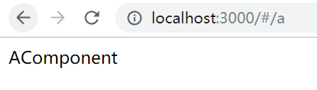
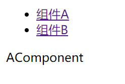

# 使用前端路由

手动实现前端路由我们在其他笔记章节已经做过了，原理可以参考相关章节，这里摘录其中一段有关hash路由的原理：

> 井号本来是用作页面上的锚点，URL中出现井号有一个特点，井号后面的内容改变不会触发页面重新加载，但是会触发`hashchange`事件，前端路由就是据此实现的（和jsonp之类的技术一样，属于有点hack的写法，代码难看且难以理解，但没办法，这属于历史遗留问题）...

纯前端路由有两种比较常用的实现方式：

1. 使用锚点`#`实现hash路由（最常用）
2. 使用HTML5的HistoryAPI实现（适用于较新版本的浏览器）

## 在React项目中安装前端路由组件

React项目中，我们使用`react-router`实现前端路由。这里使用的`react`版本是`16.5.2`，`react-router`版本是`4.3.1`，该版本和之前相比改动较大。

```
npm install --save react-router-dom
```

注：`react-router`分为`dom`和`native`两个包，用于web开发和React Native开发，web开发引入`react-router-dom`即可。

## 路由组件

在最新版本的`react-router`中，路由是通过一系列组件动态配置的，而不是一个静态的配置文件，这和旧版本不同。通过组件配置的路由更加可控、灵活，推荐使用。下面介绍一下有哪些常用的路由组件，以及它们的基本使用方法。

### `<Router>` 路由器

`react-router`中，路由对hash路由和HistoryAPI路由均进行了实现，它们分别对应`<HashRouter>`和`<BrowserRouter>`两个组件，具体使用哪种路由方式实际上需要根据我们的项目进行具体设计，通常一个同样需求用两种方式都能实现，只不过浏览器兼容性、服务器配置都稍有不同。

为DOM根组件启动路由功能：

index.js
```javascript
import React from 'react';
import ReactDOM from 'react-dom';
import App from './components/App';
import {HashRouter} from 'react-router-dom';


ReactDOM.render((
        <HashRouter>
            <App />
        </HashRouter>
    ),
    document.getElementById('root'));
```

通常情况下，我们都会使用Router组件作为整个web应用的根组件，这样组件树内部的路由组件才能起作用。而“真正的根组件”，`<App>`被包裹在其中。

### `<Route>`路由配置

`<App>`组件中，包含了几个子组件，并为其配置了路由，写法是下面这样的：

App.js
```javascript
import React from 'react';
import {Route} from 'react-router-dom';
import AComponent from './AComponent';
import BComponent from './BComponent';

function App(props) {
    return (
      <div>
          <Switch>
              <Route path={'/a'} component={AComponent}/>
              <Route path={'/b'} component={BComponent}/>
          </Switch>
      </div>
    );
}

export default App;
```

我们可以尝试访问一下浏览器，地址为`http://localhost:3000/#/a`这种形式：



Route的其他功能：

* exact：精确匹配，其实如果访问`/a/b`，那么路由`path={'/a'}`也能匹配，如果给`<Route>`指定`exact`，那么就能实现精确匹配，必须指定`/a`才能正确匹配路由`path={'/a'}`。

### `<Switch>` 分支条件

上面例子代码中，我们除了`<Route>`组件，还使用了`<Switch>`组件，实际上上面的例子不同switch也能正常工作，但是还是推荐在一组并列的route组件外层套一个switch。

`<Switch>`的作用：当内部的route组件有多个可以匹配当前URL时，只会渲染一个组件，而不会渲染多个。

多个路由匹配同一个URL的情况如下，如果URL是`/a/b`两个route都可以正确匹配，页面上会把两个组件都渲染出来：

```javascript
<div>
      <Route path={'/a'} component={AComponent}/>
      <Route path={'/a/b'} component={BComponent}/>
</div>
```

如果用`<Switch>`包裹，那么如果访问`/a/b`就只会渲染AComponent了。

### 路径参数

后端路由实现中，我们访问的URL通常会带上参数，前端路由也能够实现带参数路由。

路由中参数的写法：

* `/:参数名`：必要参数，如果请求URL中没有这个参数，路由就根本不会匹配
* `/:参数名?`：可选参数，可以不存在，在组件内部如果尝试访问，显然会返回一个`undefined`

下面例子中实现了一个路由的可选参数，访问`http://localhost:3000/#/user`这样的URL，页面显示`未指定用户ID`，访问类似`http://localhost:3000/#/user/1`，会显示`user 1`。

```javascript
<Route path={'/user/:id?'} component={UserComponent}/>
```

```javascript
import React from 'react';

function UserComponent(props) {
    let userId = props.match.params.id;
    if(userId === undefined) {
        return (<div>未指定用户ID</div>);
    } else {
        return (<div>user {userId}</div>);
    }
}

export default UserComponent;
```

### `<Link>` 链接

我们的web应用通常要实现点击一个链接，跳转到一个页面，前端路由中，跳转的就是路由组件。`react-router`中，这个链接可以用`<Link>`实现。

下面，我们为前面第一个例子加一个导航链接组。

NavComponent.js
```javascript
import React from 'react';
import {Link} from 'react-router-dom';

function NavComponent(props) {
    return (
        <ul>
            <li><Link to='/a'>组件A</Link></li>
            <li><Link to='/b'>组件B</Link></li>
        </ul>);
}

export default NavComponent;
```

首先我们定义一个导航组件，这里使用`react-router-dom`的`<Link>`组件作为链接，并通过`to`属性指定链接跳转的位置。

App.js
```javascript
import React from 'react';
import {Switch, Route} from 'react-router-dom';
import AComponent from './AComponent';
import BComponent from './BComponent';
import NavComponent from './NavComponent';

function App(props) {
    return (
        <div>
            <NavComponent/>
            <Switch>
                <Route path={'/a'} component={AComponent}/>
                <Route path={'/b'} component={BComponent}/>
            </Switch>
        </div>
    );
}

export default App;
```

在我们的根UI组件中，加入导航组件。

这样我们的前端路由就能正常工作了：



### `<Redirect>`重定向

该组件和`<Link>`用法差不多。

例子：
```javascript
<Redirect to='/b'/>
```

### history API

我们知道HTML5有history API，`react-router`则针对自己的路由编写了一套类似的API接口，用于实现手动路由跳转等功能。

### location 对象

location对象对应的就是一次路由操作，我们向history中入栈一个location，就会触发路由跳转，我们也可以给路由对象绑定一个监听器，路由触发时，回调函数会传入这个location作为参数。

一个location对象的例子（这里用的是`BrowserRouter`进行演示）：
```javascript
{
  hash: ""
  key: "jnvqdg"
  pathname: "/a"
  search: ""
  state: undefined
}
```

说明：

* hash：路由`#`后面的值
* key：一个随机值，location对象的逻辑主键
* pathname：当前路径
* search：查询参数，就是`?`后面的字符串
* state：路由可携带的载荷

#### location.state 实现路由参数传递

前面我们用路径参数实现过路由参数传递，实际上我们还可以用`location.state`实现，它可以携带一个对象，而不仅仅是一个参数字符串。

传入state：
```javascript
history.push({
  'pathname': '/a',
  'state':{
    'val':10
  }
});
```

取出：
```javascript
console.log(history.location.state);
```

#### push

跳转，该方法作用了用户点击`<Link>`组件相同。

例子：
```javascript
<button onClick={() => {
                const {history} = props;
                history.push({
                    'pathname': '/a'
                });
            }}>1</button>
```

注意：必须是`<Route>`包装过的组件（使用`component`指定的），才能访问到`props.history`。

#### replace

跳转，该方法作用了用户点击`<Redirect>`组件相同 。

#### listen

注册监听器，当地址发生变化时执行回调函数。

示例代码：
```javascript
const {history} = props;
    history.listen((location)=>{
        console.log(location.pathname);
    });
```

### 其他高级用法

可以参考[该组件的Github仓库](https://github.com/ReactTraining/react-router)
