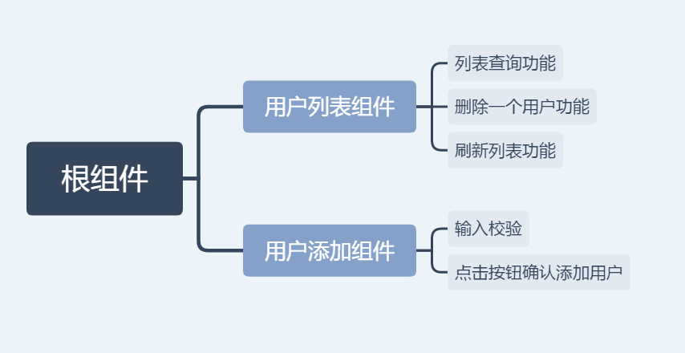
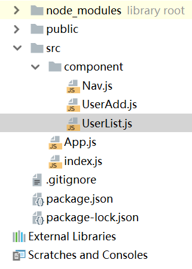
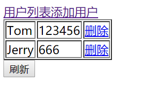
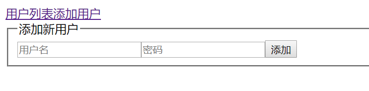

# 服务器端整合

这篇笔记中，我们使用React构建一个简单的web应用，并使用axios和后台服务器通信，后台使用SpringBoot搭建一个简单的增删改查REST服务。

注：为了简单起见，这里接口设计的并不是很标准。

## 服务端接口和反向代理

* POST `/api/user` 添加一个user
* DELETE `/api/user/{username}` 根据用户ID删除一个user
* PUT `/api/user/{username}` 根据username更新一个user信息，如果该username不存在，则创建一个
* GET `/api/user` 获取全部user
* GET `/api/user/{username}` 根据username查询一个user

后端Tomcat运行于8080端口，前端webpack dev server运行于3000端口。为了便于前后端整合调试，我们再起一个Nginx作为反向代理，它运行于本地的80端口，这里我们这样映射：

```
location / {
    proxy_pass   http://127.0.0.1:3000;
}

location /api/user {
    proxy_pass   http://127.0.0.1:8080/api/user;
}
```

后期补充：实际上这里可以直接用webpack-dev-server的反向代理功能，不需要再启动一个Nginx作反向代理，配置例子如下，在`webpack.dev.config.js`的`devServer`属性中配置反向代理`proxy`：

```javascript
proxy:{
  '/api': {
    target: 'http://127.0.0.1:8080',
    changeOrigin: true,
    //pathRewrite: { '^/server': '' }, 注：这里还可以配置路径重写
  }
}
```

假设Tomcat运行在8080端口，webpack dev server运行在80端口，这样配置好后，就可以在`localhost/api`访问`localhost:8080/api`了。如果有需要也可以加上路径重写功能，比如加上`pathRewrite: { '^/server': '' }`，那么我们访问`localhost/server/api`就能访问到`localhost:8080/api`。

## 功能概述

我们设计这样几个功能，实现用户的增加、删除、查询：

1. 查询用户列表，有一个刷新按钮，点一下可以刷新所有用户，有一个删除按钮，可以删除一个用户
2. 添加一个用户

## 组件这样设计



## 创建功能和引入依赖

这里我们直接使用`create-react-app`创建一个功能。

```
npx create-react-app userlist-demo
```

我们需要路由，以及axios和后端通信。

```
npm install --save react-router-dom
npm install --save axios
```

## 编写代码

根据前面设计好的规划，我们一步步编写代码。



首先在`index.js`中引入路由组件。

index.js
```javascript
import React from 'react';
import ReactDOM from 'react-dom';
import App from './App';
import {HashRouter} from 'react-router-dom';

ReactDOM.render(
    (<HashRouter>
        <App/>
    </HashRouter>),
    document.getElementById('root'));
```

在根组件中，我们通过`<Switch>`和`<Route>`进行路由的定义。

App.js
```javascript
import React, {Component} from 'react';
import {Switch, Route} from 'react-router-dom';
import Nav from './component/Nav';
import UserList from './component/UserList';
import UserAdd from './component/UserAdd';

class App extends Component {
    render() {
        return (
            <div>
                <Nav/>
                <Switch>
                    <Route path={'/add'} component={UserAdd}/>
                    <Route path={'/'} component={UserList}/>
                </Switch>
            </div>
        );
    }
}

export default App;
```

我们编写一个简单的导航组件，它使用`<Link>`标签配合路由组件使用。

component/Nav.js
```javascript
import React from 'react';
import {Link} from 'react-router-dom';

function Nav() {
    return (
        <div>
            <span>
                <Link to="/">用户列表</Link>
            </span>
            <span>
                <Link to="/add">添加用户</Link>
            </span>
        </div>
    );
}

export default Nav;
```

添加用户组件，实际上就是一个表单。

component/UserAdd.js
```javascript
import React, {Component} from 'react';
import axios from 'axios';

class UserAdd extends Component {
    constructor() {
        super();
        this.state = {username: '', password: ''};

        this.handleFormSubmit = this.handleFormSubmit.bind(this);
        this.handleFormChange = this.handleFormChange.bind(this);
    }

    handleFormChange(event) {
        if (event.target.name === 'username') {
            this.setState({...this.state, username: event.target.value});
        } else if (event.target.name === 'password') {
            this.setState({...this.state, password: event.target.value});
        }
    }

    handleFormSubmit(event) {
        event.preventDefault();

        if(this.state.username === '') {
            alert('用户名不能为空');
            return;
        }
        if(this.state.password === '') {
            alert('密码不能为空');
            return;
        }

        axios.post('/api/user', {
            username : this.state.username,
            password : this.state.password
        }).then((resp) => {
            alert("添加成功");
        });
    }

    render() {
        return (
            <form onSubmit={this.handleFormSubmit}>
                <fieldset>
                    <legend>添加新用户</legend>
                    <input type="text" placeholder="用户名" name="username" onChange={this.handleFormChange}/>
                    <input type="password" placeholder="密码" name="password" onChange={this.handleFormChange}/>
                    <input type="submit" value="添加"/>
                </fieldset>
            </form>
        );
    }
}

export default UserAdd;
```

用户列表组件，实际上是一个表格。

component/UserList.js
```javascript
import React, {Component} from 'react';
import axios from 'axios';

class UserList extends Component {
    constructor() {
        super();
        this.state = {users: []};

        this.refreshComponentData = this.refreshComponentData.bind(this);
        this.deleteUser = this.deleteUser.bind(this);
    }

    /**
     * 组件加载完后刷新一下数据
     */
    componentDidMount() {
        this.refreshComponentData();
    }

    /**
     * 刷新数据的ajax操作
     */
    refreshComponentData() {
        axios.get('/api/user').then((resp) => {
            if (resp.data.users !== undefined) {
                this.setState({
                    users: resp.data.users
                });
            }
        });
    }

    /**
     * 访问 DELETE /api/user/{username} 删除一条数据
     * @param username 表格<a>标签传进来的用户名
     * @param event 事件对象
     */
    deleteUser(username, event) {
        event.preventDefault();
        axios.delete('/api/user/' + username).then((resp) => {
            console.log(resp);
        }).then((resp) => {
            //删除操作执行成功后刷新一下数据
            this.refreshComponentData();
        });
    }

    render() {
        if (this.state.users.length === 0) {
            return (<p>无数据</p>);
        } else {
            return (
                <div>
                    <table border="solid">
                        <tbody>
                        {this.state.users.map((val) => {
                            return (
                                <tr key={val.username}>
                                    <td>{val.username}</td>
                                    <td>{val.password}</td>
                                    <td>
                                        <a href="#" onClick={this.deleteUser.bind(this, val.username)}>删除</a>
                                    </td>
                                </tr>
                            );
                        })}
                        </tbody>
                    </table>
                    <button onClick={this.refreshComponentData}>刷新</button>
                </div>
            );
        }
    }
}

export default UserList;
```

注意：循环渲染的时候要为`<tr>`指定一个`key`，这是React的Virtual Dom实现需要的。

## 执行结果

虽然没有CSS，样式比较简陋，但是我们已经实现了一个比较完整的带有前后端通信功能的React应用。

列表组件（上方是导航条，两个链接挤在一起了）：



添加组件：


