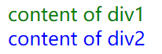
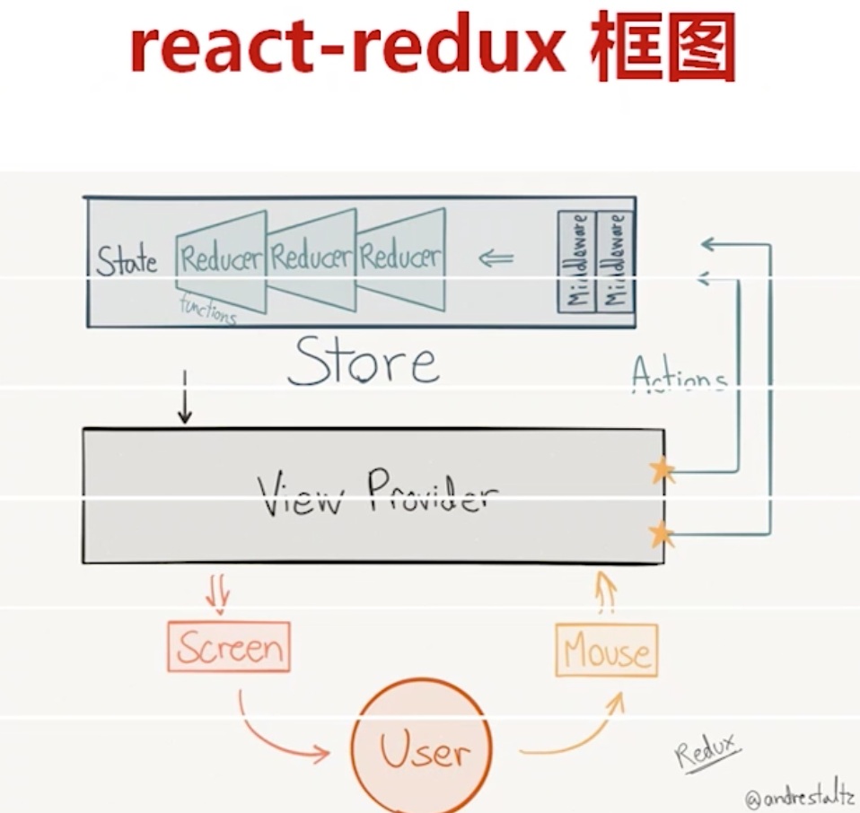

# Redux的状态数据流管理模型

React经常搭配一个叫做Redux的东西使用，但是Redux乍看一比较难以理解，这篇笔记专门介绍一下什么是Redux，以及在React项目中使用Redux有什么意义。

## 什么是Redux

Redux是一种模式，在组件状态（state）关联比较复杂的应用中，使用Redux模式管理这些组件状态，能够让我们的思路更加清晰。它不能让我们少些一些代码，相反使用Redux会让我们的项目变得更复杂，但是复杂并不是意味着困难，Redux让我们的思路能够变得更简单。

什么时候需要用到Redux呢？比如一个React开发的web应用需要能够更换皮肤，应用整体更换皮肤后每个组件都要更改其加载的CSS，如果不使用Redux，一种实现方式是从组件树的根组件开始，通过props和回调函数把“更换CSS”这个目的一层层传递给下层组件，想一想就太复杂了，不可能这样做。另一种方式是使用React组件的context，context内部的状态相当于全局可以访问的，通过context能够较为简单的解决这个问题。

但是如果我们应用的组件之间的状态关联非常复杂，全部使用全局数据就会非常混乱，使用全局数据打破了React组件化设计的初衷，极大的增加了组件之间的耦合性，而且复杂的全局数据会使代码变得难以维护，这时候许多人给出了各种各样的解决方案，其中Redux是比较简洁、比较规范、逼格最高的一种，受到了广泛使用。

## Redux模式的编写

我们先不考虑React，也不考虑Redux相关的库，我们使用最普通的JavaScript代码演示一下Redux模式的原理，这里我们直接使用JavaScript的DOM操作API代替React模拟两个简单的组件。

页面上定义了两个`<div>`，我们假装它们是两个组件。

index.html
```html
<!DOCTYPE html>
<html lang="zh">
<head>
    <meta charset="UTF-8">
    <title>Redux Demo1</title>
</head>
<body>
<div id="div1"></div>
<div id="div2"></div>
<script src="index.js"></script>
</body>
</html>
```

JavaScript代码中有相应的函数通过改变全局组件状态的方式，修改这两个“组件”的内容，但是我们使用的是Redux的写法，而不是直接修改。除此之外，还实现了通过回调函数实现当组件数据被改变时，自动触发组件的重新渲染。

index.js
```javascript
/**
 * 重新渲染整个组件
 * @param appState 新的组件状态数据
 * @param oldAppState 之前的组件状态数据
 */
function renderApp(appState, oldAppState = {}) {
    //判断一下，如果新的组件数据和原来的一样，就不要重新渲染了，这样做能提高性能，但是我们要比较的是两个不同对象的值，因此采用JSON.stringify()
    if (JSON.stringify(oldAppState) !== JSON.stringify(appState)) {
        console.log("app rendered");
        //这里分别调用渲染组件div1和div2的函数
        renderDiv1(appState.div1, oldAppState.div1);
        renderDiv2(appState.div2, oldAppState.div2);
    }
}

/**
 * 重新渲染div1组件
 * @param state
 * @param oldState
 */
function renderDiv1(state, oldState = {}) {
    //判断是否需要重新渲组件
    if (JSON.stringify(state) !== JSON.stringify(oldState)) {
        console.log("div1 rendered");
        let componentDom = document.querySelector('#div1');
        componentDom.innerHTML = state.text;
        componentDom.style.color = state.color;
    }
}

/**
 * 重新渲染div2组件
 * @param state
 * @param oldState
 */
function renderDiv2(state, oldState = {}) {
    if (JSON.stringify(state) !== JSON.stringify(oldState)) {
        console.log("div2 rendered");
        let componentDom = document.querySelector('#div2');
        componentDom.innerHTML = state.text;
        componentDom.style.color = state.color;
    }
}

/**
 * store可以看做全局状态数据的一个操作类，所有操作必须通过action对象通知store，让store去修改真正的数据（appState对象）
 * @param stateChanger 定义如何修改全局状态数据的函数
 * @returns {{getState: (function(): *), dispatch: dispatch, subscribe: subscribe}} store对象
 */
function createStore(stateChanger) {
    //这里使用了观察者模式，用途是实现dispatch被调用后，自动回调各个组件的render()函数
    let listeners = [];
    return {
        //全局存储的组件状态数据
        appState : {
            div1: {
                text: 'content of div1',
                color: 'red'
            },
            div2: {
                text: 'content of div2',
                color: 'blue'
            }
        },
        /**
         * 规范上，我们不能直接操作state对象，因此为store对象定义了getState()方法，而且返回的是当前appState的一个拷贝（注意拷贝深度）
         * @returns {{div1: *, div2: *}} 返回全局状态数据的拷贝
         */
        getState: function () {
            return {
                div1: Object.assign({}, this.appState.div1),
                div2: Object.assign({}, this.appState.div2)
            };
        },
        /**
         * 这个函数实现的就是“通知”store去修改全局状态数据
         * @param action 代表“如何”修改全局状态数据
         */
        dispatch: function (action) {
            stateChanger(this.appState, action);
            listeners.forEach((listener) => listener());
        },
        /**
         * 观察者模式，将重新渲染的回调函数绑定到store里，dispatch调用时，会导致所有的listener函数回调
         * @param listener 重新渲染时回调的函数
         */
        subscribe: function (listener) {
            listeners.push(listener);
        }
    };
}

/**
 * 定义改变全局组件数据的函数
 * @param state 状态数据对象
 * @param action 修改的动作类
 */
function stateChanger(state, action) {

    switch (action.type) {
        case 'UPDATE_DIV1_TEXT':
            state.div1.text = action.text;
            break;
        case 'UPDATE_DIV1_COLOR':
            state.div1.color = action.color;
            break;
        default:
            break;
    }
}
let store = createStore(stateChanger);

//临时存储原来的状态
let oldState = store.getState();
//让store订阅重新渲染时的回调函数
store.subscribe(() => {
    let newState = store.getState();
    renderApp(newState, oldState);
    oldState = newState;
});

//初始化页面，第一次手动调用绘制组件的函数
renderApp(store.getState());

//构造一个action对象，通知store去修改数据
store.dispatch({
    type: 'UPDATE_DIV1_COLOR',
    color: 'green'
});
```

显示效果：



页面控制台日志输出：
```
index.js:9 app rendered
index.js:24 div1 rendered
index.js:38 div2 rendered
index.js:9 app rendered
index.js:24 div1 rendered
```

可以发现，修改组件状态数据的操作成功生效，修改页面上部分组件的状态数据后，并不是所有组件都被重新渲染了。

## Redux实现分析

从网上找了一张图：



Redux中有这么几个重要的概念：

1. action：action只是一个数据结构，描述了一个事件（用以通知store该做出何种动作），而不提供具体操作的逻辑，action至少要有一个type属性
2. reducer：定义如何改变状态数据，对应上面代码中的stateChanger()函数，所有reducer可以匹配一个事件是否和自己相关，相关就拿走该事件修改状态数据，否则将状态数据原样返回。reducer其实就是这样的函数：`(state, action)=>newState`。
3. store：用于存储组件状态数据，对应上面代码中我们实现的store

React有三个核心原则：

1. 单一数据源
2. state只读
3. 使用纯函数执行操作（reducer）

Redux能让我们的程序架构变得更加清晰合理，就是因为Redux是基于以上三个原则设计的。

## 在React中使用Redux

上面说了一堆，其实就是为了说明Redux究竟是干什么用的。上面代码就是一个简易版的Redux库，但是我们实际使用中，Redux一般是和React一起使用的，因此我们需要`redux`、`react-redux`以及许多其他的可选依赖库，这些库又引入了一些新的API和新的概念，如何在React项目中方便的使用已经编写好的Redux，将在下篇笔记中介绍。
