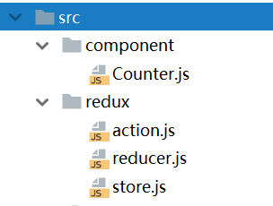

# Redux库的使用

React中使用Redux，通常需要引入`redux`和`react-redux`这两个库，但是直接使用`react-redux`库的API对于不了解Redux库的用户来说是很难理解的，因此这篇笔记我们主要介绍Redux库，我们只使用`redux`这个依赖，实现React组件的状态管理。

这篇笔记中，我们实现一个最简单的计数器`Counter`组件。阅读这篇笔记需要了解Redux实现的状态管理架构的原理：参考笔记章节：`Redux的状态数据流管理模型`。

## 引入依赖

```
npm install --save redux
```

## 编写相关组件

这里我们这样组织代码，和Redux相关的代码文件放在`src/redux`里，React组件除了根组件App以外，放在`src/component`里。



## 代码实现

这里我们先编写需要store响应的动作，我们的Counter有三个动作：加一，减一，重置为零。下面代码中，我们用常量定义了动作的`type`属性，以便于其他地方使用。除此之外，为生成动作定义了函数。

redux/action.js
```javascript
export const INCREMENT = "counter_INCREMENT";
export const DECREMENT = "counter_DECREMENT";
export const RESET = "counter_RESET";

export function increment() {
    return {type: INCREMENT}
}

export function decrement() {
    return {type: DECREMENT}
}

export function reset() {
    return {type: RESET}
}
```

下面代码中，我们编写了reducer函数，用于响应动作。注意代码中reducer的参数和返回值：参数是动作和旧的状态，返回值是新的状态。

redux/reducer.js
```javascript
import {INCREMENT, DECREMENT, RESET} from "./action";

function reducer(state = 0, action) {
    switch (action.type) {
        case INCREMENT:
            return state + 1;
        case DECREMENT:
            return state - 1;
        case RESET:
            return 0;
        default:
            return state;
    }
}

export default reducer;
```

下面代码就是创建了一个store，给其他地方引用。

redux/store.js
```javascript
import {createStore} from 'redux';
import reducer from './reducer';

let store = createStore(reducer);

export default store;
```

下面代码是计数器组件，计数器的值是从外层组件传进来的，我们先不管，注意三个按钮的回调函数，我们使用lambda表达式定义了回调时，调用`store.dispatch(action)`，其中action参数则是我们封装为了一个函数。

component/Counter.js
```javascript
import React, {Component} from 'react';
import store from '../redux/store';
import {increment, decrement, reset} from '../redux/action';

class Counter extends Component {
    constructor(props) {
        super(props);
    }

    render() {
        return (
            <div>
                <div>{this.props.value}</div>
                <div>
                    <button onClick={() => store.dispatch(increment())}>+</button>
                    <button onClick={() => store.dispatch(decrement())}>-</button>
                    <button onClick={() => store.dispatch(reset())}>C</button>
                </div>
            </div>
        );
    }
}
```

根组件中，使用生命周期回调函数`componentDidMount`绑定store监听，当store中的state状态改变时，回调`onChange()`函数。

App.js
```javascript
import React, {Component} from 'react';
import Counter from './component/Counter';
import store from './redux/store';

class App extends Component {

    constructor() {
        super();
        this.onChange = this.onChange.bind(this);
        this.state = {value : 0};
    }

    componentDidMount() {
        store.subscribe(this.onChange);
    }

    onChange() {
        this.setState({value : store.getState()});
    }

    render() {
        return (
            <Counter value={this.state.value}/>
        );
    }
}

export default App;
```

这样我们就用Redux实现了一个计数器组件。

## 一些说明

上面例子中，我们用了两个React组件，App和Counter，内层组件Counter的状态数据通过`props`间接依赖于外层组件App（实际上我们可以把按钮的回调函数也封装到外层组件，通过props传入Counter），这样我们就把一个组件划分成“只负责显示”和“只负责逻辑”的两部分，结构更加清晰。实际上，`react-redux`就是这么封装的，一个传统的组件被划分为UI组件（内层）和容器组件（外层），而且`react-redux`能够自动生成容器组件。

实际上，你会发现上面使用Redux相比不使用，多写了很多代码，而且似乎“破坏”了React最初设计的组件化的结构，但实际上当项目的状态数据结构越来越复杂之后，这种将组件的状态数据统一管理，使用store/action/reducer，能够使我们的项目结构更加清晰。
