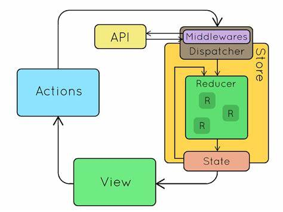
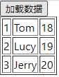

# Redux异步操作中间件

前面我们介绍的`redux`相关内容，都是同步式的发送`action`到`reducer`来修改`redux`数据的，还没有涉及异步操作相关内容，实现异步操作需要额外的插件。

`redux-thunk`和`redux-saga`是两个比较常用的`redux`异步插件，其中`redux-saga`写法比较美观，而且易于理解，这里我们介绍后者。

## redux-saga简介



如图所示，`redux-saga`在原本`redux`的基础上，以中间件形式封装了一层。我们可以通过`redux-saga`触发异步调用，然后间接的触发`reducer`。

## 例子

具体概念非常难以表述，其实逻辑很简单，我们这里直接通过一个例子来了解`redux-saga`的用法。下面例子中，我们点击按钮，3秒后返回数据，并渲染到页面上。



因为只是一个小例子，我们的工程目录组织的也比较简洁，如下所示：

```
redux-demo
    |_src
        |_App.jsx // 根组件
        |_services.js // 封装的异步调用
        |_pages
            |_loadTable.jsx // 页面组件
        |_redux
            |_store.js // 定义redux的store
            |_actions/loadTable.js // 定义redux的action
            |_containers/loadTable.js // 定义react-redux的外层包装
            |_reducers/loadTable.js // 定义redux的reducer
            |_sagas
                |_loadTable.js // 定义redux-saga的异步操作
                |_sagas.js // 整合所有子异步操作
```

App.jsx
```javascript
import React, { Component } from 'react';
import LoadTable from './redux/containers/loadTable';

class App extends Component {
    constructor(props) {
        super(props);
        this.state = {};
    }
    render() {
        return (
            <div>
                <LoadTable/>
            </div>
        );
    }
}

export default App;
```

services.js
```javascript
export function loadTableService() {
    // 用settimeout假装是执行了一个异步请求
    return new Promise((resolve, reject) => {
        setTimeout(() => {
            resolve({
                rspCode: '0',
                rspMsg: '操作成功',
                data: [
                    {id: 1, name: 'Tom', age: 18},
                    {id: 2, name: 'Lucy', age: 19},
                    {id: 3, name: 'Jerry', age: 20},
                ]
            });
        }, 1000);
    })
}
```

这里注意，我们的异步操作返回的是一个`Promise`对象，数据封装在`resolve()`回调中，这样`redux-saga`才能进行调用。

redux/actions/loadTable.js
```javascript
export const actionType = {
    LOAD_TABLE: 'lt_LOAD_TABLE',
    SAVE_TABLE: 'lt_SAVE_TABLE'
};

export function saveTableAction(payload) {
    return {
        type: actionType.SAVE_TABLE,
        payload: payload
    };
}

export function loadTableAction() {
    return {
        type: actionType.LOAD_TABLE
    };
}
```

这里我们定义了两个`Action`，`LOAD_TABLE`用来触发`redux-saga`去异步加载数据，`SAVE_TABLE`用于同步保存数据到`redux`的存储中。

redux/reducers/loadTable.js
```javascript
import {actionType} from '../actions/loadTable';

const initialState = {
    tableData: []
};

function loadTableReducer(state = initialState, action) {
    switch (action.type) {
        case actionType.SAVE_TABLE:
            return {...state, tableData: action.payload};
        default:
            return state;
    }
}

export default loadTableReducer;
```

`reducer`中，我们编写了保存数据的同步操作。

redux/sagas/loadTable.js
```javascript
import {saveTableAction} from '../actions/loadTable';
import {call, put} from 'redux-saga/effects';
import {loadTableService} from '../../services';

export function* loadTableEffect() {
    const resp = yield call(loadTableService);
    yield put(saveTableAction(resp.data));
}
```

`sagas`中，我们编写了调用异步接口`loadTableService`，加载数据的异步操作。

这里注意，我们编写的是一个`Generator`函数，并用`yield`执行返回每一步操作。这里`redux-saga`的作用就体现出来了，它会自动调用`Generator`函数的每一步，而不是我们编写一大串嵌套代码。

redux/sagas/sagas.js
```javascript
import {takeEvery} from 'redux-saga/effects';
import {actionType} from '../actions/loadTable';
import {loadTableEffect} from "./loadTable";

function* sagas() {
    yield takeEvery(actionType.LOAD_TABLE, loadTableEffect);
}

export default sagas;
```

上面代码中，`takeEvery`的作用是每触发一次`LOAD_TABLE`，就调用一次我们之前编写的`loadTableEffect`，`loadTableEffect`会异步获取数据，并触发`SAVE_TABLE`，数据存储到`redux`后会自动触发渲染页面，这样一个完整的单项数据流就跑通了。

redux/store.js
```javascript
import { createStore, applyMiddleware } from 'redux';
import createSagaMiddleware from 'redux-saga';
import loadTableReducer from './reducers/loadTable'
import sagas from './sagas/sagas';

const sagaMiddleware = createSagaMiddleware();

const store = createStore(
    loadTableReducer,
    applyMiddleware(sagaMiddleware)
);

sagaMiddleware.run(sagas);

export default store;
```

这里不要忘记，我们创建`strore`时，需要引入`sagaMiddleware`。

pages/loadTable.jsx
```javascript
import React, {Component} from 'react';
import {loadTableAction} from '../redux/actions/loadTable';

export class LoadTable extends Component {
    constructor(props) {
        super(props);
        this.state = {};
    }

    handleBtnClick = () => {
        const {dispatch} = this.props;
        dispatch(loadTableAction());
    };

    render() {
        const tableData = this.props.state.tableData;
        return (
            <div>
                <button onClick={this.handleBtnClick}>加载数据</button>
                <table border="1">
                    {
                        tableData.map((d) => (
                            <tr>
                                <td>{d.id}</td>
                                <td>{d.name}</td>
                                <td>{d.age}</td>
                            </tr>
                        ))
                    }
                </table>
            </div>
        );
    }
}
```

redux/containers/loadTable.js
```javascript
import {connect} from 'react-redux';
import {LoadTable as LoadTableInner} from '../../pages/loadTable';

let LoadTable = connect((state) => ({state}), (dispatch) => ({dispatch}))(LoadTableInner);

export default LoadTable;
```

上面两段代码是创建页面的JSX和`react-redux`的包装组件，这里比较简单就不多说了。
