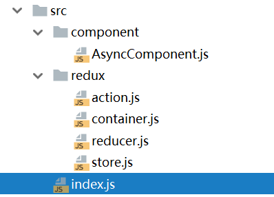
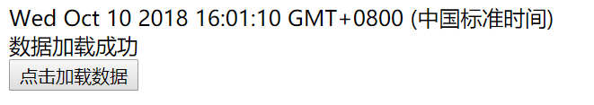

# 异步中间件之redux-thunk

这里所说的“中间件”说白了就是一个函数，它在一个action的处理过程中插了一步操作，但实际上这个过程中也没啥功能可插的，主要就是ajax的时候实现异步加载数据。这里我们主要介绍一下`redux-thunk`，它是一个异步中间件。

## redux-thunk的例子

下面我们用redux-thunk实现一个例子：点击按钮，用`setTimeout()`假装是在加载数据，界面显示`加载中`，1秒后加载完成，界面显示加载的数据（这里加载的数据是日期）。



index.js
```javascript
import React from 'react';
import ReactDOM from 'react-dom';
import {Provider} from 'react-redux';
import App from './redux/container';
import store from './redux/store';
import registerServiceWorker from './registerServiceWorker';

ReactDOM.render(
    (<Provider store={store}>
        <App/>
    </Provider>),
    document.getElementById('root'));

registerServiceWorker();
```

src/redux/action.js
```javascript
export const LOAD_DATA = "asyncComponent_LOAD_DATA";
export const LOAD_DATA_SUCCESS = "asyncComponent_LOAD_DATA_SUCCESS";
export const LOAD_DATA_FAILED = "asyncComponent_LOAD_DATA_FAILED";

export function loadData() {
    return (dispatch) => {
        //立即同步发送一个action
        dispatch(loadDataAction());
        //异步的action
        setTimeout(() => {
            dispatch(loadDataSuccessAction(new Date().toString()));
        }, 1000);
    };
}

function loadDataAction() {
    return {
        type: LOAD_DATA,
        msg: '数据加载中'
    }
}

function loadDataSuccessAction(data) {
    return {
        type: LOAD_DATA_SUCCESS,
        payload: data,
        msg: '数据加载成功'
    }
}

function loadDataFailedAction() {
    return {
        type: LOAD_DATA_FAILED,
        msg: '数据加载失败'
    }
}
```

注意上面代码的写法，我们除了各个Action，还编写了一个`loadData()`函数，这个函数的返回值是一个接受`dispatch`参数的函数，异步操作就是在这里定义的，我们在异步函数中产生了一个`action`。

src/redux/container.js
```javascript
import {connect} from 'react-redux';
import {bindActionCreators} from 'redux';
import AsyncComponent from '../component/AsyncComponent';
import {loadData} from './action';

const mapStateToProps = (state) => ({
    data: state.data,
    status: state.status
});

const mapDispatchToProps = (dispatch) => ({
    handleLoadBtn: bindActionCreators(loadData, dispatch)
});

let App = connect(mapStateToProps, mapDispatchToProps)(AsyncComponent);

export default App;
```

上面代码中，我们的`handleLoadBtn`显然是一个处理异步操作的按钮回调事件，这里我们使用`redux`库提供的`bindActionCreators()`，间接调用之前的`loadData()`。

注：实际项目中发现`bindActionCreators`不太好用，例如上面例子中不方便向`loadData()`传参数，我们可以这么写：

```javascript
const mapDispatchToProps = (dispatch) => ({
    handleLoadBtn: (param) => {
      loadData(param)(dispatch);
    }
});
```

src/redux/reducer.js
```javascript
import {LOAD_DATA, LOAD_DATA_SUCCESS, LOAD_DATA_FAILED} from "./action";

function reducer(state, action) {
    switch (action.type) {
        case LOAD_DATA:
            return {...state, status: action.msg};
        case LOAD_DATA_SUCCESS:
            return {...state, data: action.payload, status: action.msg};
        case LOAD_DATA_FAILED:
            return {...state, status: action.msg};
        default:
            return state;
    }
}

export default reducer;
```

上面代码中，`reducer()`函数会根据各个不同的Action修改state到新的状态。

src/redux/store.js
```javascript
import {createStore, applyMiddleware} from 'redux';
import thunkMiddleware from 'redux-thunk';
import reducer from './reducer';

let store = createStore(
    reducer,
    {data: '', status: ''},
    applyMiddleware(thunkMiddleware));

export default store;
```

上面代码中，注意`createStore()`的几个参数：第一个是reducer函数，第二个是state的初始状态，第三个我们使用`applyMiddleware(thunkMiddleware)`告诉redux这里应用`redux-thunk`异步中间件。

src/component/AsyncComponent.js
```javascript
import React, {Component} from 'react';

class AsyncComponent extends Component {
    constructor(props) {
        super(props);
    }

    render() {
        return (
            <div>
                <div>{this.props.data}</div>
                <div>{this.props.status}</div>
                <button onClick={this.props.handleLoadBtn}>点击加载数据</button>
            </div>
        );
    }
}

export default AsyncComponent;
```

## 运行结果



## 从后台请求数据

参考笔记章节：`服务器端整合开发`。
