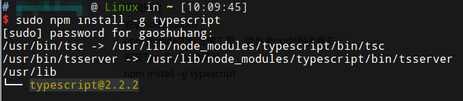
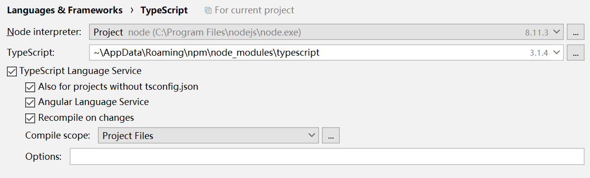

# TypeScript简介

TypeScript是由微软开发的开源编程语言，是JavaScript的超集，在JavaScript的基础上，添加了可选的静态类型和基于类的面向对象编程。简而言之，其实TypeScript就可以当作加了强类型和语法糖的JavaScript。

TypeScript代码通过TypeScript编译器，生成JavaScript代码，使其可以在浏览器或node上运行，最新的Angular框架也使用TypeScript编写。

## 环境搭建

### 安装node和npm

npm是node的包管理工具，请参考node相关章节。

### 安装TypeScript编译器

```
npm install -g typescript
```



安装完成后，可以在终端中使用tsc命令，编译TypeScript代码。

### 使用WebStorm

我们可以直接新建一个空的工程，然后创建TypeScript文件，WebStorm会自动识别文件的扩展名，以应用对应的语法检查，直接就可以正常编写了。

WebStorm能够即时编译我们编写的TypeScript文件，如图，选择`recompile on changes`：



注：WebStorm一般内置了一个TypeScript编译器，但可能不是最新版本的。
