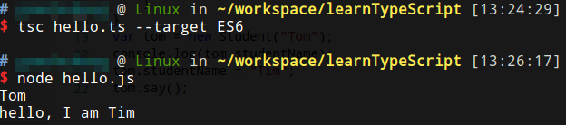

# 接口

## TypeScript中接口的意义

TypeScript的接口相对于Java，具有更广泛的意义。TypeScript接口更像是一种数据对象类型的规定，而Java中更偏向于行为的描述，例子：

```javascript
interface LabelledValue {
  label: string;
}

function printLabel(labelledObj: LabelledValue) {
  console.log(labelledObj.label);
}

let myObj = {size: 10, label: "Size 10 Object"};
printLabel(myObj);
```

TypeScript接口可以这样理解：

1. myObj对象有size属性和label属性，并传入printLabel()函数中。
2. 接口LabelledValue规定了这样一种对象：有一个属性是string类型。
3. printLabel定义了参数必须符合LabelledValue接口，即：拥有一个string类型的属性，myObj符合这种规定。
4. printLabel内，打印LabelledValue规定的string类型属性。

注意：

接口属性的定义没有顺序。

## 可选属性

```javascript
interface SquareConfig {
  color?: string;
  width?: number;
}
```

使用“?”表示可选属性，可选属性可以不存在，尝试获取不存在的属性将得到`undefined`。

使用可选属性的好处是对可能存在的属性进行预定义，例如下面的例子代码:

```javascript
interface SquareConfig {
    color?: string;
    width?: number;
}

function createSquare(config: SquareConfig): { color: string; area: number } {
    // 预定义的默认属性
    let newSquare = {color: "white", area: 100};
    // 如果某属性不存在就使用预定义的值
    if (config.color) {
        newSquare.color = config.color;
    }
    if (config.width) {
        newSquare.area = config.width * config.width;
    }
    return newSquare;
}
```

## 只读属性

```javascript
interface Point {
    readonly x: number;
    readonly y: number;
}
let p1: Point = { x: 10, y: 20 };
p1.x = 5; // error!
```

只读属性不能修改，和const区别：属性使用readonly，变量使用const。

## 对象字面量的额外类型检查

下面稍微修改之前讲解接口部分的代码，我们不定义`let myObj = {size: 10, label: "Size 10 Object"}`，而是直接使用字面量作为函数参数：

```javascript
interface LabelledValue {
    label: string;
}

function printLabel(labelledObj: LabelledValue) {
    console.log(labelledObj.label);
}

printLabel({size: 10, label: "Size 10 Object"});
```

上述代码会产生编译错误。

传递给createSqure()函数的参数是对象字面量，这会产生额外的类型检查，由于接口中不存在`size`属性，因此是无法通过编译的。

注：为什么会针对对象字面量做额外检查？因为按正常人的思维，参数类型都已经指定为接口类型了，对象字面量多余的字段根本就是无意义的，因此会报错。

## 类型断言

类型断言能够检查传入参数是否是指定类型，如果类型不符合抛出编译错误，以免运行时才发现bug。

```javascript
let mySquare = createSquare({ width: 100, opacity: 0.5 } as SquareConfig);
```

其实JavaScript中，我们也经常手动编写一个类型断言的功能，检查传入参数是否符合要求，以便于调试我们的代码。

## 接口描述函数类型

下面代码中使用接口规定了函数类型：

```javascript
interface SearchFunc {
  (source: string, subString: string): boolean;
}
let mySearch: SearchFunc;
mySearch = function(source: string, subString: string) {
  let result = source.search(subString);
  if (result == -1) {
    return false;
  }
  else {
    return true;
  }
}
```

调用签名指定了函数的参数类型和返回值类型。

## 接口描述可索引类型

```javascript
interface StringArray {
  [index: number]: string;
}
let myArray: StringArray;
myArray = ["Bob", "Fred"];
let myStr: string = myArray[0];
```

接口中使用了索引签名，表示用number索引，得到的是string类型。索引支持字符串和数字。

# 类

现代JavaScript使用函数式编程和基于对象的面向对象方式（而不是基于类的），这种方式是历史原因造成的，对于熟练使用Java/C++编程的程序员来说，这种编程方式需要额外的学习。TypeScript中的面向对象写法和传统语言更相似。

## 使用类

```javascript
class Student{
    private _studentName:string;
    constructor(studentName:string){
        this._studentName = studentName;
    }
    public get studentName(){
        return this._studentName;
    }
    public set studentName(newName:string){
        this._studentName = newName;
    }
    public say():void{
        console.log("hello, I am " + this._studentName);
    }
}
var tom:Student = new Student("Tom");
console.log(tom.studentName);
tom.studentName = "Tim";
tom.say();
```

基本和Java相同，类Student定义了一个string属性，一个构造器方法，一组set/get方法，一个say()方法。实例化类时，使用new关键字。this引用表示类的实例。

* 属性可以用private，public，protected修饰，但默认为public。构造器可以用public修饰，但没有意义。
* protected表示在该类的派生类中可以访问该属性。
* 可以指定readonly，使属性为只读。
* 存取器：set/get使用方法如上述代码，注意如果只有get没有set，该属性自动设置为只读，私有属性和存取器暴露的属性不能同名，例子中使用下划线`_studentName`表示私有属性。

编译运行上述代码：



注意：`--target ES6`，表示生成EcmaScript6标准的代码。

## 静态成员属性

TypeScript中也可以定义类本身的静态属性：

```javascript
class User {
    static typeName: string = '用户';
    username: string;

    constructor(username: string) {
        this.username = username;
    }
}

// 访问静态成员属性
console.log(User.typeName);

// 访问实例成员属性
let user: User = new User('Tom');
console.log(user.username);
```

注意，实例对象中访问类静态成员，会抛出编译错误，当然，本身这样做也没有任何意义。

## 抽象类和抽象方法

`abstract`关键字可以标识抽象类和抽象方法，抽象类必须被实现类继承后才能使用。

```javascript
abstract class Dog {
    abstract bark():void;
}

class MyDog extends Dog {
    bark(): void {
        console.log('Woof!');
    }
}

let dog:Dog  = new MyDog();
dog.bark();
```

## 实现接口

类实现接口例子：

```javascript
interface ClockInterface {
    currentTime: Date;
    setTime(d: Date);
}
class Clock implements ClockInterface {
    currentTime: Date;
    setTime(d: Date) {
        this.currentTime = d;
    }
    constructor(h: number, m: number) { }
}
```

和Java一样，接口描述了类的公共部分。接口之间可以继承，一个类可以实现多个接口。
