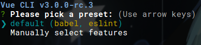
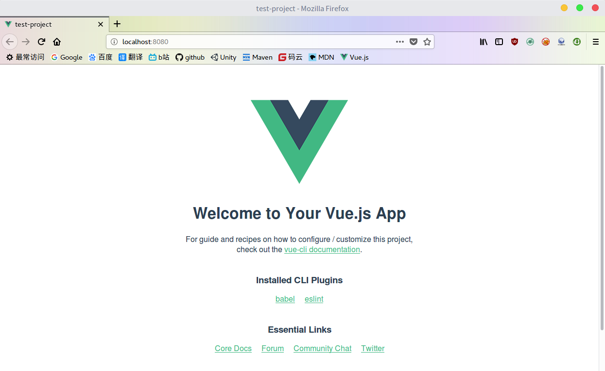
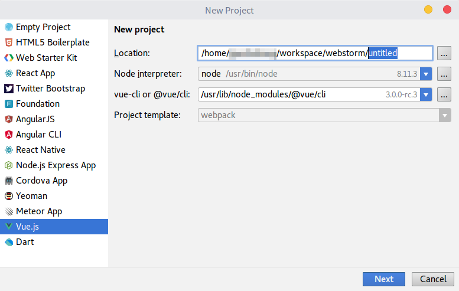
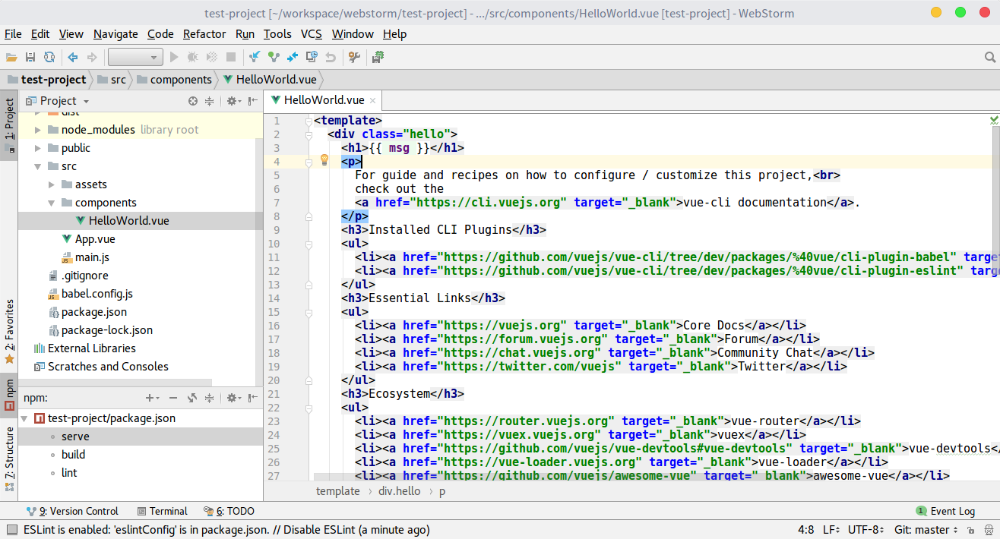
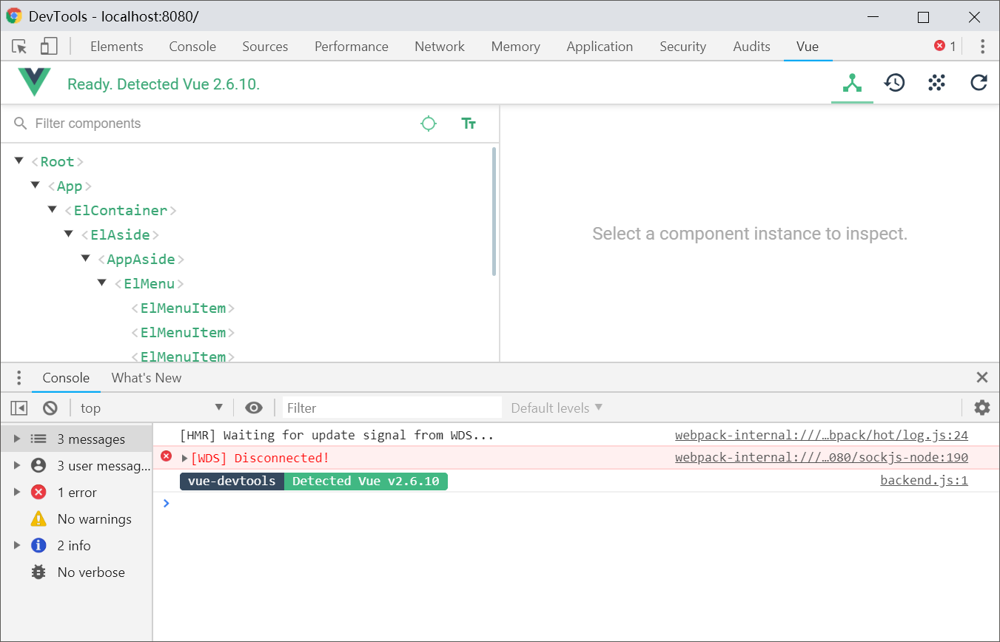

# Vue 简介

Vue是一个网页前端框架，用于构建基于浏览器的客户端应用。和Angular相比，Vue像是Angular的简化版，比Angular功能更精简，学习和使用上更加简单，有更高的灵活性，而且作者是国人，中文文档比较齐全，在国内外都很受欢迎。

Angular2不得不说实际操作起来比较复杂，像是在写JavaEE，但JavaEE有Eclipse、Intellij IDEA这种自动化的IDE支持，实际体验不仅没有复杂性带来的操作难度，反而能强烈感到这种复杂设计带来的清晰、严谨的架构，Angular好像除了Angular-CLI之外，没有自动化程度高、还很靠谱的IDE工具支持，写起来有点不胜其烦。

关于前端框架的讨论，在Angular2相关章节已经介绍过了。和Angular相同，考虑是否使用Vue时，要根据应用的具体需求进行判断，不要强行使用徒增项目的复杂度。前端技术更新很快，Vue现在的版本是2.x。

Vue官方网站 [https://cn.vuejs.org/](https://cn.vuejs.org/)

# 开发环境搭建

## 手动搭建简易环境

单人写小项目或是自己随便写写，直接把需要的依赖包下载下来（或使用npm下载），引入`index.html`就行了。通常情况下，我们可能需要这几个包：

* jquery.min.js
* vue.min.js
* vue-router.min.js

这种做法不支持单文件组件`.vue`，不支持热部署，依赖管理不方便，打包不方便，但对于小项目这些都不是问题。

多人合作的较大项目中，自己用各种工具搭建环境又太麻烦了，一般不主要关注前端技术的程序员根本搞不清发展飞快的各种前端工具，于是作者写了个`vue-cli`工具帮我们自动配置。

## 使用vue-cli

现在最新的版本应该是`vue-cli 3`，这个版本貌似还不是正式版，而且和`2.x`还有不小的区别，文档也不全。

安装
```
npm install -g @vue/cli
```

创建项目
```
vue create <项目名>
```



这里要我们选择项目需要哪些基础的组件，这些组件的选择涉及项目的整体配置，后面还有几个配置，根据提示来就行了。总之最后就装了2w多文件，120+MB，和往常一样，建议使用固态硬盘。

构建和运行项目，默认端口8080
```
npm run serve
```



项目产品模式打包
```
npm run build
```

项目目录结构：
```
|-dist 项目产品模式打包后的输出结果
|-node_modules 依赖库
|-public
  |-favicon.ico 网站图标
  |-index.html 应用入口页面
|-src
  |-App.vue 根组件
  |-assets 图片之类的静态资源
  |-components 我们自己编写的组件
  |-main.js 入口JavaScript文件
```

具体每个文件怎么编写，项目创建好后已经给出了一些预定义的资源、组件，我们照猫画虎就行了。

## 使用webstorm

现在版本的webstorm（2018.1）内置了Vue的插件，支持最新版的`vue-cli`，比较方便，有个像样的IDE支持的技术还是比较靠谱的。





## 使用Chrome Vue插件

我们可以在Chrome插件商店中搜索Vue.js devtools，安装这个插件后可以很方便的调试Vue的组件结构。



## 使用ElementUI

ElementUI是饿了么开源的一款基于Vue的功能丰富的组件库，开源协议为MIT。这个库为`vue-cli`编写了插件，我们可以很方便的在Vue工程中安装。

首先我们要使用`vue-cli`创建工程，然后引入`element`即可：
```
vue add element
```

安装完成后，我们从ElementUI的文档中粘代码就行了。

[http://element-cn.eleme.io/#/zh-CN](http://element-cn.eleme.io/#/zh-CN)


总的来说，这个库完成度还不是很高，组件丰富程度还可以，但是样式感觉比阿里的Antd还丑（直接用就像毛坯房一样得自己去装修，但是由于组件封装了一层，在外部改样式就非常难搞了）。实际使用中如果对样式有较高要求，还是建议自己编写组件库，毕竟Vue的组件写法设计比React清晰得多，我们封装组件库是很容易的。
