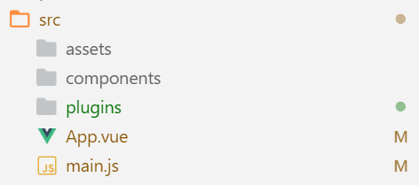

# Vue的组件化

使用Vue和直接操作DOM的思路不同，Vue是围绕着页面应用中的数据构建代码的，是数据驱动了页面结构的改变。而直接使用JQuery操作DOM则更注重页面的显示效果，通过组合页面上的HTML元素达到展示数据的目的。Vue中，我们编写的JavaScript代码是围绕着Vue组件进行的。

## Vue对象

`Vue`可以看做是Vue框架的上下文对象，它本身也具有组件的功能，但我们一般都不会直接使用它，而是将一个根组件注册到`Vue`对象上。

```javascript
//创建Vue对象
let app = new Vue({
  el: "#app",
  data: {},
  methods: {}
});
```

## Vue组件的注册

这里我们了解下Vue中，如何使用JavaScript代码注册全局和局部组件，以及如何使用`.vue`创建单文件组件，前者仅作了解，后者是实际开发中常用的方式。

### 使用代码注册组件

实际上，使用代码注册组件是十分罕见的，但我们还是有必要了解一下，因为单文件组件其实就是一种封装形式，如果不了解这些内容直接使用会感到不明所以。

#### 注册全局组件

下面是官网的例子，编写了一个按钮组件，每点击一次，按钮上的数字就会增加。

```javascript
//注册组件
Vue.component('button-counter', {
  data: function ()
  {
    return {
      count: 0
    }
  },
  template: '<button v-on:click="count++">You clicked me {{ count }} times.</button>'
});

let app = new Vue({
  el: "#app",
  data: {},
  methods: {}
});
```

注册组件需要的参数有`data`、`methods`、`computed`以及生命周期回调函数。但是，这里要注意的是`data`的写法是有区别的，组件定义中，`data`属性是一个函数，真正的数据作为函数的返回值对象，这是为了每个组件实例都能维护一份单独的数据拷贝，避免相同组件的不同实例之间的数据互相干扰。

编写组件时注意以下几点：

1. 注册组件的代码要写在创建Vue对象之前。
2. 自定义组件的`data`必须是一个函数，否则页面上所有相同组件中的数据都会被同步改变。
3. 切记，每个自定义组件的模板（template）中，必须只包含一个根元素，多个并列的元素是不行的。如果组件里确实包含多个并列的HTML标签，把它们用`<div>`包起来就行了。

```html
<div id="app">
  <button-counter></button-counter>
</div>
```

HTML代码中直接使用注册的组件名作为标签名就行了。

#### 注册非全局的子组件

我们用Vue构建的应用通常被称为SPA（单页Web应用），使用Vue的目的之一就是组件化，多个组件形成组件树，最终组件树的根节点就是整个应用。

下面例子演示了如何创建一个非全局的子组件：

```javascript
var componentB = Vue.component("component-b", {
  data: function () {},
  template: "<ul><li>1</li><li>2</li><li>3</li></ul>"
});

var componentA = Vue.component("component-a", {
  data: function () {},
  template: "<div><p>componentA</p><component-b></component-b></div>",
  components: {
    "component-b": componentB
  }
});
```

上面代码中，在componentA中套了一个componentB。

### 单文件组件

了解了如何用JavaScript代码注册组件，其实单文件组件也就会使用了。我们把一个`.vue`文件看成一个非全局组件就行了，我们的整个SPA应用就是从根组件`App.vue`一层层嵌套实现的。以下例子我们在`vue-cli`创建的工程结构中编写。



在单文件组件中，使用`<template>`、`<script>`、`<style>`分别定义模板，处理逻辑，和样式表。

下面例子是我们编写的一个例子组件`MyTest.vue`：
```html
<template>
    <div v-text="msg"></div>
</template>
<script>
export default {
    name: 'MyTest',
    data: function() {
        return {
            msg: 'hello'
        };
    }
}
</script>
```

编写好`MyTest.vue`后，我们需要让`App.vue`这个根组件包含我们编写的组件。

App.vue
```html
<template>
  <div id="app">
    <my-test></my-test>
  </div>
</template>

<script>
import MyTest from './components/MyTest.vue'

export default {
  name: 'app',
  components: {
    MyTest
  }
}
</script>
```

最终我们看一下工程根目录`index.js`这个入口文件：

```javascript
import Vue from 'vue'
import App from './App.vue'
import './plugins/element.js'

Vue.config.productionTip = false

new Vue({
  render: h => h(App),
}).$mount('#app')
```

这里其实就是将根组件`App.vue`注册到Vue对象上。
