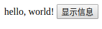

# 使用Vue对象

使用Vue和直接操作DOM的思路不同，Vue是围绕着页面应用中的数据构建代码的，直接使用JQuery操作DOM则更注重页面的显示效果，通过组合页面上的HTML元素达到展示数据的目的。Vue中，我们编写的JavaScript代码是围绕着`Vue`对象进行的。

## 数据和方法（data、method）

下面是一个最简单的Vue例子，点击一个按钮，在`<span></span>`中显示一些信息。

```html
<!DOCTYPE html>
<html lang="en">
<head>
	<meta charset="UTF-8">
	<title>Test1</title>
	<script src="lib/js/vue.js"></script>
</head>
<body>
<div id="app">
	<span>
			{{msg}}
	</span>
	<button @click="show_msg">显示信息</button>
</div>
<script>
	let app = new Vue({
		el: "#app",
		data: {
			msg: ""
		},
		methods: {
			show_msg: function ()
			{
				this.msg = "hello, world!";
			}
		}
	});
</script>
</body>
</html>
```

运行结果：



在JavaScript代码中，我们创建了一个`Vue`对象：

* `el`：该对象对应的HTML代码中的片段
* `data`：可操作的数据
* `methods`：可调用的方法

HTML代码中：

* `{{msg}}`是一个模板写法，对应的就是`data`中定义的变量`msg`，如果JavaScript变量值改变，页面上的值也会改变
* `@click`是`v-on:click`的简写，`v-xxx`类似angular中的`ng-xxx`指令，这里用于绑定按钮点击需要调用的函数

## 计算属性（computed）

有时某个变量需要经过一些业务逻辑处理后再展示，我们可以在模板里写链式的函数调用，但模板的用途是展示数据，里面不应该放太多的业务代码，此时可以使用计算属性。

```html
<body>
<div id="app">
	<input type="text" v-model="i"> {{j}}
</div>
<script>

	let app = new Vue({
		el: "#app",
		data: {
			i: 1
		},
		methods: {},
		computed: {
			j: function ()
			{
				return this.i + 1;
			}
		}
	});
</script>
</body>
```

上面代码中，在`computed`对象中，创建了一个属性`j`，和`data`中定义的属性不同，`computed`中的属性是间接计算得到的，计算过程就是后面的函数，计算结果就是函数的返回值。

## Vue对象的生命周期

```javascript
let app = new Vue({
	el: "#app",
	data: {},
	methods: {},
	created: function ()
	{
	},
	mounted: function ()
	{
	},
	updated: function ()
	{
	},
	destoryed: function ()
	{
	}
});
```

Vue2中定义了若干个生命周期方法，常用的一般就上面四个：

* `created`：创建了Vue实例
* `mounted`：组件挂载，模板编译之后
* `updated`：模板更新后
* `destoryed`：Vue实例销毁
