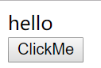
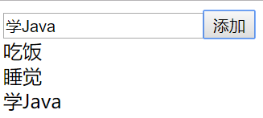

# Vue组件的使用

这篇笔记我们详细了解一下Vue中组件的使用。以下例子都使用`vue-cli`创建的工程，组件由单文件组件实现。

## 组件的属性

### 数据和方法（data、method）

下面是一个最简单的Vue例子，点击一个按钮，在`<span></span>`中显示一些信息。

```html
<template>
    <div>
        <div v-text="msg"></div>
        <div><button @click="showMsg">ClickMe</button></div>
    </div>
</template>
<script>
export default {
    name: 'MyTest',
    data: function() {
        return {
            msg: ''
        };
    },
    methods: {
        showMsg: function() {
            this.msg = 'hello';
        }
    }
}
</script>
```

JavaScript代码中：

* `data`：可操作的数据
* `methods`：可调用的方法

HTML代码中：

* `v-text`用来将数据绑定到`<div>`内的文本节点上，对应的就是`data`中定义的变量`msg`，如果`data`改变，页面上的值也会改变
* `@click`是`v-on:click`的简写，`v-xxx`类似angular中的`ng-xxx`指令，这里用于绑定按钮点击需要调用的函数

运行结果：



注：了解React的同学会发现，这里和React最明显的不同就是设置数据省去了麻烦的`setState()`，这和Vue内部的实现原理有关。

### 计算属性（computed）

有时某个变量需要经过一些业务逻辑处理后再展示，当然我们可以在模板里写链式的函数调用，但模板的用途是展示数据，里面不应该放太多的业务代码，此时可以使用计算属性。

```html
<template>
    <div>
        <div v-text="renderData"></div>
        <div><button @click="showMsg">ClickMe</button></div>
    </div>
</template>
<script>
export default {
    name: 'MyTest',
    data: function() {
        return {
            msg: ''
        };
    },
    methods: {
        showMsg: function() {
            this.msg = 'hello';
        }
    },
    computed: {
        renderData: function() {
            return 'Tom says: ' + this.msg;
        }
    }
}
</script>
```

上面代码中，在`computed`对象中，创建了一个属性`j`，和`data`中定义的属性不同，`computed`中的属性是间接计算得到的，计算过程就是后面的函数，计算结果就是函数的返回值。

运行结果：


### props

组件的`props`用于父组件向子组件传递数据，我们在模板中引用组件的时候，就可以通过`props`传入当前组件`data`中的数据，或者直接传一个字面量。

假设下面组件要接收一个参数：

```html
<template>
    <div>
        <h1 v-text="title"></h1>
    </div>
</template>
<script>
export default {
    name: 'MyTest',
    props: {
        title: Number
    }
}
</script>
```

该组件接收一个参数`title`，类型这里约束为`Number`。这个类型约束如果不满足，框架会主动抛出一个错误。JavaScript是弱类型语言，这个特性有助于我们编写组件库时，规范数据类型。

除了类型约束，还有其它几种常用的写法，这里看一个例子：

```javascript
props: {
    shape: {
      type: String,
      default: "normal",
      validator: function(value) {
        return ["normal", "round1", "round2"].indexOf(value) !== -1;
      }
    }
}
```

`type`约束的是数据类型，`default`指定了默认值，如果该值没有被传入，就会使用默认值。`validator`指定该参数的可选项，一般都是检查传入的值是否在一些给定的值数组中，因此`reuturn [].indexOf(value) !== -1`的写法非常常见。

调用时，通过`v-bind`指令进行绑定，可以简写为`:`：

```html
<my-test :title="2"></my-test>
```

注意一个奇怪的设定：如果绑定的类型是String字面值，外层组件必须省略`v-bind`，也就是写作`<my-test title="hello"></my-test>`，否则会报错。

### 插槽slot

模板中可以使用Vue定义的`<slot></slot>`标签，这在Vue中被称为「插槽」，外层组件调用自定义组件时，自定义组件标签内部的文本会子组件会在插槽位置显示。

```javascript
<template>
    <div>
        <slot></slot>
    </div>
</template>
<script>
export default {
    name: 'MyTest'
}
</script>
```

```html
<my-test><h1>hello</h1></my-test>
```

渲染后的HTML：
```html
<div><h1>hello</h1></div>
```

如果有多个插槽，可以使用`name`属性在`slot`上指定插槽名，模板中这样编写：

```html
<slot name="header"></slot>
```

HTML中可以用`template`标签把`slot`要插入的数据包裹起来，并使用`slot`属性标注slot的名字，代码如下：
```html
<template slot="header">
  Here might be a page title
</template>
```

### 组件的生命周期

```javascript
created: function ()
{
},
mounted: function ()
{
},
updated: function ()
{
},
destoryed: function ()
{
}
```

Vue2中为组件定义了若干个生命周期方法，需要使用时直接覆盖就行了。常用的一般就上面四个：

* `created`：创建了Vue组件实例
* `mounted`：组件挂载，模板编译之后
* `updated`：模板更新后
* `destoryed`：Vue组件实例销毁

## 使用$emit触发事件

`$emit`能够实现从子组件向父组件触发一个事件，可以用来传递数据或是触发特定方法。这里我们编写一个稍微复杂点的例子。

TodoList.vue
```html
<template>
  <div>
    <div>
      <input type="text" v-model="txtInput">
      <button @click="handleClick">添加</button>
    </div>
    <div>
      <todo-item
        v-for="(item, index) in todoData"
        :key="index"
        :index="index"
        :txt="todoData[index]"
        @delete="deleteTodo"
      ></todo-item>
    </div>
  </div>
</template>
<script>
import TodoItem from "./TodoItem.vue";

export default {
  name: "TodoList",
  components: {
    TodoItem
  },
  data: function() {
    return {
      txtInput: "",
      todoData: []
    };
  },
  methods: {
    handleClick: function() {
      this.todoData.push(this.txtInput);
    },
    deleteTodo: function(index) {
      this.todoData.splice(index, 1);
    }
  }
};
</script>
```

TodoItem.vue
```html
<template>
    <div v-text="txt" @click="handleClick"></div>
</template>
<script>
export default {
  name: "TodoItem",
  props: {
    index: Number,
    txt: String
  },
  methods: {
      handleClick: function() {
          this.$emit("delete", this.index);
      }
  }
};
</script>
```

其实重点就两处，一个是父组件`TodoList`中，使用`@delete`绑定了一个`delete`事件，另一处就是子组件`TodoItem`通过`$emit`触发`delete`事件了。



## 组件树遍历

尽管Vue本身是数据驱动的，但是某些情况下我们还是免不了要操作「文档结构」，但是在Vue中操作的不是DOM树而是组件树，在编写组件库时比较常用到组件树遍历。

获取当前组件的父组件：
```
this.$parent
```

获取当前组件的子组件数组：
```
this.$children
```

下面是一个比较复杂的实例，来源于我编写的一个组件库中`context-menu`组件（右键菜单），该组件包含`ContextMenu`和`MenuItem`两种组件，`MenuItem`两个组件可以互相包含，来组成菜单树。在根`ContextMenu`组件中，我们需要实现隐藏整个菜单的功能，下面代码实现了递归遍历组件树，将其全部隐藏：

```javascript
menuHide() {
  this.isShowing = false;
  // 向下遍历树形结构隐藏所有子菜单
  function __callHideMethodRecursive(rootNode) {
    let childrenNodes = rootNode.$children;
    for (let node of childrenNodes) {
      if (
        node.$options.name === "si-menu-item" &&
        node.type === "menu-set"
      ) {
        for (let node2 of node.$children) {
          if (node2.$options.name === "si-context-menu") {
            node2.isShowing = false;
            __callHideMethodRecursive(node2);
            break;
          }
        }
      }
    }
  }
  __callHideMethodRecursive(this);
}
```

在每个菜单项组件中，需要实现点击选项，隐藏整个菜单树。因此，子菜单组件中我们向上遍历到`ContextMenu`组件，然后调用`menuHide()`函数。

```javascript
closeContextMenu() {
      if (!this.disabled) {
        // 向上遍历调用根菜单组件的menuHide()方法
        let p = this.$parent;
        let contextMenuRoot = null;
        while (true) {
          if (p === null || p === undefined) {
            break;
          }
          if (p.$options.name === "si-context-menu") {
            contextMenuRoot = p;
          }
          p = p.$parent;
        }
        contextMenuRoot.menuHide();
      }
    }
```

我们可以看到，使用`$parent`和`$children`进行组件树的遍历，也能够实现父子组件之间的方法调用，而且比`$emit`还直观一些，但是写起来太多复杂，上述代码如果新手来写，debug就可能会浪费几十分钟的时间。而`$emit`能够依靠事件机制进行传递，更加灵活。
