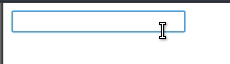

# Vue常用指令

Vue的指令以`v-`开头，类似angular的`ng-`，使用Vue指令能很方便的在HTML代码中实现各种功能，下面以例子的形式介绍一些常用到的指令。

## v-if v-else v-else-if 实现判断逻辑

```html
<body>
<div id="app">
	<span v-if="i==1">a</span>
	<span v-else-if="i==2">b</span>
	<span v-else="i==3">c</span>
</div>
<script>
	let app = new Vue({
		el: "#app",
		data: {
			i: 1
		},
		methods: {}
	});
</script>
</body>
```

这个用法和JSP里的标签，或是各种其他模板引擎都很像。

## v-for 用于循环显示

```html
<body>
<div id="app">
	<span v-for="(value, index) in arr">{{index}} {{value}}</span>
</div>
<script>
	let app = new Vue({
		el: "#app",
		data: {
			arr:["Tom","Jerry","Lucy"]
		},
		methods: {}
	});
</script>
</body>
```

上面代码中循环输出了一个数组的所有元素和序号，注意`v-for`的写法。

注：不仅是数组，遍历JSON格式也是可行的，只要是在JavaScript里可以遍历的，`v-for`就可以遍历。

## v-show 显示与隐藏

```html
<span v-show="（true显示，false隐藏）">...
```

这个比较简单，而且和`v-if`功能重复了。

## v-model 双向数据绑定

```html
<body>
<div id="app">
	<input type="text" v-model="msg">{{msg}}
</div>
<script>
	let app = new Vue({
		el: "#app",
		data: {
			msg: ""
		},
		methods: {}
	});
</script>
</body>
```



如图所示，`v-model`将输入框和`msg`变量进行了双向绑定。

## v-bind 绑定HTML标签的属性

```html
<body>
<div id="app">
	<a :href="link">click here</a>
</div>
<script>
	let app = new Vue({
		el: "#app",
		data: {
			link: "http://www.ciyaz.com"
		},
		methods: {}
	});
</script>
</body>
```

`v-bind:xxx`可以简写为`:xxx`，推荐使用简写。

上面代码中绑定了`<a>`标签的`href`属性到变量`link`，如果代码中`link`变量值改变，HTML中的href属性值也会跟着改变。除了改变原生HTML标签的属性值，实际上`v-bind`还很常用于父组件向子组件传递数据，因为这个过程也是通过HTML属性实现的。

## v-on 绑定事件

```html
<body>
<div id="app">
	<div style="width: 100px; height: 100px; background: red" @click="func1"></div>
	<input type="text" @keydown.enter="func2">
</div>
<script>
	let app = new Vue({
		el: "#app",
		data: {},
		methods: {
			func1: function ()
			{
				alert(1);
			},
			func2: function ()
			{
				alert(2);
			}
		}
	});
</script>
</body>
```

`v-on:xxx`可以简写为`@xxx`，推荐使用简写。

上面代码实现了两个例子，分别绑定了点击事件和键盘事件。关于键盘事件，我们知道可以绑定键盘按下`keydown`和键盘弹起`keyup`，后面的`.enter`表示绑定的是回车键，我们也可以直接用具体的KeyCode，即`.13`代替`.enter`。除此之外，可供绑定的已声明好的键位还有`.delete（退格）`、`.tab`、`.esc`、`.space`、`.up`、`.down`、`.left`、`right`等，具体可参考官网文档。

关于事件的详细讲解，请参考`04-Vue中使用事件`。

## v-once 只渲染一次

```html
<span>{{ msg }}</span>
```

正常情况下，如上写法在msg变量改变时，HTML中显示的数据也会改变，加上`v-once`那么该`<span>`只在页面加载时渲染一次。

## v-text/v-html 不渲染HTML/渲染HTML

假设有如下HTML代码：

```html
<span>{{ msg }}</span>
```

如果`msg="<h1>title</h1>"`，正常情况下`<span>`中会把HTML代码原样显示（关键字符进行了转义），使用`v-html`后，就不会进行转义了，`<h1>`标签将真正的生效。

`v-text`指令和`{{}}`写法的作用是完全相同的，都会将HTML关键字符转义输出，即上面代码等同于：

```html
<span v-text="msg"></span>
```

使用`v-text`的一个好处是当用于加载页面时，不会看到一闪而过的大括号`{{}}`。实际上Vue运行总是比页面HTML加载慢一点，如果用`{{}}`写法，用户的浏览器里Vue运行之前，大括号就会被渲染出来，当然改用`v-text`也还存在问题，比如循环展示数据时，用户还是会看到一个空的数据项一闪而过，最好的解决办法是给用户一个`加载中`提示，当所有代码加载好后再把页面展示给用户。
