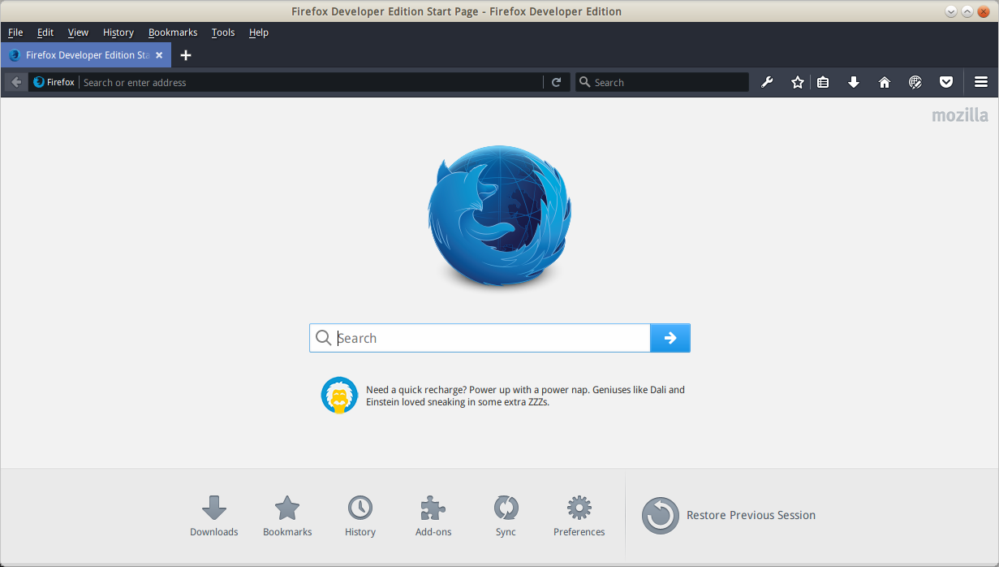
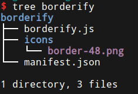
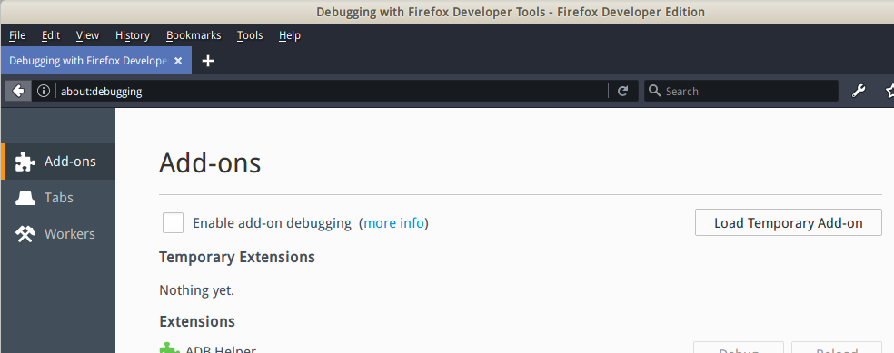
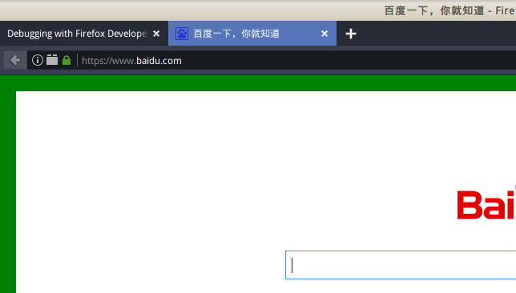

# Firefox插件开发

WebExtension是跨浏览器的插件规范，在不同浏览器上大致兼容。浏览器插件同样要使用html，css，javascript开发。插件能够实现：

* 改变指定网站的外观或内容
* 修改Firefox的用户界面
* 给Firefox加上新功能

本系列笔记介绍firefox浏览器的插件开发，参考MDN关于插件的教程。

# 开发环境搭建

## 浏览器

为了不影响日常使用的浏览器，这里单独下载了最新版的firefox developer edition，官网：[https://www.mozilla.org/en-US/firefox/developer/](https://www.mozilla.org/en-US/firefox/developer/)



### 编辑器

这里选用了Visual Studio Code，实际上任何能够编写html/css/javascript的编辑器都能够胜任。

# Hello world

这里创建一个最简单的插件，实现在特定网页上加上边框的功能，并将其加载到浏览器中运行。

## 工程目录结构



* borderify 工程根目录文件夹
* borderify.js javascript源文件，这里的javascript代码会被加载进网页并执行
* icons 插件图标文件夹
* manifest.json 工程说明文件，这个文件是最重要的

manifest.json
```json
{
  "manifest_version": 2,
  "name": "Borderify",
  "version": "1.0",
  "description": "Adds a solid red border to all webpages matching mozilla.org.",
  "icons": {
    "48": "icons/border-48.png"
  },
  "content_scripts": [
    {
      "matches": ["*://*.baidu.com/*"],
      "js": ["borderify.js"]
    }
  ]
}
```

* manifest_version：manifest文件标准版本，使用“2”即可
* name：插件名
* version：插件版本
* description：插件描述，在浏览器的插件管理界面可以看到
* icons：插件图标，除了可以指定48，还可以指定96不过实际没什么用
* content_scripts：javascript脚本，其用通配符指定了一个URL，javascript插件脚本会在所有这些网页上加载

## borderify.js

```javascript
document.body.style.border = "20px solid green";
```

我们的javascript脚本十分简单，只是给body加上一个边框。

## 加载插件



在浏览器地址栏输入about:debugging，可以看待一个插件管理界面，点击Load Temporary Add-on加载临时插件。选择项目目录中的manifest.json。

临时插件加载后，浏览器关闭时就会自动卸载。

## 测试

打开百度，可以看到绿色边框。说明插件加载成功。



## 发布插件

Firefox对于插件有严格的审核，即使不把你编写的插件以公共方式发布，也必须获得Firefox的审核批准和签名，没有签名的插件不能正式加载到用户浏览器，只能以上述“临时”方式加载。

### 插件发布教程

[https://developer.mozilla.org/zh-CN/Add-ons/WebExtensions/Publishing_your_WebExtension](https://developer.mozilla.org/zh-CN/Add-ons/WebExtensions/Publishing_your_WebExtension)

打包注意：压缩格式为zip，确保manifest.json在根目录（在工程文件夹内打包而不是把工程文件夹打包），压缩后把扩展名改为.xpi。
