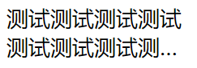

# 多行省略的实现

实际开发中，经常有多行省略的需求。多行省略一般有三种实现方式：

1. 根据字数省略
2. 根据行高省略
3. 使用CSS实现



第一种方式非常简单，但效果不是很好，这里就不多介绍了。

## 根据行高省略

根据行高省略的基本策略，就是把文字一个一个的往下减，直到行高满足要求为止。

```css
.text {
    font-size: 18px;
    line-height: 24px;
    visibility: hidden;
}
```

```javascript
$(function() {
    var txtEle = $('.text');
    var useShave = false;
    while(txtEle.height() > 48) {
        useShave = true;
        var txt = txtEle.text();
        txtEle.text(txt.substr(0, txt.length - 1));
    }
    if (useShave) {
        txt = txtEle.text();
        txtEle.text(txt.substr(0, txt.length - 1));
        txtEle.text(txtEle.text() + '...');
    }
    txtEle.css({'visibility': 'visible'});
});
```

上面代码中，我们在样式里将文字设置为`visibility:hidden`，处理完毕后再显示出来，因此这里需要注意一下`visibility`占位的样式问题。

注：不能使用`display:none`，因为它不是隐藏而是HTML元素直接不渲染了，也无法获取其高度。

## 使用CSS实现

使用CSS实现比较简单，代码如下：

```css
.text {
    font-size: 18px;
    line-height: 24px;
    height: 48px;
    text-overflow: ellipsis;
    display: -webkit-box;
    -webkit-box-orient: vertical;
    -webkit-line-clamp: 2;
}
```

这种`-webkit-box`方式仅支持Chrome（新版的Firefox似乎也可用），兼容性不是很好，但对显示效果有严格要求的页面一般也都不会考虑IE用户，IE能凑合着看就行，因此实际上使用也非常广泛。
