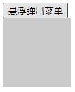

# 悬浮弹出菜单

实际开发中，经常有这样一种需求：鼠标悬浮在导航按钮上，弹出显示一个下拉菜单；鼠标移开时，菜单自动隐藏。这是一个看似简单的需求，但实际实现起来比想象中的复杂。这里记录一下以供日后参考。

## 实现思路分析



我们将鼠标的位置分为三种状态：

1. 悬浮于导航按钮上
2. 悬浮于菜单上
3. 悬浮于导航按钮和菜单之外

显然，当满足条件1和条件2时，菜单需要显示，当满足条件3时，菜单需要隐藏。

我们这里介绍用CSS的`:hover`选择器，和纯JavaScript两种实现思路。前者比较简单易懂，后者通用性强。

## CSS实现

CSS能够实现上述需求，而且非常简单，是最推荐的方式。但是CSS实现有一个限制条件：导航按钮必须和悬浮菜单必须是同一节点下的子节点，或必须是兄弟节点关系。

### 位于同一节点下

```html
<div class="nav-container">
    <button>悬浮弹出菜单</button>
    <div class="menu"></div>
</div>
```

```css
.menu {
    width: 100px;
    height: 100px;
    background-color: #cbcbcb;
    display: none;
}

.nav-container:hover .menu {
    display: block;
}
```

上面例子中，导航按钮和悬浮菜单是同一节点的子节点，两者都位于`nav-container`内，那么只要给`nav-container`加上让`menu`显示的`:hover`就可以了。

局限性：如果同一父节点下还有其它元素，那么所有元素都会触发`menu`的显示，这显然不不符合我们的需求。

### 兄弟关系

```html
<button class="nav-btn">悬浮弹出菜单</button>
<div class="menu"></div>
```

```css
.menu {
    width: 100px;
    height: 100px;
    background-color: #cbcbcb;
    display: none;
}

.nav-btn:hover + .menu {
    display: block;
}

.menu:hover {
    display: block;
}
```

上面代码中，导航按钮和悬浮菜单是兄弟关系，这样我们就可以用`+`选择器，为`nav-btn`和`menu`都指定上`menu`的显示触发，这样就能够避免上面同一父节点下有多个子节点的问题。

局限性：导航按钮和悬浮菜单必须是兄弟节点，这在某些特殊情况下是不可能做到的。

## JavaScript实现

有时候就是有这么一种奇葩情况：导航按钮和悬浮菜单不是兄弟节点，用一个父节点仅把两个节点包起来也不可行（例如导航按钮有多个，而弹出的悬浮菜单是同一个）。这种情况，只能用JavaScript来实现了！

首先要介绍的是悬浮控制函数：

```javascript
/**
 * 悬浮菜单控制
 * 
 * @param triggers  触发节点，多个以数组形式传入
 * @param popup     悬浮菜单节点
 */
function holdHoverablePopup(triggers, popup) {
    // DOM的API只有insertBefore没有insertAfter，只能自己实现一个
    function insertAfter(newNode, targetNode) {
        var parentEl = targetNode.parentNode;
        if (parentEl.lastChild === targetNode) {
            parentEl.appendChild(newNode);
        } else {
            parentEl.insertBefore(newNode, targetNode.nextSibling);
        }
    }

    if (popup && triggers) {
        var overPopupBlock = false;
        popup.addEventListener('mouseenter', function () {
            overPopupBlock = true;
        });
        popup.addEventListener('mouseover', function () {
            overPopupBlock = true;
        });
        popup.addEventListener('mouseout', function () {
            overPopupBlock = false;
            var t;
            if (t) {
                clearTimeout(t);
            }
            t = setTimeout(function() {
                if (!overPopupBlock) {
                    popup.style.setProperty('display', 'none');
                }
            }, 100);
        });
        for (var i = 0; i < triggers.length; i++) {
            var tgr = triggers[i];
            (function(tgr) {
                tgr.addEventListener('mouseenter', function() {
                    popup.style.setProperty('display', 'block');
                    insertAfter(popup, tgr);
                });
                tgr.addEventListener('mouseout', function() {
                    var t;
                    if (t) {
                        clearTimeout(t);
                    }
                    t = setTimeout(function() {
                        if (!overPopupBlock) {
                            popup.style.setProperty('display', 'none');
                        }
                    }, 100);
                });
            })(tgr);
        }
    }
}
```

实现其实比较tricky。代码中，导航菜单悬浮触发时，会把悬浮菜单节点剪切到触发节点下面，然后根据悬浮状态来控制悬浮菜单的显示隐藏（这里就和CSS的`:hover`是一个原理了，只不过是换成了JavaScript的`mouseenter`和`mouseout`来实现，替换成CSS其实也可以）。

另外，你可能注意到了，代码中有个延时`100ms`，这和JavaScript的`mouseenter`、`mouseout`有关。在实际使用中，我发现监听父节点而鼠标滑过不同子节点时，父节点会重新触发`mouseout`然后再立即触发`mouseenter`，这就有点坑了，不知道是不是Chrome浏览器实现的问题，只能用一个延时来弥补。

具体实现代码：

```html
<div>
    <button id="btn">悬浮弹出菜单</button>
</div>
<div>
    <div class="menu" id="menu"></div>
</div>
```

```javascript
window.onload = function() {
    var btn = document.getElementById('btn');
    var menu = document.getElementById('menu');
    holdHoverablePopup([btn], menu);
};
```
