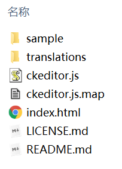
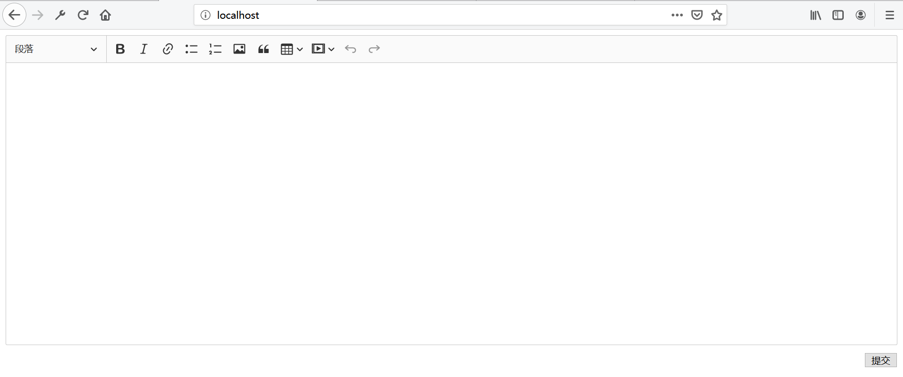
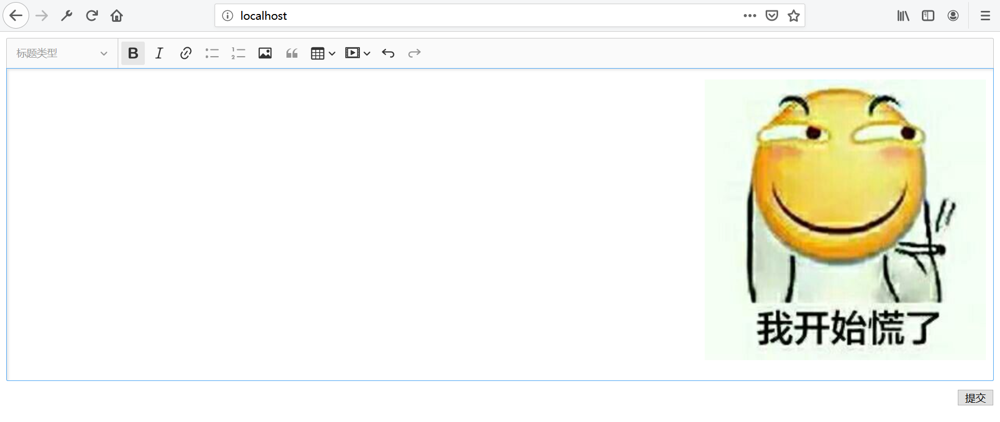

# ckeditor-富文本编辑器

ckeditor是一个简单好用的纯前端富文本编辑器，富文本底层为HTML。这篇笔记记录最新版本ckeditor5的使用。

## 下载安装

[官网](https://ckeditor.com/ckeditor-5/)

根据文档介绍，我们可以通过`npm`集成到前端项目或直接下载。



压缩包中，`index.html`是一个例子，我们可以参考其中的代码。`ckeditor.js`是压缩好的JavaScript源码，我们在项目中引用这一个文件就行了。`translations`是语言包，如果有需要，我们可以加载中文语言包。

## 前端配置

下面我们编写了一个ckeditor的测试页面。

```html
<!doctype html>
<html lang="zh-cmn-Hans" xmlns:th="http://www.thymeleaf.org">
<head>
    <meta charset="UTF-8">
    <meta name="viewport"
          content="width=device-width, user-scalable=no, initial-scale=1.0, maximum-scale=1.0, minimum-scale=1.0">
    <meta http-equiv="X-UA-Compatible" content="ie=edge">
    <script th:src="@{/static/zh-cn.js}"></script>
    <script th:src="@{/static/ckeditor.js}"></script>
    <title>ckeditor测试</title>
</head>
<body>
<div>
    <div id="editor"></div>
    <div style="text-align: right; margin-top: 10px">
        <button onclick="submit()">提交</button>
    </div>
</div>
<script>
    var editor;
    window.onload = function (ev) {
        ClassicEditor
            .create(document.querySelector('#editor'), {
                language: 'zh-cn',
                ckfinder: {
                    uploadUrl: '/upload'
                }
            })
            .then(function (value) {
                editor = value;
            })
            .catch(function (reason) {
                console.error(reason);
            });
    };
    function submit() {
        console.log(editor.getData());
    }
</script>
</body>
<style>
    .ck-editor__editable_inline {
        min-height: 400px;
    }
</style>
</html>
```



我们主要关注ckeditor的初始化配置，ckeditor5配置过程使用了Promise模式。`language`是我们配置的语言包（注意我们预先引用了`zh-cn.js`），`uploadUrl`是后端的图片上传URL。

## 后端集成

后端接受编辑器表单值非常简单，这里就不多做介绍了，这里主要实现后端处理图片上传。



前端代码中，我们已经指定`uploadUrl`了，当ckeditor中的图片上传按钮点击后，浏览器会弹出文件选择对话框，确认后，ckeditor就会以ajax的形式，将包含我们图片二进制数据的表单通过`POST`请求传递给后端，我们可以通过`upload`参数进行接收。

后端上传成功返回JSON：
```json
{
    "uploaded": true,
    "url": "图片链接地址"
}
```

后端上传失败返回JSON：
```json
{
    "uploaded": false,
    "error": {
        "message": "报错信息"
    }
}
```

如果后端返回报错信息，ckeditor会以alert的形式，将图片上传失败的报错信息返回给用户。

后端代码这里使用SpringMVC实现：
```java
package com.ciyaz.demo.ckeditor.controller;

import com.ciyaz.imgserver.sdk.ImageServerUtil;
import org.springframework.stereotype.Controller;
import org.springframework.web.bind.annotation.RequestMapping;
import org.springframework.web.bind.annotation.RequestMethod;
import org.springframework.web.bind.annotation.RequestParam;
import org.springframework.web.bind.annotation.ResponseBody;
import org.springframework.web.multipart.MultipartFile;

import java.io.IOException;
import java.util.HashMap;
import java.util.Map;

/**
 * ckeditor图片上传
 *
 * @author CiyaZ
 */
@Controller
public class ImageUploadController {

    @ResponseBody
    @RequestMapping(value = "/upload", method = RequestMethod.POST)
    public Map<String, Object> upload(@RequestParam("upload") MultipartFile image) {
        Map<String, Object> result = new HashMap<>(2);
        ImageServerUtil serverUtil = new ImageServerUtil("fAjzpc2H9SnO1gTj", "127.0.0.1", null, 8080);
        try {
            byte[] imageData = image.getBytes();
            String filehash = serverUtil.uploadImage(imageData);
            if (filehash != null) {
                String imageUrl = "http://127.0.0.1:8080/download?filehash=" + filehash;
                result.put("uploaded", true);
                result.put("url", imageUrl);
            } else {
                result.put("uploaded", false);
                Map<String, Object> msg = new HashMap<>(1);
                msg.put("message", "图床服务处理失败");
                result.put("error", msg);
            }
        } catch (IOException e) {
            e.printStackTrace();
            result.put("uploaded", false);
            Map<String, Object> msg = new HashMap<>(1);
            msg.put("message", "图床服务请求失败");
            result.put("error", msg);
        }
        return result;
    }
}
```

注：上面代码集成了一个简易的图床[https://github.com/ciyaz/img-server](https://github.com/ciyaz/img-server)，部署在`127.0.0.1:8080`。
