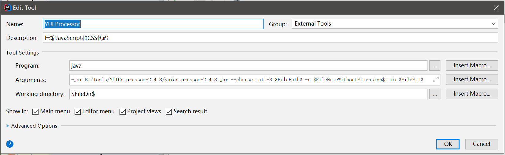

# YUI Processor

YUI Processor是一个Java编写的JavaScript和CSS压缩工具，在传统的web项目尤其是非前后端分离的JavaEE项目中，我们可以使用这个工具压缩和混淆页面代码。

注意：该工具仅支持ES5语法，最后更新日期是2013年，可以说是比较古老了，因此一般在现代项目中不会使用

## 下载

Github地址：[https://github.com/yui/yuicompressor/releases](https://github.com/yui/yuicompressor/releases)

下载下来后，其实就是一个可执行jar包。


## 在命令行中执行YUI Processor

这里简单写一点JavaScript代码：
```javascript
function add(a, b) {
	var c = a + b;
}
console.log(add(1, 2));
```

```
java -jar yuicompressor-2.4.8.jar test.js -o test.min.js
```

压缩后的结果：
```javascript
function add(e,d){var f=e+d}console.log(add(1,2));
```

CSS压缩后也是差不多的效果。

## Intellij IDEA整合

我们可以把YUI Processor配置到Intellij IDEA的External Tools中，这样我们编写代码后，就能很方便的直接调用工具进行压缩，页面上直接引入压缩后的代码文件即可，非常方便。



除此之外，还可以将YUI Processor和File Watchers整合，实现保存文件立即自动压缩，这里就不多介绍了。
