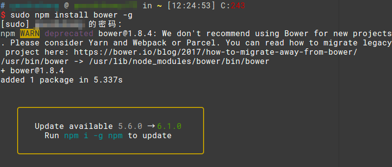

# bower

bower是一个前端模块的包管理器，用bower可以省去我们自己下载各种库，复制到项目里的麻烦。

## bower安装

```
npm install bower -g
```



注：实际上，bower前两年还挺流行的，但现在（2018年7月）被认为“过时”，安装的时候都会提示推荐使用`npm`或`yarn`。不过我们一般随便写写的项目不要在意这些细节，前端的生态圈还太年轻，大家都以造轮子为荣，追着上新工具是没必要的。

## 常用命令

### 安装依赖包

```
bower intall <包名>
```

```
bower install <包名>#<版本号>
```

### 卸载依赖包

```
bower uninstall <包名>
```

### 查询一个包

```
bower info <包名>
```

### bower缓存管理

bower会缓存下载过的依赖包，Ubuntu下，缓存的位置是`~/.cache/bower`。

列出所有缓存
```
bower cache list
```

清空缓存
```
bower cache clean
```

## bower的缺点

bower实际上是个非常简陋的工具，其实它就是把某个依赖的Github仓库给`clone`到本地，但是bower之所以能流行，也是因为它简单易用，当然缺点也显而易见：

1. 依赖库的稳定性全靠维护该依赖库的作者
2. 下载下来的文件包含源码等一大堆乱七八糟的东西，项目大小、编辑器卡顿程度直线上升，而我们实际需要的一般只有`dist`目录里的文件
3. 没有提供集成的构建工具
