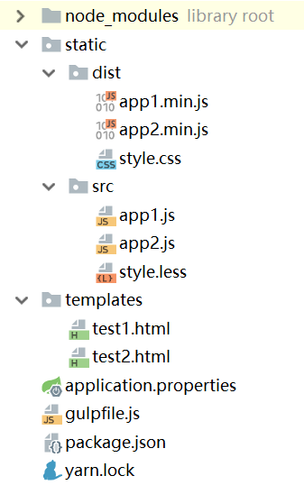

# gulp

gulp是一个前端自动化构建工具，它的配置的编写非常简单易用，而且支持大量插件，能够轻松的自动化完成前端构建任务。目前最新版本是gulp4。

官网：[https://gulpjs.com](https://gulpjs.com)

## gulp和webpack的区别

gulp和webpack这两个工具的初衷是完全不同的。gulp是一个基于流程（task）的构建工具，通过我们指定的若干task完成一个预期的工程构建。而webpack是一个打包工具，它用来将一些源码和资源打包成一个`bundle.js`，本身并没有什么流程。

至于为什么各种前端框架的脚手架都不需要gulp，因为它们都是纯前端SPA框架，项目构建比较简洁，也谈不上什么task，而且这个过程完全不需要开发者干预。webpack丰富的插件也能方便的实现代码合并混淆压缩，ES6转义，各种Loader打包加载资源，HMR等功能，gulp完全用不上。

而如果是我们自己一步步写起来的项目，尤其是那种多页面、前后端不分离的大型项目，又有代码合并混淆压缩的需求，webpack当然是办不到的，我们自然而然的会想到找一个“构建脚本”去干这件事，这时候就是gulp出场的时候，甚至可能gulp+webpack的形式出场。

## 安装gulp

初始化npm项目：
```
yarn init
```

安装gulp依赖：
```
yarn add gulp --dev
```

注意：像gulp、gulp插件、webpack这些工具都是dev依赖，不要搞错了。

安装完gulp后，我们需要在项目根目录创建一个配置文件`gulpfile.js`，构建流程就会在这个配置文件中编写。

## 配置构建流程

下面是一个`gulpfile.js`的例子，它没有实际意义，仅仅是演示如何定义构建流程。

```javascript
const {series} = require('gulp');

function clean(cb) {
    console.log('clean执行了');
    cb();
}

function build(cb) {
    console.log('build执行了');
    cb();
}

exports.build = build;
exports.default = series(clean, build);
```

能够被`gulp`命令调用的构建流程，需要定义为一个函数，并通过`exports`暴露，上面代码中我们暴露和`build`，而没有暴露`clean`，因此可以使用命令`gulp build`，而调用`gulp clean`则会报错。除此之外，`exports.default`定义的是默认的构建流程，即运行`gulp`时的动作。

## 顺序和并行构建流程

`series`表示一个顺序执行的构建流程序列，它可以用来连接多个构建流程，之前代码中，如果执行命令`gulp`，那么`clean`和`build`会依次顺序执行。除了`series`，还有一个`parallel()`用来连接并行的构建流程。

```javascript
exports.build = series(
  clean,
  parallel(
    cssTranspile,
    series(jsTranspile, jsBundle)
  ),
  parallel(cssMinify, jsMinify),
  publish
);
```

如果有多个复杂的构建流程需要连接，在`exports`的赋值语句中连接它们是推荐的写法。

## src()和dest()

构建过程其实就是`读文件->处理文件->写文件`，`src()`用来指定读取哪些文件，`dest()`用来指定输出到哪里。

一个将es6文件用babel编译为es5的例子：
```javascript
const {src, dest} = require('gulp');
const babel = require('gulp-babel');

function build() {
    return src('src/*.js')
        .pipe(babel({
            presets: ['@babel/env']
        }))
        .pipe(dest('dist/'));
}

exports.build = build;
```

gulp一个构建流程中，每一个小步骤都要用`pipe()`连接起来。

## 使用插件

上面其实已经用到了我们非常熟悉的`babel`插件，gulp支持大量的高质量插件，我们可以在gulp官网搜索其它插件：

[https://gulpjs.com/plugins/](https://gulpjs.com/plugins/)

在这些插件的npm仓库中，一般都会注明其用法。

## 改动自动构建

前端开发本来没有编译构建这些繁琐的步骤，现在引入了gulp，虽然可以用上各种现代化、工程化的特性了，但是如果每次修改一点代码就手动运行一次命令去构建代码就太麻烦了，gulp支持监测文件系统中的文件修改，触发自动构建。

```javascript
exports.default = function () {
    watch('src/', build);
};
```

注：代码中的`build`流程沿用之前的Babel转义功能。

## gulp实例

这里我们为一个SpringBoot应用编写一个gulp构建流程，后端应用出于业务复杂性和开发效率等多种因素考虑，并未使用MVVM框架和前后端分离，而是使用Thymeleaf模板，我们需要用gulp处理JavaScript和Less代码。我们打算使用`watch`去实时构建，而不是在Maven或Gradle中调用gulp。



gulpfile.js
```javascript
const {src, dest, parallel, watch} = require('gulp');
const babel = require('gulp-babel');
const uglify = require('gulp-uglify');
const rename = require('gulp-rename');
const less = require('gulp-less');
const minifyCss = require('gulp-minify-css');

function buildLess() {
    return src('static/src/*.less')
        .pipe(less())
        .pipe(minifyCss())
        .pipe(dest('static/dist/'));
}

function buildJs() {
    return src('static/src/*.js')
        .pipe(babel({
            presets: ['@babel/env']
        }))
        .pipe(uglify())
        .pipe(rename({extname: '.min.js'}))
        .pipe(dest('static/dist/'));
}

exports.default = function () {
    watch('static/src/', parallel(buildJs, buildLess));
};
```

上面代码中，我们定义了两个并行的task，分别用来编译`js`和`less`。

```html
<link th:href="@{/dist/style.css}" type="text/css" rel="stylesheet" />
<script th:src="@{/dist/app1.min.js}"></script>
<script th:src="@{/dist/app2.min.js}"></script>
```

在模板中，我们直接引入生成的`.min.js`文件。

```xml
<dependency>
  <groupId>org.springframework.boot</groupId>
  <artifactId>spring-boot-devtools</artifactId>
</dependency>
```

为了在`gulp`实时构建后，SpringBoot能够热部署，我们引入了`devtools`的起步依赖。

这样，我们的目的就基本实现了。当然，其中的不完美之处还有很多，比如：

1. 应该加一个`clean`任务，`build`和`clean`应单独暴露出来
2. 没有在模板引用CSS、JavaScript文件时加上版本号，版本迭代升级时，用户浏览器的缓存可能造成干扰
3. 不支持ES6的`import`语法，这里其实我们应该再引入`webpack`进行打包配合gulp的构建任务

看来要做到尽善尽美还是很复杂的，不过这里仅仅是演示`gulp`的使用，这里就不多说了。从上面例子我们可以发现，`gulp`作为一个前端构建工具确实是个神器。
