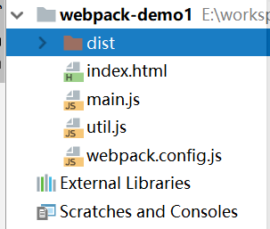

# Webpack

Webpack是一个web前端打包工具，主要应用于前端项目，Webpack支持灵活的扩展配置，而且生态非常丰富，但缺点是配置使用比较复杂。

目前各种前端MVVM框架的“脚手架”都是基于Webpack和各种插件封装而成的，一些构建和测试运行命令写在`npm scripts`中，我们直接运行一下就行了，非常方便。除此之外，我们自己编写的单页应用，也可以调用Webpack进行打包。本篇笔记以最新的Webpack4为例，结合当前最流行的yarn包管理工具，介绍webpack的简单使用。

## Webpack安装

和所有的npm包一样，webpack可以全局安装，也可以局部安装。推荐在项目中使用局部安装，以避免webpack版本冲突带来的问题。

局部安装
```
yarn add --dev webpack-cli webpack
```

## Webpack简单使用

### 打包项目

这里我们举一个简单的例子：有页面`index.html`，入口JavaScript文件`main.js`，工具函数`util.js`，JavaScript文件之间通过ES6的import实现互相引用，我们需要用webpack将JavaScript代码进行打包。

工程目录结构如下：



首先我们要使用`yarn init`初始化项目，以及在`package.json`的`scripts`中配置webpack工具，这个都是很基本的操作，就不多说了。

package.json中，`scripts`配置：
```json
"scripts": {
  "build": "webpack --mode production"
}
```

注意，webpack引入了`--mode`参数，值为`production`或`development`，分别用于生产和开发环境的打包。生产模式下，会进行代码压缩等额外的处理。

index.html
```html
<!DOCTYPE html>
<html lang="en">
<head>
    <meta charset="UTF-8">
    <title>webpack demo</title>
    <script src="./dist/bundle.js"></script>
</head>
<body>
<div id="app"></div>
</body>
</html>
```

main.js
```javascript
import {hello} from './util.js';

window.onload = function () {
    hello();
};
```

util.js
```javascript
export function hello() {
    document.getElementById('app').innerText = 'Hello, world!';
}
```

以上三个文件基本实现了我们的需求，但是至今为止，并没有任何一个浏览器能够完整支持ES6的模块化机制，因此ES6的import是不能在浏览器中直接运行的。我们需要webpack，它能够自动处理ES6的import、CommonJS、AMD规范的模块化机制。

webpack.config.js
```javascript
const path = require('path');
module.exports = {
    entry: './main.js',
    output: {
        filename: 'bundle.js',
        path: path.resolve(__dirname, './dist')
    }
};
```

使用webpack需要一个配置文件`webpack.config.js`。上面的配置代码其实是运行在node环境中的，因此需要`require`，`module.exports`这种写法，其中的内容也是非常简单：
* `entry`：源代码的入口文件
* `output`：源代码的输出路径

在项目根目录中执行打包：
```
yarn run build
```

这样，我们就会在`./dist`中看到打包后的`bundle.js`。使用webpack的模块化项目，最终JavaScript源代码都会编译为这个单一的`bundle.js`，以减少多次HTTP请求带来的开销。

### 使用Loader

默认情况下，webpack只支持JavaScript源代码文件的加载和打包，但是web项目中除了JavaScript文件，还有CSS、图片等这些常用的文件类型，甚至有TypeScript、Less等这些新型的工具语言源码文件。

这里我们以加载CSS为例，展示如何在webpack中使用Loader。

安装loader
```
yarn add --dev style-loader css-loader
```

main.css：
```css
#app {
    text-align: center;
    color: red;
}
```

这里我们为`#app`添加一个样式。

main.js：
```javascript
import './main.css';
```

在JavaScript代码中引入这个文件。

webpack.config.js
```javascript
const path = require('path');
module.exports = {
    entry: './main.js',
    output: {
        filename: 'bundle.js',
        path: path.resolve(__dirname, './dist')
    },
    module: {
        rules: [
            {
                test: /\.css$/,
                use: ['style-loader', 'css-loader'],
            }
        ]
    }
};
```

配置文件中，注意`module`这个配置节点，其中的`rules`定义了文件的后缀名正则表达式和使用的Loader。对于CSS文件，这里我们使用了`style-loader`和`css-loader`这两个加载器。注意`use`配置Loader的顺序，它是从后往前的倒着来的，配置Loader时不要搞错顺序，上面代码中，`css-loader`负责把`.css`文件加载到bundle中，`style-loader`则负责把样式注入页面。

运行`yarn run build`后，我们就会发现修改的CSS样式已经生效了，CSS代码其实是被打包进了`bundle.js`中。

## 使用devserver

webpack的devserver是一个用于调试的web静态服务器，能够和前端工具链整合，实现热更新等功能。

安装：
```
yarn add --dev webpack-dev-server
```

配置package.json的`scripts`，加一个启动调试服务器的命令：
```json
"scripts": {
  "build": "webpack --mode production",
  "dev": "webpack-dev-server --mode development --watch --hot"
}
```

* `watch`：监听文件变更
* `hot`：文件修改后刷新页面

webpack.config.js中添加相关配置：
```javascript
devServer: {
        host: 'localhost',
        port: 8080,
        open: true
    }
```

* `host`：服务的主机名
* `port`：服务的端口
* `open`：是否启动后自动打开默认浏览器

由于devserver编译输出的结果存储在内存中，因此原来`index.html`中引入`bundle.js`的方式并不能正确加载，我们需要修改一下。

```html
<script src="bundle.js"></script>
```

启动devserver：
```
yarn run dev
```

### 使用Plugin

之前我们使用devserver搭建了开发模式的调试服务器，默认情况下，文件修改后会刷新整个页面，我们可以使用HMR（HotModuleReplacementPlugin）实现局部热更新。

webpack.config.js
```javascript
const path = require('path');
const webpack = require('webpack');
module.exports = {
    entry: './main.js',
    output: {
        filename: 'bundle.js',
        path: path.resolve(__dirname, './dist')
    },
    module: {
        rules: [
            {
                test: /\.css$/,
                use: ['style-loader', 'css-loader'],
            }
        ]
    },
    devServer: {
        host: 'localhost',
        port: 8080,
        open: true,
    },
    plugins: [
        new webpack.HotModuleReplacementPlugin()
    ]
};
```

我们通过`plugins`配置，在这里配置了一个插件。

package.json的`scripts`配置：
```json
"scripts": {
  "build": "webpack --mode production",
  "dev": "webpack-dev-server --mode development --watch --hotOnly"
}
```

这里在原来的基础上，将`--hot`修改为`--hotOnly`，这样实现在不刷新浏览器的情况下，热更新页面上的一部分内容了，非常的方便。

### 实现sourceMap

通常情况下，我们开发时需要进行断点调试，然而webpack打包后，JavaScript代码进行了压缩，因此需要sourceMap，将压缩后的代码和源代码文件关联。webpack中，可以通过配置`devtools`开启该功能。

webpack.config.js中，添加如下配置：
```javascript
devtool: "source-map"
```

这样，我们在Chrome中设置断点，代码就能正确停在我们设置的断点上了。

## 使用Babel将代码编译为ES5

至今为止，将前端代码编译为ES5还是最稳妥的做法，这需要Babel这个工具。这里我们配置使用最新的babel7。

安装依赖：
```
yarn add --dev babel-loader @babel/core @babel/preset-env
```

需要注意的是，npm的包命名已经由原来的随意命名转为现在的`@团队名/项目名`这样更为标准的形式。如果你使用`babel-core`这个依赖，只能安装旧版本的babel，它并不兼容新的`babel-loader`，启动时会报错。

在`package.json`中添加Babel的配置：
```json
"babel": {
  "presets": [
    "@babel/preset-env"
  ]
}
```

`preset-env`是一组配置。

在webpack.config.js中添加babel-loader：
```javascript
module: {
    rules: [
        {
            test: /\.js$/,
            exclude: /node_modules/,
            loader: "babel-loader"
        }
    ]
},
```

这样，我们编写的包含任何新特性的代码就能够编译为ES5输出了。
