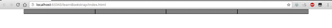
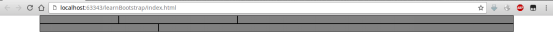
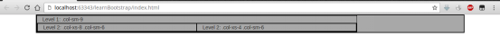
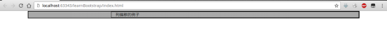

# 容器和栅格

## 容器

包含在容器内的内容宽度由Bootstrap计算得出，且比较美观，支持响应式布局。此处可取两个值：

* container：宽度固定，和屏幕两侧有一定边距。网页正文用此属性即可。
* container-fluid：占据父容器100%，适合巨幕等组件。

```html
<div class="container">
</div>
```

## 栅格系统

栅格系统即可以根据屏幕大小，动态排列内容到最美观状态。栅格写法为row内包含类似col-sm-3的属性。

页面横向分为12个栅格，一行栅格元素格数凑齐12就会另起一行。

xs、sm、md、lg适合不同大小屏幕，具体参见官网文档。

```html
<div class="row">
   <div class="col-sm-3"></div>
   <div class="col-sm-3"></div>
   <div class="col-sm-3"></div>
   <div class="col-sm-3"></div>
</div>
```

显示效果（注：例子的边框和背景颜色是为了便于展示手动添加的）



栅格换行的例子

```html
<div class="row">
   <div class="col-sm-2"></div>
   <div class="col-sm-3"></div>
   <div class="col-sm-7"></div>
   <div class="col-sm-3"></div>
   <div class="col-sm-9"></div>
</div>
```



栅格嵌套的例子
```html
<div class="row">
   <div class="col-sm-9">
      Level 1: .col-sm-9
      <div class="row">
         <div class="col-xs-8 col-sm-6">
            Level 2: .col-xs-8 .col-sm-6
         </div>
         <div class="col-xs-4 col-sm-6">
            Level 2: .col-xs-4 .col-sm-6
         </div>
      </div>
   </div>
</div>
```



使用类似`col-md-offset-*`类似的类可以形成列偏移。

```html
<div class="row">
   <div class="col-sm-9 col-md-offset-3">
      列偏移的例子
   </div>
</div>
```


