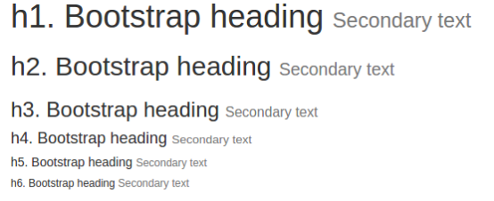
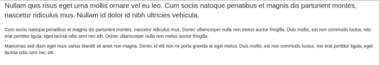
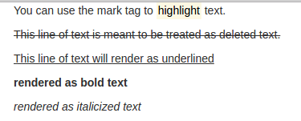
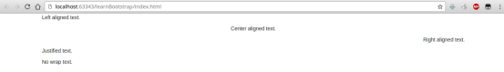
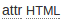
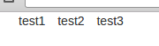
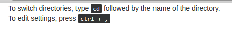
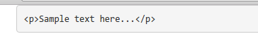

# 排版

## 标题和标题注解

```html
<h1>h1. Bootstrap heading <small>Secondary text</small></h1>
<h2>h2. Bootstrap heading <small>Secondary text</small></h2>
<h3>h3. Bootstrap heading <small>Secondary text</small></h3>
<h4>h4. Bootstrap heading <small>Secondary text</small></h4>
<h5>h5. Bootstrap heading <small>Secondary text</small></h5>
<h6>h6. Bootstrap heading <small>Secondary text</small></h6>
```



## 段落

```html
<p class="lead">...</p>
<p>...</p>
<p>...</p>
```



## 文本高亮/删除效果/下划线/粗体/斜体

```html
<p>You can use the mark tag to <mark>highlight</mark> text.</p>
<p><del>This line of text is meant to be treated as deleted text.</del></p>
<p><u>This line of text will render as underlined</u></p>
<p><strong>rendered as bold text</strong></p>
<p><em>rendered as italicized text</em></p>
```



文本位置（相对父容器）

```html
<p class="text-left">Left aligned text.</p>
<p class="text-center">Center aligned text.</p>
<p class="text-right">Right aligned text.</p>
<p class="text-justify">Justified text.</p>
<p class="text-nowrap">No wrap text.</p>
```



## 缩略语和首字母缩略语

```html
<abbr title="attribute">attr</abbr>
<abbr title="HyperText Markup Language" class="initialism">HTML</abbr>
```

鼠标移到上面指针会改变形状，并显示全文。



## 引用

```html
<blockquote>
   <p>Lorem ipsum dolor sit amet, consectetur adipiscing elit. Integer posuere erat a ante.</p>
</blockquote>
```


## 内联列表

即横着排列的`<ul>`

```html
<ul class="list-inline">
   <li>test1</li>
   <li>test2</li>
   <li>test3</li>
</ul>
```



## 内联式代码嵌入

```html
<p>For example, <code>&lt;section&gt;</code> should be wrapped as inline.</p>
```


## 用户输入

```html
<p>
   To switch directories, type <kbd>cd</kbd> followed by the name of the directory.<br>
   To edit settings, press <kbd><kbd>ctrl</kbd> + <kbd>,</kbd></kbd>
</p>
```



## 代码块

```html
<div class="container">
   <pre>&lt;p&gt;Sample text here...&lt;/p&gt;</pre>
</div>
```

注意：即使在<pre>内也不能直接使用大于号小于号等，要用实体替代。


