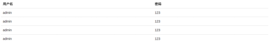
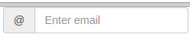
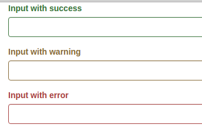
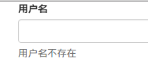
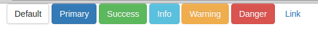
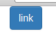

# 全局CSS样式

## 表格

普通表格示例
```html
<div class="container">
   <table class="table">
      <tr>
         <th>用户名</th>
         <th>密码</th>
      </tr>
      <tr>
         <td>admin</td>
         <td>123</td>
      </tr>
      <tr>
         <td>admin</td>
         <td>123</td>
      </tr>
      <tr>
         <td>admin</td>
         <td>123</td>
      </tr>
      <tr>
         <td>admin</td>
         <td>123</td>
      </tr>
   </table>
</div>
```



### 带有效果的表格

* table-striped：行与行之间的斑马线效果
* table-bordered：边框
* table-hover：悬停变色
* table-condensed：紧凑，单元格padding减半

代码示例
```html
<table class="table table-striped table-bordered table-hover">
...
</table>
```

### 行或单元格效果

* active：选中的颜色
* success：前绿色
* info：浅蓝色
* warning：浅黄色
* danger：浅红色

代码示例
```html
<tr class="danger">
...
</tr>
```

### 响应式表格

* table-responsive：在较小屏幕下会产生横向滚动条

代码示例
```html
<div class="table-responsive">
   <table class="table">
   </table>
</div>
```

## 表单

表单的固定写法：`<form>`的`role`属性为`form`，组件写在`form-group`里，并为`form-control`属性，`<label>`标签必须有。

注意：表单不可和输入控件组混用。

普通表单示例

```html
<form role="form">
   <div class="form-group">
      <label for="exampleInputEmail1">Email address</label>
      <input type="email" class="form-control" id="exampleInputEmail1" placeholder="Enter email">
   </div>
   <div class="form-group">
      <label for="exampleInputPassword1">Password</label>
      <input type="password" class="form-control" id="exampleInputPassword1" placeholder="Password">
   </div>
   <div class="form-group">
      <label for="exampleInputFile">File input</label>
      <input type="file" id="exampleInputFile">
      <p class="help-block">Example block-level help text here.</p>
   </div>
   <div class="checkbox">
      <label>
         <input type="checkbox"> Check me out
      </label>
   </div>
   <button type="submit" class="btn btn-default">Submit</button>
</form>
```


### 带有效果的表单

* form form-inline：表单控件表现为内联
* label sr-only：隐藏label
* input-group-addon：为控件添加前缀效果 例：

```html
<div class="input-group">
   <div class="input-group-addon">@</div>
   <input class="form-control" type="email" placeholder="Enter email">
</div>
```



* form form-horizontal：将控件组栅格化，此时控件应指定栅格属性
* div(form-group)：has-warning/has-error/has-success：改变空间状态（颜色）

例子
```html
<div class="form-group has-success">
   <label class="control-label" for="inputSuccess1">Input with success</label>
   <input type="text" class="form-control" id="inputSuccess1">
</div>
```



### 表单辅助文本

```html
<div class="form-group">
   <label class="control-label" for="username">用户名</label>
   <input type="text" class="form-control" id="username">
   <span class="help-block">用户名不存在</span>
</div>
```

可用于输出错误信息



## 按钮

按钮固定写法：`btn`属性+`btn-primary`等样式属性

按钮示例

```html
<button type="button" class="btn btn-default">Default</button>
<button type="button" class="btn btn-primary">Primary</button>
<button type="button" class="btn btn-success">Success</button>
<button type="button" class="btn btn-info">Info</button>
<button type="button" class="btn btn-warning">Warning</button>
<button type="button" class="btn btn-danger">Danger</button>
<button type="button" class="btn btn-link">Link</button>
```



按钮属性

* btn-large/btn-sm/btn-xs：大 小 超小
* btn-block：转换为块级元素，长度拉伸到父级元素100%

### 链接变按钮

```html
<a href="#" class="btn btn-primary" role="button">link</a>
```



## 图片

### 响应式图片

```html

```

其实就是 `max-width:100%; height:auto;`

### 图片形状改变

```html


```
