# 控件

## Glyphicons 字体图标

示例：带有搜索图标的按钮
```html
<button class="btn btn-primary"><span class="glyphicon glyphicon-search"></span> 搜索</button>
```

注意：务必在图标的span和内容之间加一个空格


## 下拉菜单

```html
<div class="dropdown">
   <button class="btn btn-default dropdown-toggle" type="button" id="dropdownMenu1" data-toggle="dropdown">
      Dropdown
      <span class="caret"></span>
   </button>
   <ul class="dropdown-menu" role="menu" aria-labelledby="dropdownMenu1">
      <li role="presentation"><a role="menuitem" tabindex="-1" href="#">Action</a></li>
      <li role="presentation" class="divider"></li>
      <li role="presentation"><a role="menuitem" tabindex="-1" href="#">Another action</a></li>
      <li role="presentation"><a role="menuitem" tabindex="-1" href="#">Something else here</a></li>
      <li role="presentation"><a role="menuitem" tabindex="-1" href="#">Separated link</a></li>
   </ul>
</div>
```

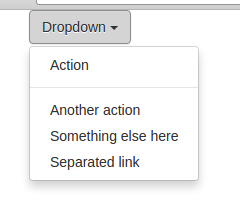

## 按钮组和按钮工具栏

```html
<div class="btn-toolbar">
   <div class="btn-group">
      <button class="btn btn-primary">按钮</button>
      <button class="btn btn-primary">按钮</button>
      <button class="btn btn-primary">按钮</button>
   </div>
   <div class="btn-group">
      <button class="btn btn-primary">按钮</button>
      <button class="btn btn-primary">按钮</button>
      <button class="btn btn-primary">按钮</button>
   </div>
   <div class="btn-group">
      <button class="btn btn-primary">按钮</button>
      <button class="btn btn-primary">按钮</button>
      <button class="btn btn-primary">按钮</button>
   </div>
</div>
```

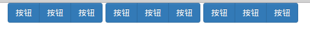

## 输入控件组

### 基本输入控件组

```html
<div class="input-group">
   <span class="input-group-addon">@</span>
   <input type="text" class="form-control" placeholder="Username">
</div>
```


### 带有组合按钮的输入控件

```html
<div class="container">
   <div class="input-group">
      <input type="text" class="form-control">
      <span class="input-group-btn">
        <button class="btn btn-default" type="button">Go!</button>
      </span>
   </div>
</div>
```


## 标签页

```html
<ul class="nav nav-tabs" role="tablist">
   <li role="presentation" class="active"><a href="#">Home</a></li>
   <li role="presentation"><a href="#">Profile</a></li>
   <li role="presentation"><a href="#">Messages</a></li>
</ul>
```

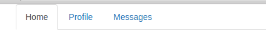

### 胶囊式标签页

```html
<ul class="nav nav-pills" role="tablist">
   <li role="presentation" class="active"><a href="#">Home</a></li>
   <li role="presentation"><a href="#">Profile</a></li>
   <li role="presentation"><a href="#">Messages</a></li>
</ul>
```

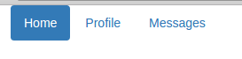

### 竖排胶囊式标签页

```html
<ul class="nav nav-pills nav-stacked" role="tablist">
   <li role="presentation" class="active"><a href="#">Home</a></li>
   <li role="presentation"><a href="#">Profile</a></li>
   <li role="presentation"><a href="#">Messages</a></li>
</ul>
```

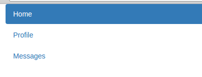

## 导航条

注意：应根据实际使用情况进行适当删减和修改

```html
<nav class="navbar navbar-default" role="navigation">
   <div class="container-fluid">
      <!-- Brand and toggle get grouped for better mobile display -->
      <div class="navbar-header">
         <button type="button" class="navbar-toggle collapsed" data-toggle="collapse" data-target="#bs-example-navbar-collapse-1">
            <span class="sr-only">Toggle navigation</span>
            <span class="icon-bar"></span>
            <span class="icon-bar"></span>
            <span class="icon-bar"></span>
         </button>
         <a class="navbar-brand" href="#">Brand</a>
      </div>

      <!-- Collect the nav links, forms, and other content for toggling -->
      <div class="collapse navbar-collapse" id="bs-example-navbar-collapse-1">
         <ul class="nav navbar-nav">
            <li class="active"><a href="#">Link</a></li>
            <li><a href="#">Link</a></li>
            <li class="dropdown">
               <a href="#" class="dropdown-toggle" data-toggle="dropdown">Dropdown <span class="caret"></span></a>
               <ul class="dropdown-menu" role="menu">
                  <li><a href="#">Action</a></li>
                  <li><a href="#">Another action</a></li>
                  <li><a href="#">Something else here</a></li>
                  <li class="divider"></li>
                  <li><a href="#">Separated link</a></li>
                  <li class="divider"></li>
                  <li><a href="#">One more separated link</a></li>
               </ul>
            </li>
         </ul>
         <form class="navbar-form navbar-left" role="search">
            <div class="form-group">
               <input type="text" class="form-control" placeholder="Search">
            </div>
            <button type="submit" class="btn btn-default">Submit</button>
         </form>
         <ul class="nav navbar-nav navbar-right">
            <li><a href="#">Link</a></li>
            <li class="dropdown">
               <a href="#" class="dropdown-toggle" data-toggle="dropdown">Dropdown <span class="caret"></span></a>
               <ul class="dropdown-menu" role="menu">
                  <li><a href="#">Action</a></li>
                  <li><a href="#">Another action</a></li>
                  <li><a href="#">Something else here</a></li>
                  <li class="divider"></li>
                  <li><a href="#">Separated link</a></li>
               </ul>
            </li>
         </ul>
      </div>
   </div>
</nav>
```

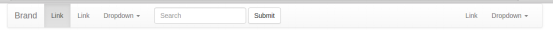

### 其他属性

* `nav navbar-fixed-top` 导航条固定在顶部，注意：为了避免内容被导航条遮挡，下方内容应设置padding为70px
* `navbar-inverse` 反色的导航条（黑色白字）

## 路径条

```html
<ol class="breadcrumb">
   <li><a href="#">Home</a></li>
   <li><a href="#">Library</a></li>
   <li class="active">Data</li>
</ol>
```

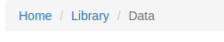

## 分页导航按钮组

注意：也经常用自定义按钮组进行替代

```html
<nav>
   <ul class="pagination">
      <li><a href="#">&laquo;</a></li>
      <li><a href="#">1</a></li>
      <li><a href="#">2</a></li>
      <li><a href="#">3</a></li>
      <li><a href="#">4</a></li>
      <li><a href="#">5</a></li>
      <li><a href="#">&raquo;</a></li>
   </ul>
</nav>
```

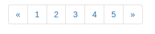

## 翻页导航按钮组

```html
<nav>
   <ul class="pager">
      <li><a href="#">Previous</a></li>
      <li><a href="#">Next</a></li>
   </ul>
</nav>
```

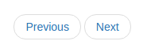

## 标签

```html
<h3>Example heading <span class="label label-default">New</span></h3>
```

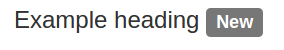

### 其他标签样式

```html
<span class="label label-default">Default</span>
<span class="label label-primary">Primary</span>
<span class="label label-success">Success</span>
<span class="label label-info">Info</span>
<span class="label label-warning">Warning</span>
<span class="label label-danger">Danger</span>
```

## 徽章

```html
<a href="#">Inbox <span class="badge">42</span></a>

<button class="btn btn-primary" type="button">
   Messages <span class="badge">4</span>
</button>
```

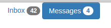

## 巨幕

可以将巨幕控件移到container外侧，指定自己的容器为`container-fliud`，这样可以去掉默认`container`的全局左右边距。

巨幕背景可以手动指定。

```html
<div class="container">
   <div class="jumbotron">
      <h1>Hello</h1>
      <p>hello bootstrap</p>
      <p><a class="btn btn-primary btn-lg" href="#" role="button">Learn more</a></p>
   </div>
</div>
```

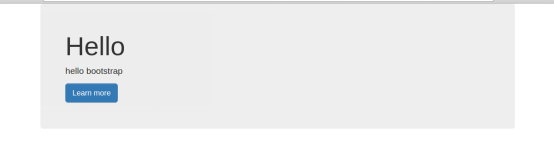

## 页头

```html
<div class="page-header">
   <h1>Example page header <small>Subtext for header</small></h1>
</div>
```

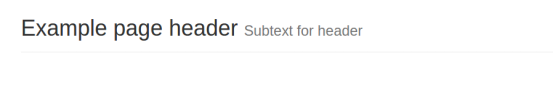

## 栅格化缩略图

注意：

1. Javascript并没有真正的产生缩略图，而只是改变了图片的尺寸。
2. holder.js后面的是图片的参数，可以适当更改，也可以使用百分比的形式。

```html
<div class="row">
   <div class="col-sm-6 col-md-4">
      <div class="thumbnail">
         
         <div class="caption">
            <h3>图</h3>
            <p>这是一幅图片</p>
            <p><a href="#" class="btn btn-primary" role="button">Button</a> <a href="#" class="btn btn-default" role="button">Button</a></p>
         </div>
      </div>
   </div>
   <div class="col-sm-6 col-md-4">
      <div class="thumbnail">
         
         <div class="caption">
            <h3>图</h3>
            <p>这是一幅图片</p>
            <p><a href="#" class="btn btn-primary" role="button">Button</a> <a href="#" class="btn btn-default" role="button">Button</a></p>
         </div>
      </div>
   </div>
   <div class="col-sm-6 col-md-4">
      <div class="thumbnail">
         
         <div class="caption">
            <h3>图</h3>
            <p>这是一幅图片</p>
            <p><a href="#" class="btn btn-primary" role="button">Button</a> <a href="#" class="btn btn-default" role="button">Button</a></p>
         </div>
      </div>
   </div>
</div>
```

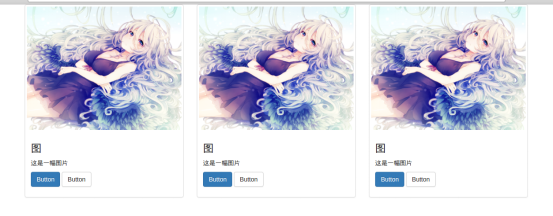

## 可关闭警告框

```html
<div class="alert alert-success alert-dismissible" role="alert">
   <button type="button" class="close" data-dismiss="alert"><span aria-hidden="true">&times;</span><span class="sr-only">Close</span></button>
   <strong>Warning!</strong> Better check yourself, you're not looking too good.
</div>
<div class="alert alert-info alert-dismissible" role="alert">
   <button type="button" class="close" data-dismiss="alert"><span aria-hidden="true">&times;</span><span class="sr-only">Close</span></button>
   <strong>Warning!</strong> Better check yourself, you're not looking too good.
</div>
<div class="alert alert-warning alert-dismissible" role="alert">
   <button type="button" class="close" data-dismiss="alert"><span aria-hidden="true">&times;</span><span class="sr-only">Close</span></button>
   <strong>Warning!</strong> Better check yourself, you're not looking too good.
</div>
<div class="alert alert-danger alert-dismissible" role="alert">
   <button type="button" class="close" data-dismiss="alert"><span aria-hidden="true">&times;</span><span class="sr-only">Close</span></button>
   <strong>Warning!</strong> Better check yourself, you're not looking too good.
</div>
```

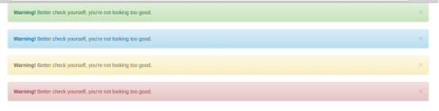

## 带动画的进度条

```html
<div class="progress">
   <div class="progress-bar progress-bar-striped active" role="progressbar" aria-valuenow="45" aria-valuemin="0" aria-valuemax="100" style="width: 45%">
      <span class="sr-only">45% Complete</span>
   </div>
</div>
```

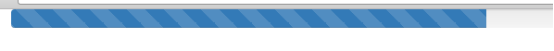

## 列表组

```html
<ul class="list-group">
   <li class="list-group-item">Cras justo odio</li>
   <li class="list-group-item">Dapibus ac facilisis in</li>
   <li class="list-group-item">Morbi leo risus</li>
   <li class="list-group-item">Porta ac consectetur ac</li>
   <li class="list-group-item">Vestibulum at eros</li>
</ul>
```

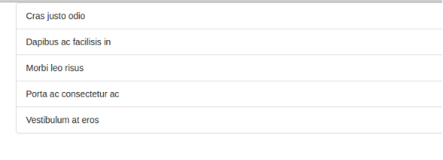

### 列表组的变体：链接组

```html
<div class="list-group">
   <a href="#" class="list-group-item active">Cras justo odio</a>
   <a href="#" class="list-group-item">Dapibus ac facilisis in</a>
   <a href="#" class="list-group-item">Morbi leo risus</a>
   <a href="#" class="list-group-item">Porta ac consectetur ac</a>
   <a href="#" class="list-group-item">Vestibulum at eros</a>
</div>
```

## 带标题的面板

```html
<div class="panel panel-default">
   <div class="panel-heading">Panel heading without title</div>
   <div class="panel-body">
      Panel content
   </div>
</div>
```

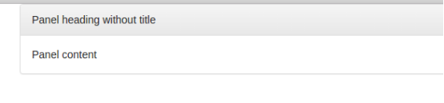

### 带有情景效果（颜色）的面板

```html
<div class="panel panel-primary">...</div>
<div class="panel panel-success">...</div>
<div class="panel panel-info">...</div>
<div class="panel panel-warning">...</div>
<div class="panel panel-danger">...</div>
```
