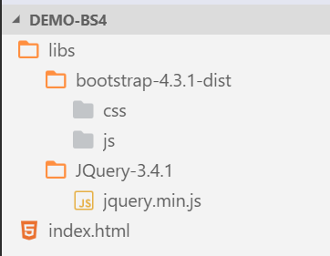

# 01-简介和环境搭建

Bootstrap是Twitter开发的一个适合后端开发者使用的CSS和JQuery插件库，Bootstrap3我已经使用了很多年了，它非常适合快速搭建没什么UI美观需求，交互又不是特别复杂的后台管理（增删改查）系统，Bootstrap3相关的笔记也已经是非常古老了，当时也并不会什么前端，但Bootstrap用着就特别顺手。

Bootstrap v4已经正式发布了一段时间，和v3的主要区别就是优化了一些界面效果，以及CSS的class使用设定更加现代化。v4和v3一样还是基于JQuery的，这里我们简单学习了解一下。

注：到目前为止，Bootstrap4的中文文档虽然有，但是基本就是机翻水平，一些单词该翻译的没翻译，不该翻译的乱翻译，而且有些本来正确的英文单词都改的错字连篇，不忍直视，简直是污染网络环境，建议不要看。

## 环境搭建

### 下载

官网：[https://getbootstrap.com/](https://getbootstrap.com/)

目前，Bootstrap最新版本是4.3.1。

除此之外，Bootstrap4还依赖JQuery，我们需要额外下载这些组件。

### 引入依赖



```html
<link rel="stylesheet" href="libs/bootstrap-4.3.1-dist/css/bootstrap.min.css">
<script src="libs/jQuery-3.4.1/jquery.min.js"></script>
<script src="libs/bootstrap-4.3.1-dist/js/bootstrap.bundle.min.js"></script>
```

注意：Bootstrap提供了好几个JavaScript文件，其中`.bundle.min.js`是最全的，除了JQuery其余依赖都自带了。

## 全局CSS设定

浏览器的默认页面有一些奇怪的特性，我们一般都会在一开始把它们去掉，比如下面这两个，取消了页面的默认边距和盒模型：

```css
* {
    box-sizing: border-box;
}
body {
    margin: 0;
}
```
