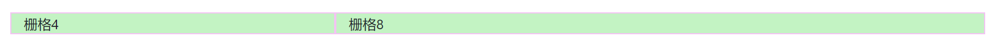
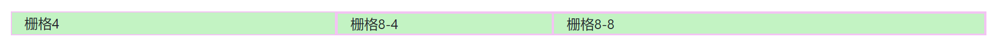
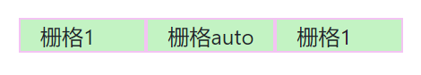
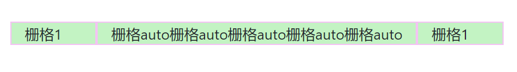
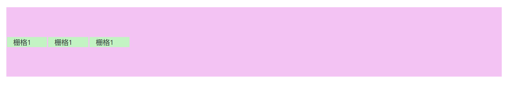
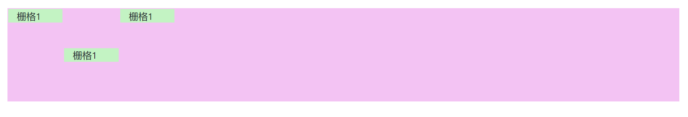

# 布局

在Bootstrap3中，栅格系统是最吸引人的地方，随着CSS标准的发展，像flex、grid这些新的布局方式的出现，Bootstrap4中也做了对应的封装，这里我们简单介绍一些Bootstrap4中的布局系统。

## container

container一般作为Bootstrap中所有其它布局的根布局，一般用在这个页面的根元素。

```html
<body>
    <div class="container">
        ...
    </div>
</body>
```

* `container`：带有自适应`margin`，其包含的页面元素会有默认的左右页边距，适用于页面正文
* `container-fluid`：永远占浏览器总宽度的100%，适用于全局顶部导航条，页头等组件

## 栅格系统

Bootstrap4中基于flexbox实现了栅格系统，使用比Bootstrap3更加灵活。和以前一样，栅格将宽度分为12份，我们可以随意指定元素占用12份中的几份，以此实现布局。

### 基本使用

下面代码将宽度划分为了4份和8份：

```html
<div class="container">
    <div class="row">
        <div class="col-lg-4">栅格4</div>
        <div class="col-lg-8">栅格8</div>
    </div>
</div>
```



### 栅格列偏移

和Bootstrap3中一样，可以使用类似`offset-lg-4`的形式指定栅格列偏移。

### 栅格嵌套

栅格是可嵌套的，下面代码嵌套了两层栅格：

```html
<div class="container">
    <div class="row">
        <div class="col-lg-4">栅格4</div>
        <div class="col-lg-8">
            <div class="row">
                <div class="col-lg-4">栅格8-4</div>
                <div class="col-lg-8">栅格8-8</div>
            </div>
        </div>
    </div>
</div>
```



### 自动栅格

我们可以用`col-lg-auto`指定一个自动栅格，它可以根据包含的内容长度，自动设置栅格参数。例子：

```html
<div class="container">
    <div class="row">
        <div class="col-lg-1">栅格1</div>
        <div class="col-lg-auto">栅格auto</div>
        <div class="col-lg-1">栅格1</div>
    </div>
</div>
```



从图中我们可以看到中间的`col-lg-auto`栅格的长度和旁边的`col-lg-1`是一样长的，它根据所包含的内容被自动设置了占用1份的栅格。如果加长其内容，就会看到不一样的效果了。下图大约占了4份栅格长度：



### 响应式栅格系统

前面我们使用了类似`col-lg-*`的class，其中`lg`表示该栅格系统应用于较大的桌面显示器（即屏幕宽度>=992px），如果希望在较小型的显示器上能够应用不同的栅格布局，可以混合使用`col-sm-*`，`col-md-*`等，这和Bootstrap3中一样，这里就不多做介绍了。

### 栅格对齐

Bootstrap4的栅格基于flex实现，因此能够更加方便的实现水平和垂直对齐，Bootstrap4已经把常用的对齐方式为我们封装好了。

#### 垂直对齐

下面例子实现了栅格系统子元素相对于`row`根元素的对齐方式为垂直居中：

```html
<div class="container">
    <div class="row align-items-center">
        <div class="col-lg-1">栅格1</div>
        <div class="col-lg-1">栅格1</div>
        <div class="col-lg-1">栅格1</div>
    </div>
</div>
```



* `align-items-start`：子元素垂直上对齐
* `align-items-center`：子元素垂直居中
* `align-items-end`：子元素垂直下对齐

除此之外，也可以采用单独设定子元素的垂直对齐方式：

```html
<div class="container">
    <div class="row">
        <div class="col-lg-1 align-self-start">栅格1</div>
        <div class="col-lg-1 align-self-center">栅格1</div>
        <div class="col-lg-1 align-self-start">栅格1</div>
    </div>
</div>
```



* `align-self-start`：相对父元素垂直上对齐
* `align-self-center`：相对父元素垂直居中
* `align-self-end`：相对父元素垂直下对齐

#### 水平对齐

下面代码实现了水平居中：

```html
<div class="container">
    <div class="row justify-content-center">
        <div class="col-lg-1">栅格1</div>
        <div class="col-lg-1">栅格1</div>
        <div class="col-lg-1">栅格1</div>
    </div>
</div>
```


* `justify-content-start`：水平左对齐
* `justify-content-center`：水平居中
* `justify-content-end`：水平右对齐
* `justify-content-around`：水平等间隔对齐（很少用）
* `justify-content-between`：水平两端对齐（很少用）
