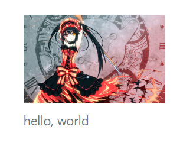

# 排版

这里排版主要指处理网页的文字正文和图片，HTML中默认有`<h1>`、`<p>`等都属于排版标签，Bootstrap中对这些排版标签进行了样式覆盖，并封装成class供我们使用，能够实现更规范、更简单的排版效果。

## 标题

### 大标题和子级标题

Bootstrap直接覆盖了默认的`<h1>`、`<h2>`等标签，使其兼容自己的排版样式：

```html
<div class="container">
    <h1>h1. Bootstrap heading</h1>
    <h2>h2. Bootstrap heading</h2>
    <h3>h3. Bootstrap heading</h3>
    <h4>h4. Bootstrap heading</h4>
    <h5>h5. Bootstrap heading</h5>
    <h6>h6. Bootstrap heading</h6>
</div>
```


### 醒目标题

我们可以用`display-1`、`display-2`等制定一个特别醒目的标题，它通常用于宣传页面等。

```html
<div class="container">
    <h1 class="display-1">h1. Bootstrap heading</h1>
    <h1>h1. Bootstrap heading</h1>
    <h2>h2. Bootstrap heading</h2>
    <h3>h3. Bootstrap heading</h3>
    <h4>h4. Bootstrap heading</h4>
    <h5>h5. Bootstrap heading</h5>
    <h6>h6. Bootstrap heading</h6>
</div>
```


### 副标题

副标题一般用作文章总标题的附属说明。

```html
<div class="container">
    <h1>
        大标题
        <small class="text-muted">副标题</small>
    </h1>
</div>
```


## 正文

### 基础使用

正文使用`<p>`指定。

```html
<div class="container">
    <p>Hello, world!</p>
</div>
```


### 中心内容

例如论文有一个「摘要」用来描述整篇文章写了什么，我们的页面有时候也要实现类似效果，这个通常是那个用于学术性，或是文字内容特别多的网页。

```html
<div class="container">
    <h1>Title</h1>
    <p class="lead">Hello, world!</p>
    <p>This is a Bootstrap4 demo.This is a Bootstrap4 demo.This is a Bootstrap4 demo.</p>
</div>
```


图中，夹在标题和正文之间的就是中心内容。

### 缩略语

一些专业性的学术文章都会有缩略语的备注，甚至专业名词附录。这个功能也可以实现到网页上。

```html
<div class="container">
    <p><abbr title="HyperText Markup Language">HTML</abbr></p>
</div>
```


### 备注和引用

Bootstrap4中备注的样式似乎是改丑了。

```html
<div class="container">
    <p>正文</p>
    <blockquote class="blockquote">
        <footer class="blockquote-footer">底部备注</footer>
    </blockquote>
</div>
```


### 按键高亮

我们可以使用`<kbd>`标签高亮一些字符，指定这些字符代表键盘按键。

```html
<div class="container">
    <p>按<kbd>CTRL+C</kbd>复制代码，<kbd>CTRL+V</kbd>粘贴代码。</p>
</div>
```


### 一些特殊效果

下面实现了关键字高亮、删除线、下划线等常用文字效果。

```html
<div class="container">
    <p>You can use the mark tag to <mark>highlight</mark> text.</p>
    <p><del>This line of text is meant to be treated as deleted text.</del></p>
    <p><s>This line of text is meant to be treated as no longer accurate.</s></p>
    <p><ins>This line of text is meant to be treated as an addition to the document.</ins></p>
    <p><u>This line of text will render as underlined</u></p>
    <p><small>This line of text is meant to be treated as fine print.</small></p>
    <p><strong>This line rendered as bold text.</strong></p>
    <p><em>This line rendered as italicized text.</em></p>
</div>
```


当然这个比较鸡肋，因为直接用也非常方便，Bootstrap再封装一层除了看起来比较统一，没什么实际意义，我们一般都是直接调用HTML标签或CSS。

## 图片

### 响应式图片

响应式图片指定`img-fluid`，可以让图片根据父元素进行自动缩放，该缩放是等比例的。下面代码在栅格中放了一个图片，基于栅格的限制，该图片会被缩放。

```html
<div class="container">
    <div class="row">
        <div class="col-lg-1">
            
        </div>
    </div>
</div>
```

### 图片圆角

`rounded`可以给图片加上圆角。

```html

```


### 缩略图边框

`img-thumbnail`能给图片加上一个圆角线框，使其看起来像是缩略图。

```html

```


### 图片的文字说明

`figure`用于给图片加上文字说明。

```html
<figure class="figure">
    
    <figcaption class="figure-caption">hello, world</figcaption>
</figure>
```


