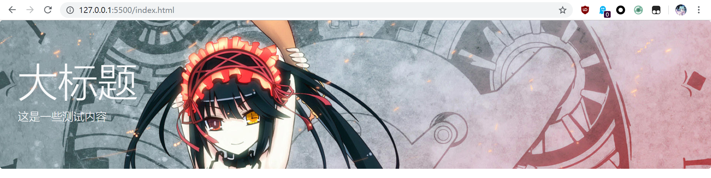

# 组件

相对Bootstrap v3，在v4中组件化体现的更加明确，而且整体也更偏向于组件库（类似JQueryUI这种类型）而不是CSS库，并且优化了一些组件的显示效果，使其更加符合现代的布局方式和审美潮流。v3中的图标库已经移除了，如有需要，建议使用`font-awesome`。

Bootstrap中的组件是基于JQuery的，因此使用前确保你已经引入了JQuery和Bootstrap相关的JavaScript脚本。

## 关于`aria-*`和`sr-only`等

Bootstrap中使用`aria-*`和`sr-only`等设定屏幕阅读器的行为，它用于帮助残障人士使用屏幕阅读器浏览网页，和视觉效果没有关系，下面对组件的介绍暂时去掉了这些无关内容，具体使用方法请参考文档。

## 组件颜色

Bootstrap内置了几种颜色，以下对组件的介绍中涉及到颜色的地方就不再说明了：

* primary：基础之蓝
* secondary：次级之灰
* success：成功之绿
* danger：危险之红
* warning：警告之黄
* info：青绿色
* light：浅色
* dark：深色

## Alert 提示框

Bootstrap中Alert这个组件其实和它的名字不太一致，这个Alert通常用于显示一些提示信息，比如操作成功，或是后台报错等。

```html
<div class="alert alert-warning alert-dismissible fade show">
    这是一个警告!
    <button type="button" class="close" data-dismiss="alert">
        <span>&times;</span>
    </button>
</div>
```


## Badge 徽章

徽章用于显示提示数字或是一个小链接图标。下面代码把徽章放到了按钮中：

```html
<button class="btn btn-primary">新消息 <span class="badge badge-light">3</span></button>
```


`badge-pill`用于指定一个圆角的胶囊徽章：

```html
<span class="badge badge-pill badge-success">Success</span>
```


我们可以把徽章指定到`<a>`标签上，成为一个可以点击的链接徽章按钮，它会带有Bootstrap统一的点击响应效果：

```html
<a href="#" class="badge badge-pill badge-success">Success</a>
```


## Breadcrumb 面包屑

面包屑导航可以配合无序列表使用：

```html
<nav>
    <ol class="breadcrumb">
        <li class="breadcrumb-item"><a href="#">Home</a></li>
        <li class="breadcrumb-item"><a href="#">Library</a></li>
        <li class="breadcrumb-item active">Data</li>
    </ol>
</nav>
```


## Button 按钮

按钮是应用程序中最常用的组件，Bootstrap中可以把`<button>`、`<a>`、`<input>`设置为按钮样式。

基础用法：

```html
<button class="btn btn-primary">按钮</button>
```


除了基本的按钮，Bootstrap还提供了另一种按钮样式，即轮廓按钮：

```html
<button class="btn btn-outline-primary">按钮</button>
```


按钮可以拥有大，普通，小三种尺寸，此外还可以指定为`block`模式（用于移动端）：

```html
<button class="btn btn-primary btn-sm">按钮1</button>
<button class="btn btn-primary">按钮2</button>
<button class="btn btn-primary btn-lg">按钮3</button>
```


```html
<button class="btn btn-primary btn-block">按钮4</button>
```


对于按钮禁用要注意，`<button>`支持`disabled`属性，而`<a>`不支持，因此禁用按钮的写法在这里就不太一样了，对于`<button>`，直接指定禁用即可：

```html
<button class="btn btn-primary" disabled>按钮</button>
```

对于`<a>`，指定class为`disabled`，其点击事件会被自动屏蔽掉：

```html
<a href="http://www.google.com" class="btn btn-primary disabled">链接</a>
```

## Button Group 按钮组

一组按钮，比如分页组件中的页码按钮，可以用按钮组包裹。

```html
<div class="btn-group">
    <button class="btn btn-primary">1</button>
    <button class="btn btn-primary">2</button>
    <button class="btn btn-primary">3</button>
</div>
```


## Card 卡片

Bootstrap中，Card取代Panel称为了一个容纳各种组件的容器，Card具有更多用法，但是总体上还是和原来差不多。实际上，Bootstrap4把本是作为容器的Panel硬生生的合并到一个Card卡片组件，使其具有太多功能，这可能并不是一个好设计。

`card-body`是卡片主体内容：

```html
<div class="card">
    <div class="card-body">这是卡片</div>
</div>
```


`card-header`是卡片标题：

```html
<div class="card">
    <div class="card-header">这是标题</div>
    <div class="card-body">这是内容</div>
</div>
```


通常一个文字卡片可以带有标题，连接等内容：

```html
<div class="card">
    <div class="card-body">
        <h5 class="card-title">标题</h5>
        <h6 class="card-subtitle">副标题</h6>
        <p class="card-text">这是卡片内容</p>
        <a href="#" class="card-link">Link1</a>
        <a href="#" class="card-link">Link2</a>
    </div>
</div>
```


除此之外还可以实现图片卡片：

```html
<div class="card">
    
    <div class="card-body">
        <p class="card-text">这是卡片内容</p>
        <a href="#" class="card-link">Link1</a>
        <a href="#" class="card-link">Link2</a>
    </div>
</div>
```


上述各种卡片的用法都可以选择性的进行组合，其余还有很多用法，具体请参考文档。

## Carousel 轮播

轮播通常用于展示大屏广告等效果，但是这里要注意，轮播的图片最好是大小一样的，至少也要是比例一样的，以免影响用户体验。

```html
<div id="carousel-example" class="carousel slide" data-ride="carousel">
    <ol class="carousel-indicators">
        <li data-target="#carousel-example" data-slide-to="0" class="active"></li>
        <li data-target="#carousel-example" data-slide-to="1"></li>
        <li data-target="#carousel-example" data-slide-to="2"></li>
    </ol>
    <div class="carousel-inner">
        <div class="carousel-item active">
            
        </div>
        <div class="carousel-item">
            
        </div>
        <div class="carousel-item">
            
        </div>
    </div>
    <a class="carousel-control-prev" href="#carousel-example" role="button" data-slide="prev">
        <span class="carousel-control-prev-icon"></span>
    </a>
    <a class="carousel-control-next" href="#carousel-example" role="button" data-slide="next">
        <span class="carousel-control-next-icon"></span>
    </a>
</div>
```


轮播框中也可以对单个图片指定字幕：

```html
<div class="carousel-item active">
    
    <div class="carousel-caption d-none d-md-block">
        <h5>标题</h5>
        <p>这里是测试内容</p>
    </div>
</div>
```


## Collapse 折叠面板

折叠面板就是一个可以控制显示/隐藏的区域，使用JQuery能够很容易的实现，这里主要介绍「手风琴」式的折叠面板，它可以用来实现菜单等效果：

```html
<div class="accordion" id="accordionExample">
    <div class="card">
        <div class="card-header" id="headingOne">
            <button class="btn btn-link" data-toggle="collapse" data-target="#collapseOne">
                折叠1
            </button>
        </div>
        <div id="collapseOne" class="collapse show" data-parent="#accordionExample">
            <div class="card-body">
                内容1
            </div>
        </div>
    </div>
    <div class="card">
        <div class="card-header" id="headingTwo">
            <button class="btn btn-link collapsed" data-toggle="collapse" data-target="#collapseTwo">
                折叠2
            </button>
        </div>
        <div id="collapseTwo" class="collapse" data-parent="#accordionExample">
            <div class="card-body">
                内容2
            </div>
        </div>
    </div>
    <div class="card">
        <div class="card-header" id="headingThree">
            <button class="btn btn-link collapsed" data-toggle="collapse" data-target="#collapseThree">
                折叠3
            </button>
        </div>
        <div id="collapseThree" class="collapse" data-parent="#accordionExample">
            <div class="card-body">
                内容3
            </div>
        </div>
    </div>
</div>
```


## Dropdown 下拉菜单

Bootstrap中封装好了一个下拉菜单组件，非常实用。

```html
<div class="dropdown">
    <button class="btn btn-primary dropdown-toggle" data-toggle="dropdown">
        你好，管理员
    </button>
    <div class="dropdown-menu">
        <a class="dropdown-item" href="#">控制面板</a>
        <a class="dropdown-item" href="#">消息</a>
        <a class="dropdown-item" href="#">退出登录</a>
    </div>
</div>
```


此外，也可以实现分裂式按钮的下拉菜单，经常用于表单中：

```html
<div class="btn-group">
    <button type="button" class="btn btn-success">提交</button>
    <button type="button" class="btn btn-success dropdown-toggle dropdown-toggle-split"
        data-toggle="dropdown"></button>
    <div class="dropdown-menu">
        <a class="dropdown-item" href="#">选项1</a>
        <a class="dropdown-item" href="#">选项2</a>
        <a class="dropdown-item" href="#">选项3</a>
    </div>
</div>
```


## Form 表单

Bootstrap4中表单用法和v3差不多，这里简单介绍一下。下面代码实现了一个登录框，我们将其放在了一个Card里：

```html
<div class="card">
    <div class="card-body">
        <form>
            <div class="form-group">
                <label for="username">用户名</label>
                <input type="text" class="form-control" id="username" />
            </div>
            <div class="form-group">
                <label for="password">密码</label>
                <input type="password" class="form-control" id="password" />
            </div>
            <button type="submit" class="btn btn-primary">登录</button>
        </form>
    </div>
</div>
```


表单输入内置了验证器的样式，我们可以通过`is-valid`和`is-invalid`指示该字段是否通过了验证，对应会显示`valid-feedback`和`invalid-feedback`中的内容。下面代码会显示通过验证的样式：

```html
<div class="form-group">
    <label for="username">用户名</label>
    <input type="text" class="form-control is-valid" id="username" required />
    <div class="valid-feedback">
        字段符合要求
    </div>
    <div class="invalid-feedback">
        字段不符合要求
    </div>
</div>
```


有关表单的用法非常多，本着实用的原则，这里无法一一介绍，具体参考文档。

## Jombotron 大屏

大屏或者叫巨幕，通常用作一个醒目的产品展示或网站介绍。Bootstrap并没有对大屏组件提供显示图片的封装，但是经过测试，使用`background`属性也能很容易的指定大屏背景。

```html
<div class="jumbotron" style="
    background: url('libs/images/1.jpeg') no-repeat top;
    background-size: cover;">
    <h1 class="display-3 text-light">大标题</h1>
    <p class="lead text-light">这是一些测试内容</p>
</div>
```



注：上面图片的尺寸不是很合适，不要在意这些细节。

实际上，这个Jombotron组件是很少用的，Bootstrap主要用来做不太在意美观程度的后台管理系统，使用者都是不懂设计的后端开发人员，像展示页面等我们最好动手写CSS和JavaScript，设计的多炫酷就能写的多炫酷，而Bootstrap的封装不仅失去了灵活性，而且丑。

## List Group 列表组

列表组其实经常作为菜单使用，而且经常和折叠面板等结合。下面代码编写了一个列表组，第一个为激活状态，第二个为禁用状态：

```html
<div class="list-group">
    <a href="#" class="list-group-item list-group-item-action active">链接1</a>
    <a href="#" class="list-group-item list-group-item-action disabled">链接2</a>
    <a href="#" class="list-group-item list-group-item-action">链接3</a>
    <a href="#" class="list-group-item list-group-item-action">链接4</a>
    <a href="#" class="list-group-item list-group-item-action disabled">链接5</a>
</div>
```


## Modal 模态对话框

模态对话框一般用于替代JavaScript中的`alert()`等功能，虽然使用起来非常复杂，但是用户交互体验比较好，而且有更大的定制空间。

```html
<div id="modal" class="modal fade" tabindex="-1">
    <div class="modal-dialog">
        <div class="modal-content">
            <div class="modal-header">
                <h5 class="modal-title">模态框标题</h5>
                <button type="button" class="close" data-dismiss="modal">
                    <span>&times;</span>
                </button>
            </div>
            <div class="modal-body">
                <p>模态框内容</p>
            </div>
            <div class="modal-footer">
                <button type="button" class="btn btn-primary">确认</button>
                <button type="button" class="btn btn-secondary" data-dismiss="modal">取消</button>
            </div>
        </div>
    </div>
</div>
```

仅仅有模态框的HTML是不够的，模态框需要在恰当的时机弹出，这通常需要JavaScript来操作。Modal组件封装了相关的方法供我们调用：

```javascript
$('#modal').modal('show');
```


## Nav 导航

导航有很多种形式，比如单纯的链接，或是标签页Tab等，这个就非常灵活了。这里简单介绍Bootstrap中导航的使用。

最基础的导航可以就是一组链接：

```html
<ul class="nav">
    <li class="nav-item">
        <a class="nav-link" href="#">链接1</a>
    </li>
    <li class="nav-item">
        <a class="nav-link" href="#">链接2</a>
    </li>
    <li class="nav-item">
        <a class="nav-link" href="#">链接3</a>
    </li>
    <li class="nav-item">
        <a class="nav-link disabled" href="#">禁用链接</a>
    </li>
</ul>
```


`nav-tabs`可以指定标签页的效果，其中`active`用于指定被激活的标签页：

```html
<ul class="nav nav-tabs">
    <li class="nav-item">
        <a class="nav-link active" href="#">链接1</a>
    </li>
    <li class="nav-item">
        <a class="nav-link" href="#">链接2</a>
    </li>
    <li class="nav-item">
        <a class="nav-link" href="#">链接3</a>
    </li>
    <li class="nav-item">
        <a class="nav-link disabled" href="#">禁用链接</a>
    </li>
</ul>
```


除了`nav-tabs`还可以使用`nav-pills`指定胶囊标签：


## Navbar 导航条

Navbar是页头导航，下面代码虽然很多，但其实都是和之前介绍过的组件相组合，为页头加入链接、表单等元素：

```html
<nav class="navbar navbar-expand-lg navbar-light bg-light">
    <a class="navbar-brand" href="#">Navbar</a>
    <button class="navbar-toggler" type="button" data-toggle="collapse" data-target="#navbarSupportedContent">
        <span class="navbar-toggler-icon"></span>
    </button>
    <div class="collapse navbar-collapse" id="navbarSupportedContent">
        <ul class="navbar-nav mr-auto">
            <li class="nav-item active">
                <a class="nav-link" href="#">Home</a>
            </li>
            <li class="nav-item">
                <a class="nav-link" href="#">Link</a>
            </li>
            <li class="nav-item dropdown">
                <a class="nav-link dropdown-toggle" href="#" id="navbarDropdown" data-toggle="dropdown">
                    Dropdown
                </a>
                <div class="dropdown-menu">
                    <a class="dropdown-item" href="#">Action</a>
                    <a class="dropdown-item" href="#">Another action</a>
                    <div class="dropdown-divider"></div>
                    <a class="dropdown-item" href="#">Something else here</a>
                </div>
            </li>
            <li class="nav-item">
                <a class="nav-link disabled" href="#" tabindex="-1">Disabled</a>
            </li>
        </ul>
        <form class="form-inline my-2 my-lg-0">
            <input class="form-control mr-sm-2" type="search" placeholder="Search">
            <button class="btn btn-outline-success my-2 my-sm-0" type="submit">Search</button>
        </form>
    </div>
</nav>
```


除此之外，比较常用的还有固定导航条在屏幕顶部，这可以在`<nav>`上使用`fixed-top`指定。

实际上，页头导航的定制需求还是很强的，我们实际开发中，页头并不一定按照上面给定的模板编写，只要了解Bootstrap中的布局原理，定制还是很容易的。

## Pagination 分页

其实一个按钮组就可以制作一个最简单的分页组件，Bootstrap提供的`pagination`也并没有对分页功能做太多封装。

```html
<ul class="pagination">
    <li class="page-item">
        <a class="page-link" href="#">
            <span>&laquo;</span>
        </a>
    </li>
    <li class="page-item"><a class="page-link" href="#">1</a></li>
    <li class="page-item"><a class="page-link" href="#">2</a></li>
    <li class="page-item"><a class="page-link" href="#">3</a></li>
    <li class="page-item">
        <a class="page-link" href="#">
            <span>&raquo;</span>
        </a>
    </li>
</ul>
```


我们可以在`<li>`上指定`active`和`disabled`，用于激活和禁用效果。

```html
<nav>
    <ul class="pagination">
        <li class="page-item disabled">
            <a class="page-link" href="#">
                <span>&laquo;</span>
            </a>
        </li>
        <li class="page-item active"><a class="page-link" href="#">1</a></li>
        <li class="page-item"><a class="page-link" href="#">2</a></li>
        <li class="page-item"><a class="page-link" href="#">3</a></li>
        <li class="page-item">
            <a class="page-link" href="#">
                <span>&raquo;</span>
            </a>
        </li>
    </ul>
</nav>
```


## Popover/Tooltip 提示

Popover可以实现点击按钮触发一个提示框的效果。使用前需要初始化Popover：

```javascript
$('[data-toggle="popover"]').popover();
```

例子：
```html
<button type="button" class="btn btn-lg btn-danger" data-toggle="popover" title="标题"
    data-content="弹出内容">点击弹出</button>
```


Tooltip可Popover差不多，只是效果有些区别，使用前也需要初始化：

```javascript
$('[data-toggle="tooltip"]').tooltip();
```

例子：
```html
<button type="button" class="btn btn-secondary" data-toggle="tooltip" data-placement="top"
    title="这是提示信息">按钮</button>
```


## Progress/Spinner 进度条

`progress`用于指定进度条：

```html
<div class="progress">
    <div class="progress-bar progress-bar-striped progress-bar-animated" style="width: 75%"></div>
</div>
```


其中，需要使用`width`这个CSS属性指定进度，这个其实封装度很低，比较难用。

`spinner`用于指定一个环境的加载中提示：

```html
<div class="spinner-border text-primary"></div>
```


## Table 表格

表格的基本用法和之前v3差不多：

```html
<table class="table table-hover table-striped">
    <thead>
        <tr>
            <th>用户名</th>
            <th>密码</th>
        </tr>
    </thead>
    <tbody>
        <tr>
            <td>Tom</td>
            <td>abc123</td>
        </tr>
        <tr>
            <td>Jerry</td>
            <td>jerry666</td>
        </tr>
        <tr>
            <td>Lucy</td>
            <td>admin</td>
        </tr>
    </tbody>
</table>
```


