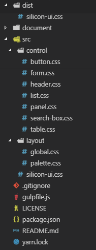

# CSS工程项目搭建

你读到这里可能就会有疑问了，CSS居然tm也能写篇笔记讲项目搭建，CSS说白了就是浏览器渲染引擎的配置文件，连编程语言都算不上，写个`xxx.css`，`link`进HTML或者Webpack打包进前端代码包就完事了，这对于CSS的使用者来说确实完全没问题。

然而在这里，我们假设要写一个通用CSS样式库，这个CSS工程需要模块划分，压缩构建，以及发布到npm。这里主要讲解如何搭建一个使用Gulp构建的CSS样式库工程。

## 工程目录结构



上面是一个例子CSS样式库工程。

* `dist`：构建输出的文件夹
* `document`：一些文档、例子等无关内容
* `src`：CSS源码，根目录有一个`.css`文件，作为其他所有CSS引入的目录文件
* `gulpfile.js`：Gulp配置文件
* `package.json`：npm项目描述文件

## package.json

构建CSS的一个比较简单方式就是配置一个Gulp，依赖如下：

```json
"devDependencies": {
  "gulp": "^4.0.0",
  "gulp-concat": "^2.6.1",
  "gulp-minify-css": "^1.2.4",
  "gulp-notify": "^3.2.0",
  "gulp-rename": "^1.4.0"
}
```

在`scripts`中，我们指定构建整个工程的npm命令：

```json
"scripts": {
  "build": "gulp css"
}
```

这样，我们执行`npm run build`就可以构建工程了。

## gulpfile.js

`gulpfile.js`是Gulp的配置文件，这里我们主要配置一个CSS的压缩插件。

```javascript
let gulp = require('gulp');
let cssUglify = require('gulp-minify-css');

gulp.task('css', gulp.series(function () {
    return gulp.src('src/*.css')
        .pipe(cssUglify())
        .pipe(gulp.dest('dist'))
}));
```

## 模块化CSS

这个其实也算不上什么模块化，就是把整个CSS样式库划分成多文件的结构，写法如下：

```css
@import url('control/button.css');
@import url('control/panel.css');
...
```

这种写法最好不要直接用在`<link>`引入CSS的Web环境中，因为每个CSS文件都会单独发起HTTP请求，当样式库变得庞大时，网络开销会非常巨大，最好使用Gulp进行构建输出。
