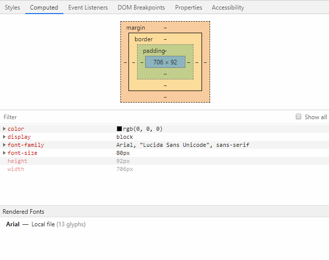

# 字体设置

文字是网页的内容主要之一，如果字体不忍直视，那页面给人的感觉就Low到爆了。另外，我们的页面通常不可能只用一种字体，例如个人博客：标题可能选用一种个性化、活泼的字体，正文使用一种舒适养眼的字体，文章中的内嵌代码块则要使用一种漂亮稳重的等宽字体。

## fallback机制和字体族

我们的操作系统自带了一些字体，然而很多字体并不是免费随便用的，这就导致Windows、OSX中自带的字体各不相同，而Linux用户更不用说，系统安装哪些字体完全是出于用户的个人喜好，这就导致各个操作系统下，字体显示效果各不相同。

`font-family`可以指定多个字体以及一个默认字体族，浏览器会依次寻找，如果全不匹配，就使用我们指定的字体族中，系统的默认字体。常用字体族包括：

* serif：衬线字体族
* sans-serif：非衬线字体族
* monospace：等宽字体族，通常仅用于程式代码

## font-family字体设置

```css
.font-demo {
	font-family: Arial, "Lucida Sans Unicode", sans-serif;
}
```


上面例子中，浏览器会依次寻找`Arial`、`Lucida Sans Unicode`字体，如果都没找到，就会使用系统默认的非衬线字体，在Windows操作系统下，默认的非衬线字体是`Microsoft YaHei`。当然，由于Windows操作系统自带了`Arial`字体，所以在Windows操作系统下以上CSS会让英文字体变为`Arial`，中文字体则是fallback为`微软雅黑`。

那么，我们写了一串字体设置CSS，如何确定究竟哪个字体生效了呢？这个可以在Chrome浏览器开发者工具中查看。选中DOM节点后，点击`Computed`标签，该DOM节点所有生效的CSS配置信息都会显示在这里。



## @font-face引入字体

如果我们需要的字体在各种操作系统中都没有，那么可以使用`@font-face`自行加载。但是要注意，使用这种方式引入字体，中文字体基本没戏了，因为中文字体体积都非常之大，是不可能以这种方式加载到网页中的，对于中文字体正文最好使用系统自带的字体，一些LOGO则可以生成文字的`png`图片。

```css
@font-face {
	font-family: "Roboto Regular";
	src: url("Roboto-Regular.ttf");
}
.font-demo {
	font-family: "Roboto Regular", Arial, "Lucida Sans Unicode", sans-serif;
}
```

以上配置，会让英文使用`Roboto Regular`这个字体。

## 其他字体配置

### font-size 字体大小

该配置指定字体的大小，例如`font-size: 5rem`表示该字体大小是默认的5倍，当然如果不考虑任何设备兼容性，你也可以使用`px`。

### font-weight 字体粗细

该配置指定字体的粗细，例如`font-weight: bold`表示使用加粗的字体。通常我们只用两种：

* bold：加粗
* lighter：更细
