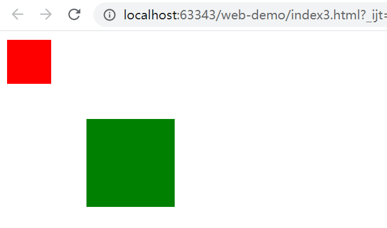

# 布局

布局是网页展示信息的大框架，也是CSS中最困难的地方，和大多数UI框架会提供一系列`Layout`组件不同，由于历史原因，网页布局是结合使用文档结构、元素盒模型、元素定位实现的，这篇笔记介绍CSS中常用的布局实现，包括传统的元素定位方式、浮动定位、和全新的Flex布局。

## 定位属性

CSS中，`position`属性用于指定元素的定位方式。

### static 默认定位方式

`static`是`position`的默认值，也就是说，默认情况下，页面上的元素不会被特殊定位。从习惯上来说，除非要覆盖样式库，否则我们基本不会把`position: static;`显示的写出来。

```html
<div style="
width: 100px;
height: 100px;
background-color: green;">
    <div style="
    width: 50px;
    height: 50px;
    background-color: red;
    position: static;"></div>
</div>
```


### relative 相对父元素偏移

`relative`需要和这几个定位属性配合使用：`top`、`left`、`right`、`bottom`。如果不指定定位属性，`relative`和`static`的表现是一致的，指定定位属性后，会在原有基础上进行偏移。

```html
<div style="
width: 100px;
height: 100px;
background-color: green;">
    <div style="
    width: 50px;
    height: 50px;
    background-color: red;
    left: 10px;
    top: 10px;
    position: relative;"></div>
</div>
```


### fixed 相对页面固定位置

很多网页设计有固定顶部的导航，即使页面向下卷动，导航也始终保持在顶部，这是通过`fixed`定位方式实现的。和`relative`类似，`fixed`也是通过`top`、`left`、`right`、`bottom`这四个偏移属性指定位置。


上面是一个网页头部的`fixed`部分示例。

### absolute 相对最近的非static祖先元素固定位置

从上面小标题的描述来看，就知道`absolute`这个属性有多奇葩，`absolute`的定位规则：寻找一个最近的非`static`父元素，相对它定位，如果没有找到这样的元素，则相对`<body>`定位，并且会随着页面卷动。

下面代码中，内部`<div>`会相对父`<div>`定位：

```html
<div style="
    width: 100px;
    height: 100px;
    background-color: green;
    position: absolute;
    left: 100px;
    top: 100px;">
        <div style="
        width: 50px;
        height: 50px;
        background-color: red;
        position: absolute;
        left: 10px;
        top: 10px;"></div>
</div>
```


下面代码中，内部`<div>`会不顾父`<div>`，相对`<body>`来定位，乍以看起来有点像`<fixed>`，但是要注意它不会固定在视口的一个相对位置，而是会随着文档卷动的。

```html
<div style="
    width: 100px;
    height: 100px;
    background-color: green;
    margin-left: 100px;
    margin-top: 100px;">
        <div style="
        width: 50px;
        height: 50px;
        background-color: red;
        position: absolute;
        left: 10px;
        top: 10px;"></div>
</div>
```



## float 浮动定位

`float`可以实现浮动定位，浮动定位的元素会自动靠向一边进行排列。浮动定位能够实现流式布局、文字环绕图片等功能，比较常用。注意，浮动定位的写法类似`float: left;`这种，而不是`position: float`。

```css
.container {
    width: 300px;
    height: 100px;
    background-color: green;
    margin-left: 100px;
    margin-top: 100px;
}

.item {

    width: 50px;
    height: 50px;
    background-color: red;
    float: left;
    margin-left: 10px;
}
```

```html
<div class="container">
    <div class="item"></div>
    <div class="item"></div>
    <div class="item"></div>
</div>
```


`float`甚至可以和`position: relative`结合使用，这里就不多介绍了。

注：浮动定位存在高度塌陷问题，这部分内容在`Web网页设计/常见问题/浮动定位高度塌陷问题`章节中介绍。

## Flex布局

CSS3中，引入了全新的Flex布局，使用Flex布局能够很容易的实现传统布局模式难以实现的效果。参考资料：[https://developer.mozilla.org/zh-CN/docs/Web/CSS/flex](https://developer.mozilla.org/zh-CN/docs/Web/CSS/flex)

Flex布局中，有清晰的容器和元素的概念，使用Flex布局，首先需要对容器元素指定`display: flex;`，然后分别对容器和元素配置一系列CSS属性。

### 容器

Flex容器包含许多元素，容器决定如何排列这些元素。

#### flex-direction 排列方向

`flex-direction`决定Flex容器中元素的排列方向，可选值：

* `row`：默认，从左到右横向排布
* `row-reverse`：从右到左横向排布
* `column`：从上到下纵向排布
* `column-reverse`：从下到上纵向排布

#### flex-wrap 换行控制

`flex-wrap`决定在Flex容器排列方向上的换行方式，可选值为：

* `nowrap`：默认，不换行，多个元素将被在对应排列方向上压缩
* `wrap`：换行
* `wrap-reverse`：换行，但第一行在下面，后续元素在上面

#### justify-content 排列方向上的对齐方式

`justify-content`指定排列方向上的对齐方式，可选值为：

* `flex-start`：根据`flex-direction`定义的方向，向方向起点对齐
* `flex-end`：根据`flex-direction`定义的方向，向方向终点对齐
* `center`：在排列方向上居中
* `space-between`：左右元素在排列方向上分别紧靠左右边缘，其余元素均匀分布在中间
* `space-around`：元素均匀分布在中间，左右元素和容器边缘有一定边距

#### align-items 排列方向纵向的对齐方式

`align-items`指定排列方向纵向上的对齐方式，可选值为：

* `stretch`：在排列方向纵向上以占满整个容器，默认值
* `flex-start`：根据`flex-direction`定义的方向纵向，向方向起点对齐
* `flex-end`：根据`flex-direction`定义的方向纵向，向方向终点对齐
* `center`：在排列方向纵向上居中（垂直居中）

### 元素

Flex容器中的单个元素可以决定自己占用多大空间，除此之外，还可以为自己单独指定一个对齐方式。

#### flex 一个元素的空间占比

flex属性其实是以下三个属性的合写：

* `flex-grow`：元素的缩放比例，默认值为`0`，即不放大，如果指定一个小于1的值，元素将缩小
* `flex-shrink`：元素的被动压缩比例，当元素长度之和大于容器，所有元素将被压缩，默认值为`1`，即等比例压缩
* `flex-basis`：元素在flex容器中的理想高度，可以指定一个带单位的数值长度，默认值为`auto`

这几个属性可能乍一看起来比较费解，我们只要试试就明白了。

例子：这里利用`flex`属性实现一个类似栅格系统的效果，我们需要让5个元素均匀的占满父容器。

```css
.container {
    display: flex;
    justify-content: space-between;
    border: 1px solid darkgray;
}
.card {
    flex: 1 1 auto;
}
.item1 {
    background-color: red;
}
.item2 {
    background-color: green;
}
.item3 {
    background-color: yellow;
}
.item4 {
    background-color: blue;
}
.item5 {
    background-color: skyblue;
}
```

```html
<div class="container">
    <div class="card item1">测试内容</div>
    <div class="card item2">测试内容</div>
    <div class="card item3">测试内容</div>
    <div class="card item4">测试内容</div>
    <div class="card item5">测试内容</div>
</div>
```


#### align-self 单独设置纵向对齐方式

Flex容器中已经指定了元素的纵向排列方式，但是`align-self`还允许我们单独为一个元素指定它自己的纵向排列方式。可选值和`align-items`相同。
