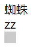

# 长度单位

CSS中，有几种长度单位：`px`，`em`，`rem`，除此之外，还经常有用`%`指定相对长度的状况，这篇笔记我们学习一下CSS中长度的使用。

## `px`

`px`就是像素值，它用来衡量一个位图的长宽各有多少个像素点。如果我们的网页布局中大量使用位图，一些对`px`的设置是不可避免的。

## `em`和`rem`

现在能浏览网页的设备各种各样，而且分辨率、像素密度的差别都非常大，使用`px`布局一个兼容各种设备的页面是不可能完成的事情，这时需要使用`rem`。

`rem`是一个相对值，相对于页面的根元素，`1rem`就是一个页面字体的大小。

```html
<div>蜘蛛</div>
<div>zz</div>
<div style="width: 1rem; height: 1rem;background-color: #cbcbcb"></div>
```

我们最下方的`div`大小就是`1rem x 1rem`的。



`em`表示相对父容器字体的变长，已淘汰，无卵用，不要用。

## 使用`%`

```html
<div class="progress-bg">
        <div class="progress-fg"></div>
</div>
```

```css
.progress-bg {
    width: 15rem;
    height: 1.6rem;
    background-color: #f3c3f3;
}

.progress-fg {
    height: 100%;
    width: 61%;
    background-color: #c3f3c3;
}
```


