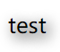

# 阴影

CSS中阴影主要有`box-shadow`和`text-shadow`两种，恰当的使用阴影，能让页面扁平无聊的页面瞬间变得具有立体的美感。

## 阴影基本使用

### text-shadow

```html
<span id="shadow-demo1">test</span>
```

```css
#shadow-demo1 {
    /* offset-x | offset-y | blur-radius | color */
    text-shadow: 3px 3px 10px rgb(0, 0, 0);
}
```

* offset-x：阴影X轴偏移
* offset-y：阴影Y轴偏移
* blur-radius：模糊半径
* color：颜色



### box-shadow

```html
<div id="shadow-demo2"></div>
```

```css
#shadow-demo2 {
    /* offset-x | offset-y | blur-radius | spread-radius | color */
    box-shadow: 2px 2px 10px 10px rgba(0, 0, 0, 0.2);
}
```

* offset-x：阴影X轴偏移
* offset-y：阴影Y轴偏移
* blur-radius：模糊半径
* spread-radius：阴影半径
* color：颜色

`blur-radius`和`spread-radius`的区别其实很明显：

* `blur`表示模糊，该半径越大，阴影约模糊，反之越锐利
* `spread`表示传播，其实就是指定阴影大小


如果加一个`inset`，可以将外阴影变为内阴影，例如`box-shadow: inset 2px 2px 10px 10px rgba(0, 0, 0, 0.2)`。


