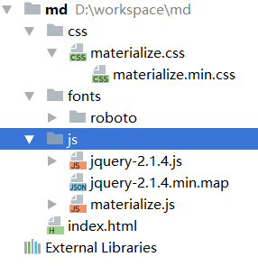

# Materialize

Materialize是一个开源的CSS样式库，使用方法类似于bootstrap。Materialize实现了Google提出的Material Design风格。本系列笔记主要介绍Materialize的常用控件，用于开发中快速查找。

使用Materialize的方法和Bootstrap非常像，基本都是为html元素添加css属性，同时有些功能，是使用JQuery插件提供的。使用某些控件，如下拉菜单，需要使用JavaScript先初始化一番。同时，和Bootstrap一样，提供了一些实用功能的JQuery插件，如轮播幻灯片等。有关JQuery插件的内容请参考Materialize官方网站，这里不再介绍。

# 下载

官方网站：[http://materializecss.com/](http://materializecss.com/)

# 加入项目

加入项目的方法和Bootstrap类似，都依赖于JQuery，因此必须在引用Materialize的js前，引入JQuery。

```html
<link href="css/materialize.min.css" type="text/css" rel="stylesheet"/>
<link href="https://fonts.googleapis.com/icon?family=Material+Icons" rel="stylesheet">
<script src="js/jquery-2.1.4.min.js"></script>
<script src="js/materialize.min.js"></script>
```

加入后的项目结构：


