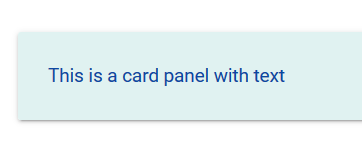

# 颜色

## 背景颜色

直接在class中输入Material Design包含的颜色名即可。例如：`class="blue"`。

## 文本颜色

在class中加入颜色名-text，例如：`blue-text`。

## 颜色深浅

class中使用lighten和darken可以调整背景色和文本颜色的深浅。例如`class="blue lighten-2"`。

取值范围都是1~5。

颜色例子：

```html
<div class="card-panel teal lighten-5 blue-text text-darken-4">This is a card panel with text</div>
```



## 调色板

Material Design调色板：[http://materializecss.com/color.html](http://materializecss.com/color.html)
