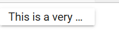
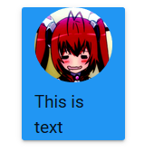
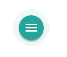
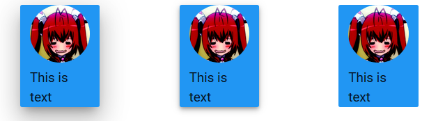

# 隐藏

Materialize可以实现元素隐藏，和在特定屏幕大小下隐藏元素。

* hide 隐藏
* hide-on-small-only 小屏幕隐藏
* hide-on-med-only 中形屏幕隐藏
* hide-on-med-and-down 中形和小屏幕隐藏
* hide-on-med-and-up 中形和大形屏幕隐藏
* hide-on-large-only 大屏幕隐藏

# 自动省略

truncation可以实现当一行文本显示不下时，添加省略号。

例子
```html
<div class="row">
	<div class="card-panel col s1 truncate">This is a very very very very very very very long text</div>
</div>
```

显示效果



# 鼠标悬浮

hoverable是一个Material Design风格的悬浮特效。

例子
```html
<div class="row">
	<div class="card-panel col s1 hoverable">This is text</div>
</div>
```

鼠标悬浮时，会有一个深度增加的特效。

# 响应式图像和圆形图像

responsive-img可以使图像自动调整大小以适应响应式布局。一般都建议加上这个属性。

circle属性可以创建圆形图像。

```html
<div class="container">
	<div class="row">
		<div class="card-panel col s1 hoverable blue">
			
			This is text
		</div>
	</div>
</div>
```



# 响应式视频

和图片一样，视频有responsive-video，便于视频窗口自适应。这个CSS类只能用于HTML5的Video标签。

# 脉冲按钮

pulse能让按钮发出脉冲。

```html
<a class="btn btn-floating pulse"><i class="material-icons">menu</i></a>
```



# 深度

z-depth-深度值，可以为组件设置深度。

```html
<div class="row">
	<div class="card-panel col s1 blue z-depth-5">
		
		This is text
	</div>
	<div class="card-panel col s1 blue z-depth-2 offset-s1">
		
		This is text
	</div>
	<div class="card-panel col s1 blue z-depth-0 offset-s1">
		
		This is text
	</div>
</div>
```


